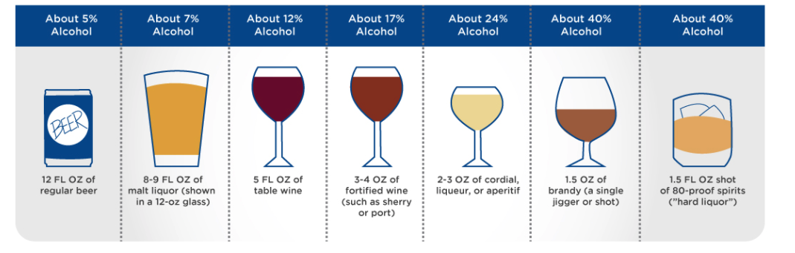
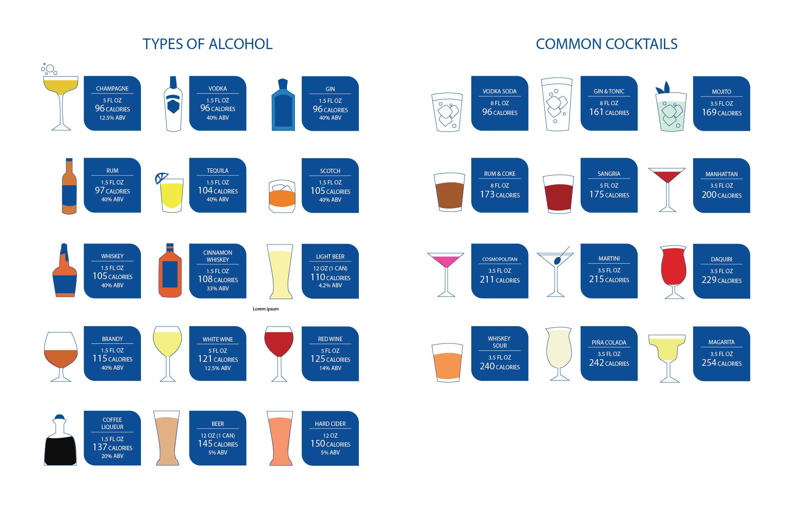
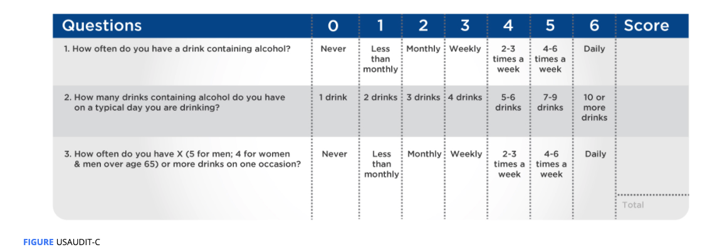

# Accommodating In A Dietary Program.

**Standard Drink**  Any alcoholic beverage that contains 0.6 ounces of ethanol. 

**Moderate drinking  :**  

* one standard drink per day for females 
* two standard drinks per day for males.

**high-risk drinking :**

* females  &gt;4 standard drinks / per day   \|  &gt;8 standard drinks / per week
* males  &gt; 5 standard drinks / per day   \|  &gt; 15 standard drinks / per week

**binge drinking:** Consumption of a large amount of alcohol in a single session.

* 4~5 standard drink for both male and females.

The actual energy from ethanol in an **alcoholic** beverage may be **relatively small \(about 99.4 kcal**\); however, many alcoholic beverages contain considerably more energy due to the **carbohydrate content of the alcohol itself**

## Monitoring Alcohol Use

**U.S Alcohol Use Disorders Identification Test \(USAUDIT-C\)** 

A total score **&gt;7**  for males and five or more for females is a positive score;

Men over the age of 65 use  **=&gt; 5** for a positive score similar to women

