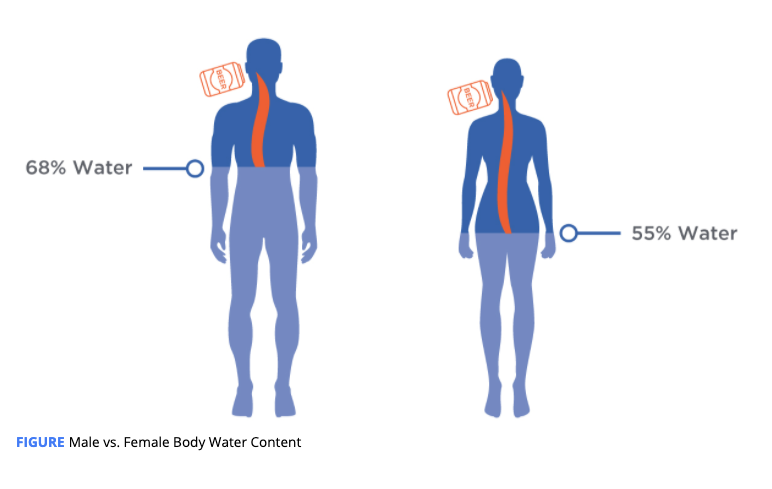
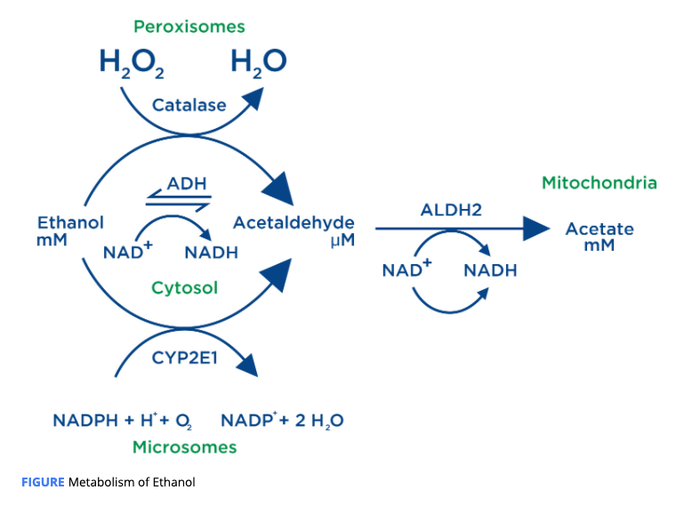

# Digestion and Absorption

## Absorption Process

* Metabolized in the gastric mucosa \(**stomach lining**\) by **alcohol dehydrogenase** **\(ADH\)** in what is referred to as **first-pass metabolism**.
* Passes unaltered into the **bloodstream** through the stomach and small intestine by simple diffusion.
* Once in circulation, the water **solubility** of ethanol allows it to diffuse into the majority of **tissues**, particularly the **liver**

## The Factors of Absorption

### 1. Food in the stomach

> “never consuming alcohol on an empty stomach”

Food **slows** the absorption of alcohol

But **increases** the rate at which ethanol is metabolized both in first-pass metabolism and metabolism in the live, **as a result** 

* increased liver blood flow
* activity of ADH
* rates of NADH
* reduced form of nicotinamide adenine dinucleotide \(NAD+\) re-oxidation

Absorbed rate :  food + dilute alcoholic beverages &gt; food + concentrated alcoholic beverages

Absorbed rate :  dilute alcoholic beverages &lt; concentrated alcoholic beverages

 Absorbed rate :  ethanol in carbonated beverages &gt;  alcohol in noncarbonated beverages

### 2. Sex and Body Composition

1. First-pass Metabolism is greater in male than female.  Different in ADH activity 
2. Metabolism by the liver are similar in female and males.  - water & lean body mass :   BAC in females  &gt; male , But depends on how much ethanol consumed.

## Metabolism

**90%** of ethanol is metabolized in the **liver** by ADH ,  at a rate of approximately 0.25 ounces \(7 grams\) per hour

The other **10%** is excreted through breath, sweat, and urine.

absorption &gt; metabolism will see BAC rise accordingly and intoxication will begin.

 **results** in the formation of **acetaldehyde** and **NADH**

\*\*\*\*

\*\*\*\*

Alcohol Dehydrogenase \(ADH\)  **:**  The primary enzyme involved in metabolism of ethanol.

First-Pass Metabolism : The initial metabolism of ethanol occurring in the stomach.

Blood Alcohol Content \(BAC\): The amount of ethanol in the blood relative to water.

