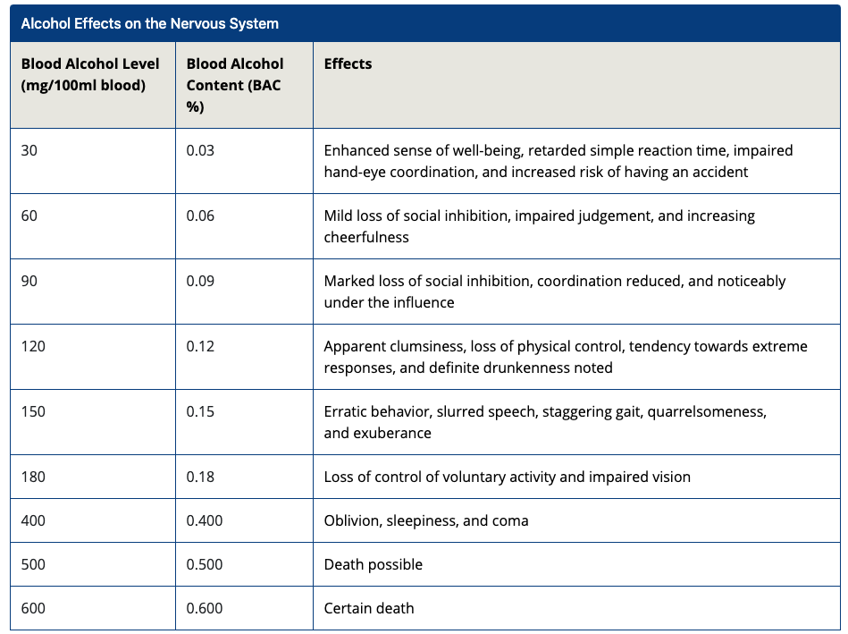

# Physiological Effects Of Alcohol

## Effects on the Central Nervous System

Depressant effects on the central nervous system \(CNS\)

* moderate ethanol consumption will significantly **alter** cortical excitability and the way signals are transmitted in the CNS;
  * cognitive impairments associated with intoxication
* increased activity in the **limbic region**, through the actions of **dopamine** and **serotonin**, reinforce the pleasure associated with ethanol consumption, making it a highly **addictive drug**
* damage to the brain
  * memory loss, learning difficulties, psychosis, mental confusion, and, in extreme cases, paralysis

## Effects on the Cardiovascular System

* Increase heart rate and blood pressure
* Increased risk of coronary heart disease and alcoholic cardiomyopathy
* In hot environments,Increases in peripheral vasodilation \(increased blood flow to the skin\)
* In cold env, thermal discomfort are reduced, risk of developing hypothermia.

## Effects on Immune and Hormonal Function

* chronic alcoholics 
*  susceptible to infection 
* impacting recovery after illness or trauma
* reduction in testosterone in men and an increase in estrogen in both sexes
* impact muscle mass, bone density, fertility, and sexual function
  * Estrogen is a category of sex hormone responsible for the development and regulation of the female reproductive system
* risk of breast cancer in females

