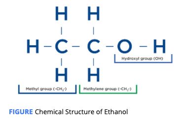

# What is Alcohol

## Structure

Chemical Structure of ethanol :   C2 H6 O

Produced by the fermentation of glucose.   So the two are structurally similar. 

It is not regulated by hormones.  

Ethanol is often considered the fourth macronutrient because, when metabolized, 7.1 kcals per gram of ethanol are liberated as energy -  Fat &gt; Ethanol  &gt; Carbohydrate  &gt; Protein 

