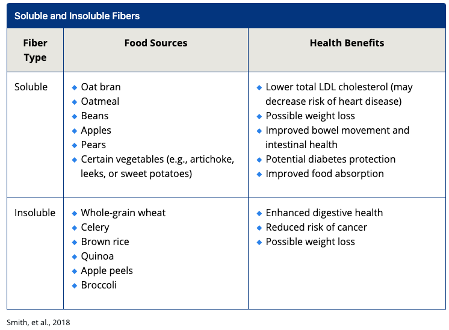
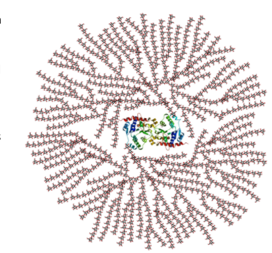
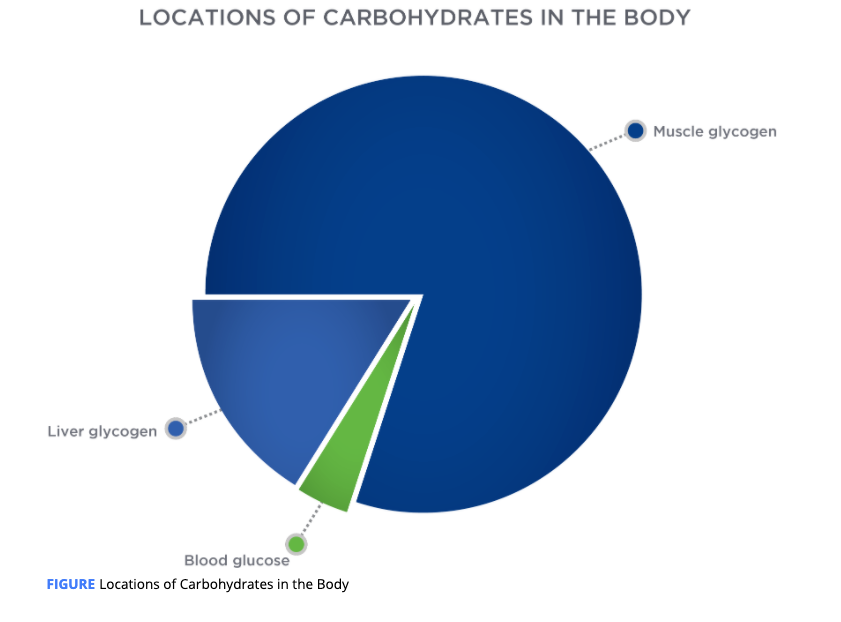
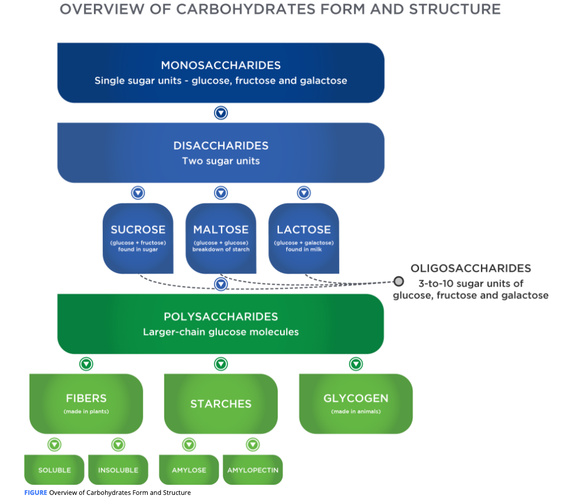

# Carbohydrate Introduction

Carbohydrates are often referred to as **sugars** and **starches**, or as simple and complex carbohydrates.

Except for **lactose** \(**milk sugar\)** and **glycogen** \(the **storage form of carbohydrates in the body\)**, all carbohydrates are plant-derived.

## Carbohydrate Structure

scientific classifications:

 **monosaccharides** -&gt; single sugar units

**disaccharides** -&gt; paired sugar units, 

 **polysaccharides**, which represent longer sugar unit chains. 

 **oligosaccharides**, also exists, containing 3 to 10 sugar units. Polysaccharides and oligosaccharides are known as complex carbohydrates. 

Once absorbed, carbohydrates can be used immediately as a **source of fuel** or can be **stored as glycogen** in specific cells. In fact, the largest storage depots for carbohydrates \(glycogen\) are the **muscle and liver cells**.

### Monosaccharides

**Glucose** \(sometimes also referred to as dextrin or dextrose\), **fructose**, and **galactose** represent the three nutritionally important monosaccharides to humans.

**galactose** is only present in dairy products

### Disaccharides

* **Sucrose** is comprised of one glucose molecule joined with one fructose molecule. Examples include cane sugar, brown sugar, and date sugar. Sucrose contributes as a primary **sugar in most fruits**.
* **Lactose** is comprised of one glucose molecule joined with one galactose molecule. **It is only found in dairy products**.
* **Maltose** is comprised of two glucose molecules. Examples include **corn syrup, brown rice syrup, and molasses.**

#### Added Sugars

Added sugars are those not naturally occurring in food groups

are either monosaccharides or disaccharides that contain glucose, fructose, or galactose \(**Table:** **Added Sugars**\).  

### Oligosaccharides

Oligosaccharides are largely resistant to digestion because the human digestive tract lacks the necessary enzymes that can chemically break down many of these structures. This allows them to pass to the large intestine where intestinal bacteria act on them.

certain enzymes derived from intestinal bacteria may produce oligosaccharides from ingested starches and sugars.

Serve as food for our large intestinal bacteria 

 Also referred to as prebiotics.

fructo-oligosaccharides \(FOS\), galacto-oligosaccharides \(GOS\), and inulin, extracted from chicory root

### Polysaccharides

Polysaccharides are also complex carbohydrates and comprise starches, fibers and glycogen.

Each contain **long-chain glucose structures** of more than 10 units, but they can be as large as several thousand units

**Amylose** : A straight-chain and digestible form of starch containing glucose molecules.

**Amylopectin** : A branched-chain and digestible form of starch containing glucose molecules.

**Fiber** : as a block structure

**amylose and amylopectin** are **digestible** and make up approximately **20% and 80%** of the **digestible starches found in vegetables, grains, pasta, rice, and beans,**

Greater levels of amylopectin result in a faster and a greater spike in blood sugar than a similar compound with more amylose.

**fiber** represents most of the indigestible portions of plant food,

Soluble Fiber : A type of dietary fiber that dissolves in water to form a gel, associated with **heart health benefits** and glucose control. Source pectins, gums, and mucilages that originate from the inside of the plant cell.

soluble -&gt; dissolve or swell when placed in water

             -&gt; digested by the bacteria living within the large intestine

They offer several benefits:

* **Weight loss**—It can delay gastric emptying \(from the stomach\) and it promotes an overall feeling of fullness, thereby potentially reducing caloric intake.
* **Reducing risk for cardiovascular disease**—It can bind to cholesterol particles. It can prevent its absorption and help remove this compound from the body.
* **Bowel movement and intestinal health**—It attracts water and it promotes bulk to the stool, which can safeguard against constipation.
* **Diabetes protection**—This carbohydrate is not absorbed. It can, therefore, reduce potential blood sugar spikes.
* **Improved absorption of foods**—It slows the movement of food through the small intestine. It can enhance nutrient absorption.

**Insoluble fiber** 

form the structural parts of plants and include compounds like cellulose, hemicellulose, and lignin, are often found in the outermost portion of grains,vegetables, fruits, and seeds

* **Digestive** health—It adds bulk and draws water into the GI tract. It improves regularity in the large intestine to avoid constipation and other **bowel-related** health problems \(e.g., hemorrhoids\).
* **Reduces** risk of **cancer**—It improves movement through the large intestine. It reduces the risk of colon cancer and other large intestinal diseases \(e.g., **diverticulosis**\).
* **Weight loss**—By delaying gastric emptying \(from stomach\), it promotes an overall feeling of fullness, reducing caloric intake.

**Functional fiber** 

A compound derived from isolated indigestible fiber to potentially provide some of the health-promoting benefits of natural fiber.

These commercially available and man-made compounds like polydextrose and inulin are popular in many foods, but whether they offer the same health-promoting benefits as natural fiber remains to be determined.

Good Food Sources of Fiber

| **Food Source** | **Standard Portion Size** | **Dietary Fiber \(grams\)** |
| :--- | :--- | :--- |
| High fiber bran ready-to-eat cereal | ⅓ to ¾ cup | 9.1 to 14.3 grams |
| Navy beans | ½ cup | 9.6 grams |
| Split peas \(cooked\) | ½ cup | 8.1 grams |
| Lentils \(cooked\) | ½ cup | 7.8 grams |
| Pinto beans \(cooked\) | ½ cup | 7.7 grams |
| Wheat bran flakes, ready-to-eat cereal | ¾ cup | 4.9 to 5.5 grams |
| Pear \(raw\) | 1 medium-sized | 5.5 grams |
| Baked beans \(canned, plain\) | ½ cup | 5.2 grams |
| Avocado | ½ cup | 5.0 grams |
| Apple \(with skin\) | 1 medium-sized | 4.4 grams |
| Raspberries, blackberries | ½ cup | 3.8 to 4.0 grams |
| Prunes \(stewed\) | ½ cup | 3.8 grams |
| Almonds | 1 ounce | 3.5 grams |
| Banana | 1 medium-sized | 3.1 grams |
| Winter squash \(cooked\) | ½ cup | 2.9 grams |
| Peanuts \(oil roasted\) | 1 ounce | 2.7 grams |
| Quinoa \(cooked\) | ½ cup | 2.6 grams |

## Glycogen

**Glycogen** is the storage molecule of glucose in animals, ****It is important to note that there is no fructose in glycogen; only glucose molecules are used to form glycogen. 

can range from 100 to over 30,000 glucose units

Glycogenolysis : The process of **breaking down** the glycogen molecule into its individual glucose units for entry into the energy pathways.

**glycogenesis:**  The process of forming glycogen from glucose.

