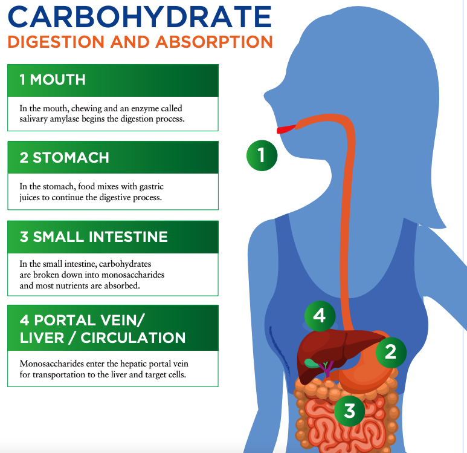
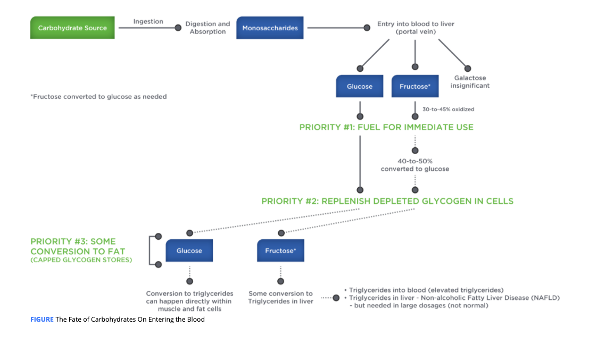

# Digestion, Absorption

**Mouth**: salivary amylase, an enzyme released by the salivary glands.

Salivary amylase starts the digestive process by cleaving large-chain polysaccharides into smaller segments

chewing helps break down carbohydrates

rounded mass of food that is swallowed is known as **bolus**.

**Stomach**:

gastric juices and the high acidity of stomach contents continue the digestive process.

Chyme: The partially digested, semi-fluid mass of food expelled by the stomach to the duodenum.

In the **jejunum**, the digestible carbohydrates are further broken down to disaccharide and monosaccharide forms,

**jejunum** It is the second section of the small intestine where digestion and absorption occur. It is located immediately after the duodenum and leads into the ileum.

**small intestine:** 

the **ileum**, where most carbohydrates absorption occurs. 

**ileum** It is the final section of the small intestine where lots of absorption occurs. It is located immediately after the jejunum and leads into the large intestine.

 **disaccharides** still need to undergo further digestion to single sugar units, which takes place within the **brush border** of the intestinal wall.

**T**he walls of the small intestine contain many finger-like projections called **villi**

The absorptive cells within the brush border release specific enzymes to digest any remaining disaccharides to their monosaccharide form.

Glucose and galactose, however, are absorbed via a different process than fructose. This process results in glucose and galactose being absorbed into the body **at a faster rate than fructose.**

all monosaccharides enter the **hepatic portal vein** for transportation to the liver.

Priority number one for carbohydrates is to serve as an immediate fuel, so glucose or fructose can be used by the liver or pass into circulation for delivery to any target cell.

he body’s absorbed fructose is either oxidized or converted to glucose, the balance is converted to either lactate \(about 30%\) or to triglycerides \(fats\) \(&lt;1%\).

While the conversion to triglycerides is small, it has raised health concerns, especially with the liver.

This disease is called **non-alcoholic fatty liver disease** \(NAFLD\), a condition demonstrating greater significance in inactive people who consume large amounts of fructose \(and overall energy\) in their diet

