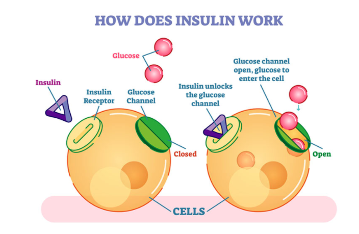

# Functions

The primary role of dietary carbohydrates is to provide **energy** for the body. Any **excess** carbohydrates not used for immediate energy production can be stored as **glycogen within the muscle and liver.**

The physiological pathway of fat metabolism involves a carbohydrate byproduct for complete metabolism.

degraded fat fragments are converted to **ketones** and metabolized differently

body can produce glucose from certain non-carbohydrate sources, including specific amino acids \(via **gluconeogenesis**\) that are almost exclusively derived from muscle tissue. 

The body can also make glucose from fatty acids, if needed, particularly when consuming a high-fat, very-low carbohydrate diet

### Hormonal Regulation of Glucose \(Insulin \| Glucagon\)

**Type 1 Diabetes** : A condition in which the pancreas produces little to no insulin. --- due to some genetic variant or an autoimmune response

A physically inactive lifestyle, coupled with overconsumption of energy \(e.g., too many calories\), can ultimately decrease receptor sensitivity to insulin, leading to insulin resistance, and, ultimately, **Type 2 diabetes.**

\*\*\*\*

### During Exercise

This occurs because exercise is a **catabolic** event that relies on the release of stored energy to use for work and insulin is an anabolic hormone that normally functions to build energy stores and prevents their breakdown or release

**Catabolic :** The breakdown of nutrients to release energy.

During exercise, **epinephrine**, **norepinephrine**, and **glucagon** levels all increase to stimulate glycogenolysis and glucose release from the liver into the blood.

red blood cells can only use glucose as a fuel and they rely exclusively on blood glucose as that fuel

**Cortisol** is tasked with preserving both blood sugar and liver glycogen, considering how the liver is the only organ that can release glucose into circulation.

### Glycemic Index

The glycemic index \(GI score\) is a relative ranking of a food’s effect on blood glucose \(blood sugar\) 2 hours after the consumption of that food.

* Not all simple sugars have high GI scores \(e.g., fructose or sucrose\). Fructose is absorbed more slowly and needs conversion to glucose in the liver. This subsequently lowers its GI score.
* Not all complex carbohydrates have low GI scores \(e.g., instant rice, instant mashed potatoes, or cornflakes\). Removing fiber can increase a food’s GI score.

Glycemic Index Scores of Common Carbohydrate Foods

| **Food** | **GI Score** | **Food** | **GI Score** |
| :--- | :--- | :--- | :--- |
| Glucose | 100 | Hamburger bun | 61 |
| Baguette \(white, plain\) | 95 | Raisin Bran® cereal | 61 |
| Hard Candy | 90–100 | Sweet potato | 60 |
| Baby carrots | 92 | Honey | 55 |
| Rice \(instant\) | 91 | Snickers® Bar | 55 |
| Gatorade® \(U.S. formula\) | 89 | Oatmeal \(steel cut\) | 55 |
| Potato \(instant, mashed\) | 87 | Tortilla \(corn\) | 52 |
| Pretzels | 83 | Quinoa | 53 |
| White potato \(boiled\) | 82 | Orange juice, Oranges | 50 |
| Cornflakes cereal | 81 | Brown rice \(steamed\) | 50–55 |
| Oatmeal \(instant\) | 79 | Banana | 30–55 |
| Donut \(plain\) | 75 | Carrots | 47 |
| French fries | 75 | Sponge cake \(plain\) | 46 |
| Graham crackers | 74 | Chicken nuggets \(frozen\) | 46 |
| Soda crackers | 74 | Peach | 42 |
| Cream of Wheat® \(instant\) | 74 | Spaghetti | 42 |
| Corn chips | 72 | Apple juice | 41 |
| White rice \(boiled\) | 72 | Baked beans | 40 |
| Saltine crackers | 70 | Strawberries | 40 |
| White bread | 70 | Apple | 36 |
| Watermelon | 70-80 | Kidney beans | 34 |
| Bread \(whole wheat\) | 69 | Milk \(all varieties\) | 31 |
| Special K® cereal \(U.S. formula\) | 69 | Tortilla \(wheat\) | 30 |
| Popcorn \(microwave\) | 65 | Grapefruit | 25 |
| Sucrose \(sugar\) | 65 | Fructose | 18 |
| Macaroni and cheese | 64 | Peanuts | 13 |
| White rice | 64 | Agave | 11 |
| Raisins | 64 | Hummus | 6 |
| Cola | 63 | Sugar alcohols \(non-caloric sweetener\) | 3 |

Factors that affects GI

* **Monosaccharide** form—glucose versus fructose
* **Polysaccharide** form—amylopectin versus amylose
* **Food form \(liquid versus solid\)**—Foods leaving the stomach generally have a semi-liquid, gooey consistency \(e.g., like cream of wheat\). Solid foods will, therefore, remain in the stomach longer until they reach that consistency. However, semi-liquid \(smoothies or pulp\) or liquid forms of food \(juicing\) empty the stomach much faster.
* **Degree of processing and cooking**—This alters GI scores in both directions. Separating nutrients from fiber during cooking \(boiling\) can raise GI scores while making starch more resistant via repeated heating or cooking can lower GI scores \(e.g., reheating pizza where it becomes rubber-like\).
* **Presence of other nutrients** \(e.g., fiber, protein, or fats\)—This slows gastric emptying and digestion, which lower the food’s GI score.
* Human variability in digestion and absorption

Glycemic Load:

A method for determining how the quantity of carbohydrates consumed impact blood sugar levels.

