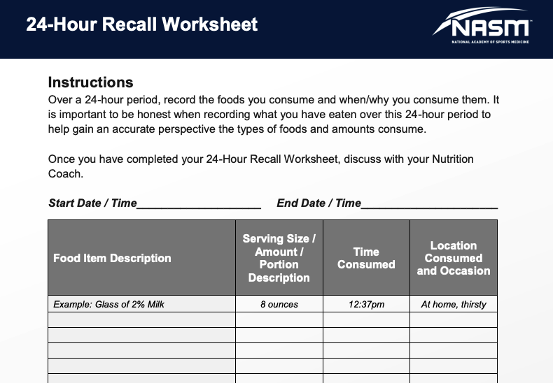
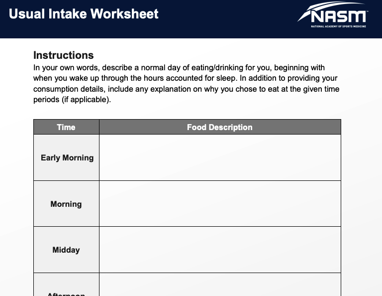
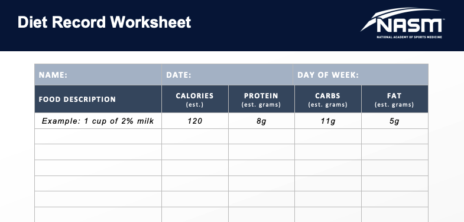

# Assessing Dietary Intake

 Understand that a client may be unintentionally providing you with a diet record \(or other dietary assessment\) that is not fully reflective of their lifestyle. For example, a client may present you with a day of a diet record that they feel is a _normal_ day.

it is important to have a conversation with the client to ensure they understand the procedures of the dietary assessment method and the importance of getting an accurate picture of their habitual diet.

### Methods of Dietary Assessment

#### 24-Hour Recall

1. **Quick list:** Obtain a simple list of all food and drink items eaten within a 24-hour period of time without focusing on specific details and amounts.

2. **Forgotten foods:** Ask the client about specific food categories that may have been forgotten such as nonalcoholic or alcoholic beverages, sweets/desserts, and snacks. This may be particularly important for those who _graze_.

3. **Time and occasion:** Ask the client to think about his or her schedule during the 24-hour recall period and state what time foods were consumed. Remembering the activities of the day may help the client remember additional items.

4. **Describe the food:** Now that the list of foods/drinks has been compiled, ask the client to provide the following information for each food item: where the food was obtained \(home, restaurant, etc.\), brand/restaurant associated with food, preparation method, how the food/drink was served \(e.g., served with anything else\), and the quantity of the food/drink.

5. **Final review/probe:** Briefly review the 24-hour recall for completeness with the client and ask one final time if there are any items that could have been forgotten.

#### Usual Intake

it can be used as a complement to a 24-hour recall or diet record in order to help determine if the days being assessed are similar to the client’s normal eating patterns.

#### Diet Record

Diet records are a common method of dietary assessment, particularly with the wide availability of **mobile diet record apps**

Diet records have the potential to provide precise information on a client’s intake; however, similar to other methods, there can be substantial error in diet records when a client either forgets to record items or is unable to accurately describe the type and amount of food eaten.

**Food frequency questionnaires** are designed to provide a big-picture view of the diet and allow for identification of **intakes of particular food groups.** These questionnaires often consist of a series of multiple-choice questions designed to identify the frequency of consumption of major categories of food



