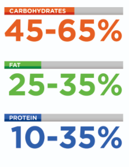
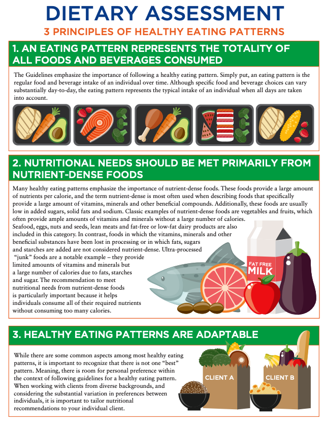

# Dietary Guidelines Foundation

In the United States, the **Department of Health and Human Services \(HHS\)** and the **United States Department of Agriculture \(USDA\)** produce the _**Dietary Guidelines for Americans**_ \(HHS & USDA, 2015\), a document that serves as a resource for health professionals and those involved in policy decisions involving nutrition.

The content of this report is intended to **describe healthy diets** that may help prevent diet-related chronic conditions such as obesity, heart disease, and diabetes.

The _2015–2020 Dietary Guidelines for Americans_ presents the following guidelines:

1. Follow a healthy eating pattern across the lifespan.
2. Focus on variety, nutrient density, and amount.
3. Limit calories from added sugars and saturated fats and reduce sodium intake.
4. Shift to healthier food and beverage choices.
5. Support healthy eating patterns for all.

**The Food and Nutrition Board of the Institute of Medicine** has developed consensus reports for recommended dietary intake. This report presents the **Dietary Reference Intakes \(DRIs\)**, which are a set of recommended intakes of various nutrients 

One set of important recommendations within the DRIs are the **Acceptable Macronutrient Distribution Ranges \(AMDRs\)**, which state the recommended percent of calories that adults should obtain from carbohydrates \(45 to 65%\), fat \(20 to 35%\), and protein \(10 to 35%\) 

**Recommended Dietary Allowance \(RDA\):** The average daily dietary nutrient intake level **sufficient** to **meet** the nutrient requirement of nearly all **\(97 to 98%\) healthy individuals** in a particular life stage and gender group  -- **bottom line** 

**Adequate Intake \(AI\):** The recommended average daily intake level based on **observed** or **experimentally** determined estimates of nutrient intake by groups of apparently healthy people that are **assumed to be adequate** – **The AI is used when an RDA cannot be determined**.  --- **adequate line** 

**Tolerable Upper Intake Level \(UL\):** The **highest average daily nutrient intake level** that is likely to pose no risk of adverse health effects to almost all individuals in the general population – As intake increases above the UL, the potential risk of adverse effects may increase.  **-- upper bound**

**Estimated Average Requirement \(EAR\):** The **average daily nutrient intake level** estimated to meet the requirement of half the healthy individuals in a particular life stage and gender group  **-- average**

**Acceptable Macronutrient Distribution Range \(AMDR\):** The range of intake **for a particular energy source** that is associated with reduced risk of chronic disease while providing intakes of essential nutrients

### Principles of Healthy Eating Patterns

