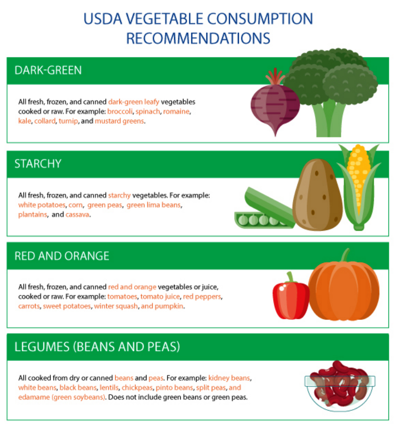
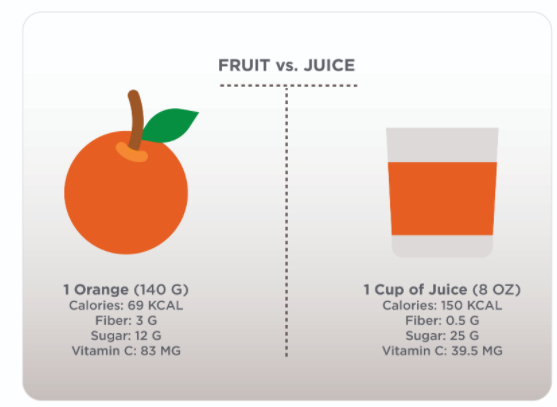
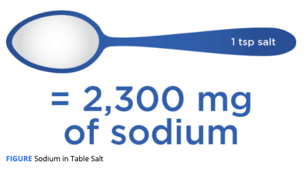

# Dietary Guidelines Foundation

In the United States, the **Department of Health and Human Services \(HHS\)** and the **United States Department of Agriculture \(USDA\)** produce the _**Dietary Guidelines for Americans**_ \(HHS & USDA, 2015\), a document that serves as a resource for health professionals and those involved in policy decisions involving nutrition.

The content of this report is intended to **describe healthy diets** that may help prevent diet-related chronic conditions such as obesity, heart disease, and diabetes.

The _2015–2020 Dietary Guidelines for Americans_ presents the following guidelines:

1. Follow a healthy eating pattern across the lifespan.
2. Focus on variety, nutrient density, and amount.
3. Limit calories from added sugars and saturated fats and reduce sodium intake.
4. Shift to healthier food and beverage choices.
5. Support healthy eating patterns for all.

**The Food and Nutrition Board of the Institute of Medicine** has developed consensus reports for recommended dietary intake. This report presents the **Dietary Reference Intakes \(DRIs\)**, which are a set of recommended intakes of various nutrients 

One set of important recommendations within the DRIs are the **Acceptable Macronutrient Distribution Ranges \(AMDRs\)**, which state the recommended percent of calories that adults should obtain from carbohydrates \(45 to 65%\), fat \(20 to 35%\), and protein \(10 to 35%\) 

**Recommended Dietary Allowance \(RDA\):** The average daily dietary nutrient intake level **sufficient** to **meet** the nutrient requirement of nearly all **\(97 to 98%\) healthy individuals** in a particular life stage and gender group  -- **bottom line** 

**Adequate Intake \(AI\):** The recommended average daily intake level based on **observed** or **experimentally** determined estimates of nutrient intake by groups of apparently healthy people that are **assumed to be adequate** – **The AI is used when an RDA cannot be determined**.  --- **adequate line** 

**Tolerable Upper Intake Level \(UL\):** The **highest average daily nutrient intake level** that is likely to pose no risk of adverse health effects to almost all individuals in the general population – As intake increases above the UL, the potential risk of adverse effects may increase.  **-- upper bound**

**Estimated Average Requirement \(EAR\):** The **average daily nutrient intake level** estimated to meet the requirement of half the healthy individuals in a particular life stage and gender group  **-- average**

**Acceptable Macronutrient Distribution Range \(AMDR\):** The range of intake **for a particular energy source** that is associated with reduced risk of chronic disease while providing intakes of essential nutrients

### Principles of Healthy Eating Patterns

Estimated Calorie Needs From the 2015–2020 Dietary Guidelines for Americans

| **MALES** | **FEMALES** |  |  |  |  |  |  |
| :--- | :--- | :--- | :--- | :--- | :--- | :--- | :--- |
| **Age** | **Sedentary** | **Moderatrly Active** | **Active** | **Age** | **Sedentary** | **Moderatrly Active** | **Active** |
| **18** | 2400 | 2800 | 3200 | **18** | 1800 | 2000 | 2400 |
| **19–20** | 2600 | 2800 | 3000 | **19–20** | 2000 | 2200 | 2400 |
| **21–25** | 2400 | 2800 | 3000 | **21–25** | 2000 | 2200 | 2400 |
| **26–30** | 2400 | 2600 | 3000 | **26–30** | 1800 | 2000 | 2400 |
| **31–35** | 2400 | 2600 | 3000 | **31–35** | 1800 | 2000 | 2200 |
| **36–40** | 2400 | 2600 | 2800 | **36–40** | 1800 | 2000 | 2200 |
| **41–45** | 2200 | 2600 | 2800 | **41–45** | 1800 | 2000 | 2200 |
| **46–50** | 2200 | 2400 | 2800 | **46–50** | 1800 | 2000 | 2200 |
| **51–55** | 2200 | 2400 | 2800 | **51–55** | 1600 | 1800 | 2200 |
| **56–60** | 2200 | 2400 | 2800 | **56–60** | 1600 | 1800 | 2200 |
| **61–65** | 2000 | 2400 | 2600 | **61–65** | 1600 | 1800 | 2000 |
| **66–70** | 2000 | 2200 | 2600 | **66–70** | 1600 | 1800 | 2000 |
| **71–75** | 2000 | 2200 | 2600 | **71–75** | 1600 | 1800 | 2000 |
| **76 and up** | 2000 | 2200 | 2400 | **76 and up** | 1600 | 1800 | 2000 |

While the _Dietary Guidelines for Americans_ provides generic calorie intake recommendations based on sex, age, and approximate activity level, these recommendations do not account for other relevant factors such as body weight and height. A variety of equations have been developed to estimate metabolic rate based on important characteristics of an individual. The following is an example of resting metabolic rate \(RMR\) estimation as well as how this information can be used to prescribe a client’s calorie intake.

**Mifflin-St Jeor Equation**

RMR \(kcal / day\) = \(9.99 X weight \(kg\)\) + \(6.25 X height \(cm\)\) - \(4.92 X age \(y\)\) + \(166 X Sex Factor\) - 161

Where body weight is in kilograms, height is in centimeters, and sex factor = 1 for males and 0 for females.

**Example**

You are estimating the RMR of a 175-pound man who is 6 feet tall and 35 years old.

Start by converting the weight and height to the required metric units.

![](data:image/png;base64,iVBORw0KGgoAAAANSUhEUgAAAXkAAAA8CAYAAACD4cpWAAAAAXNSR0IArs4c6QAAEbpJREFUeAHtXTuW3LYS5by1PDnw0Qr6reDJiSOlztqhlbzMoTMl7dBagiIn1uxAK/BRoNFe+qGAvlUFoAoke/rj6S6e00MSQP0uyFsg+JlpiiUQCAQCgUAgEAgEAoFAIBAIBAKBQCAQOBqB/dNuv5m2+0/7/f5oJTcu+Gk7ETaHX2B1490d4QUC50Ng/2mbiGSz3z3ZhLtPVLxlsgHpWOuaiJ52G0VSRvvNbp9MUptYHARK3yTsAisHoSjWCPxL78R2IADyfnjzIYHxevru3w4m375OfztVVfH2x+nNw8NDVRY7J0Fg8/aH6VVgexIsb1lJkPwt9+6K2PZp/LzbTPuHhzcT0fvSZfspD7qJxKtfGm2mos20+99/DVXbKU3JUHklk/c/v3sI4jIgU0Xfvpb0+trNwKpxbN49AkHyd38IFAAef341fXz7RDsPaTQ/EUXPLpvdZHE4JYzff0upYvN2+sG7EphVHg08BJ6+fE5Vm+n7V16LKA8EAoFAYIAApmymI2+CYs44jfK7ufUyJ1/P0w9ciaoGAVxxxXx8A0zsugjESN6FJiqOReDxTxrF26P8Y3W2ckgkqTwlEkkaXnknf5ieKvKHG8DGjcw5fUy6zU1qT84rb/2jfUm2coP6Pz+/nz7SQP71d+Z8vCVDqlKHuDfRyVYsgUAgcEcICFEIeS4NvzwGOe036bEcS6aM5Df7TZr/T/Xqt9xW1nG4GYCndeiqIT9eeChnMh0Rt6qD3zpheHZ0XBZWnpz2D35PB3+1Ttq2/BcfbXy5XsfFySxIvsU49gOBu0XAIq6lYJTnuH3CLuRVEw6TU+I2IuultqhdsVeShpb1YrDIE/aKLtsHr471OWTt+pcfUU1JzpBjPBRZk4/eVQP8R+LQOGQ5stXogkysA4FA4A4R8AhyDgqQkzeKH8kzWaqpl1F7qhPS60e2EoMkFN2+JULSB5Js/Rc50UXtafFkqE7kejLneBuSF5neltTZSRS+WImD/IklEAgEAoGMgBCkTSYeTBi1ei9QeXJULgRmj6Qt2ZGfUidkiSTkjWoxWu9JHi9+9XiMYhYfPLk+ViZ/Y+TN+oy6giH8TEnFaWPhGGW3jUDceL3t/r1YdESg9NTktP11epcedH+O4b+/flsmjheyrBeuUKde6Pr218eJ7llaNy0pyRweP0/VzXOfj3+WdwcaO0S6dI/ZfWkMPnRysNU/Boln4M0XnQ5+mHXJi/SOw8MfePz18zu6MZu43r43Ql7HEggEAneKAI8YV0ydjEa0S2DUI/mlxITpCas96vTUhTdSJ/94lG/E7MmNRt2kEz60/rEtY7QNW9Z00qiO7OmFfUuhtfZ1u9i+fQRiJH/7fXz2CHkUP/PyE4jHIjDtZDeS1pVqu7wURAPzeuRNCeOv/Jyh/cZt255U8ih/MOp+q97sIhv5ha8k642sPf+mpy/mFYW+mlBh5k3GeOFLUOmzFA9JJrWeps8f/5rie0AtovezHyR/P319tkgf37/LpLX99Rfz2e3W8Ic/H9uiaXp8P73Lcynb6UfrSwiNhBCiMeXx+09FVzN19Op7orxpaqeD6MrlfTaePrfwR2v8acovmKppH9LxLdn48npLm12SoTKZyunjye8RpDbbJtCH9EGH716TdL3khPLTl6mY678nVK685N5DLR17gUAgEAg0CGDEnYpnH2nkqR1j6qFRK89+N1MIPH2x4oUdkamnIzBFYt14FBm5Ecr+O7aJYOmbPvplIrJBUyCwRVcmaIerFLZl4KKnXTq55tHKUk8EDj+K70W/3u6f4NF22r6I/UAgELgzBJiUEgGn0M0fCExDA6JbOu8rpNrYSMq13rltJKLNbtd98tjyE/pM+zO2YSvpyLgg1hqzeiTNMobukRz5CXIu9kRvVa6ShxlT9lVkSW8sgUAgEAi8GASQXEaE/mKCCUcDgUDgdAh0ox5jpHU6a6HpHAhgikN/guAcdkJnILAWAT2NNid7MS6SE0ZfPveXebpdO3qqLz/rS9q5QK9Vj0tfXHpfy4+wux4BPjnUlMV6LSHxEhHgvnemFFNMh6lGue+CODWHSbue69DeW+MqUnTA5mG98ri8GBfBkL7BpIPkOcYEYkvy1E7Xn4o44dOp9Ol4iu71Hax1xPZ1EOBjbeXJdB1vw+opEbAGlEl/fw+puUK3jhlN+haneX6fi+TX+OD5Nixnx40TR4NBgFrOMPiG/NCwUyk2T0/EorvP9o47uTgSwwidy9XxsZpP7tMfH5eLJCytRQA8Y3EQ6SpkXh8TkLGm9+TKYDkXlONveftRjMdy0UinW2dlOjQuIMnnYS2AS+A1uJD/p62501MgS33jg+FESWyp3WgXCAQCgkA+d51zkAmzqcegwJsRwIyBxWtiWbZOSvLpcyDp7Y3LfGtoRPIZhISABwYT4ArSFMguv4VYvU63PELs+jV5q12UBQKBwHUQwHmtyZqJ35mBIE+RBJae2ycl+ea9iHMgN/vGK2XO3z7Yr4fDocef6Z8/W28LooWsGdB8qU1zafVlDyeMQ/0SIrZ1li/y6Q6HF+UjUJuJXlPXB0Gq777zAd1v8oeoUosPb0iNe3OHKmMJBAKByyNwif9Iduqo+IN06h/2gnOSrcwzIw5s2xY+dbiPpzCaSx2M4ik4jGY1cUJu5AjJop0mdWTeNoMK0Y+nfzRBa5/gp7ZFPtAiMim55EulYmNkU2TG/hQL9V+OkRMDEsTcer2t2nLsBQKXReCaxzr4xeIh8IFVRwgxUTbc56FX2sv0dWp31KDP4xUpT3oTsVl+6DZLuU9IWAVagBOyAVidUiVjOuTMO6Fj2lfQhXDrUb7W7QVJbfhgM/wS3QlAVT/Ul75tkr5SksD2/dG+xXYgEAhcFoHCTfb5OUfi4DWPUNtICr8IL1I9c1na1PzYyup94aLab/CXl5SGXIXpH8VtbJOdVJU5eJVJChgSHGRGQYlDIgejAL8NBno1CUMGawBhdQzqWr0ky7qbb5WM/GQZhQX8iHUgEAhcFwGcn9b5Tp4JmdYj46o8NbO4ZE1k4J2lg0H4rXkOOoacCiI3+AjyJhatwbJfE7MmeSZFlRQsQFivcohlCVhDfuho7jR8rMnOmkgeFlCoazuU/TT8gYwJnBX0ZcsOl4p0pRG/wODsx8Blj+4F1jQvec0rzuHzpIygi3x/P87T5ZVrGxb3tHLgFXBR8aMe1bcyczag07TPWe1ActmgImYypsEsRFwngdYh2ofRtFmTkEGmkAfopqOkaDB9IiDYvnm6kVgAOHyhtSej28R2IBAIXB4BHpw1XLXUkzm+WKqH2omuZQkDvEKi/BvwYrHhTx2LfZv7hDjJiLohSYqxFKdIwWEkvQBYBOIRNnRjLY76GY071gBkWMefje11e36OEgp8Hq05eeiOXLTtdNTIWNQFAldE4BrHunDSnohy9TLii7XKhLvmSV7alvNceGZ83o/8HdXlWNhIIs7dNmUWg8AZ0N02AdoTZQtKG0hbb+3POpqE+GAySB5kbfnv6R756clYvkdZIBAIXA6BU5ybzGnpX2ct8RzcYw1ahUfsaWStn31XPArusnRDFvataW7IW9yX5Znk8yjTziasJLVZOj8NGctxmspp9XAQRpLhQJ2ndbK+7Ta/QdbqJVlPt8TeJy7uDJVQSmf2beFfrAOBQOD8CIy4ZYl1TCVbXEHy0K9J0+MQas91irip3Fq4reI5q6yVtfiI2sxxX9ajs5AOShvhoBcEATnLKbG1zVM/aEvrNtDcEQqI3Ibn5CUZ5SCb/9aj9dK216lM8gcizz5gGwnlEDN89w6M1mbsBwKBwOkRaM/ZNRZwDieZ4eOOzHeKf5ifkqzmAOa55qk9zy+LizgmcA1xjxpcki5ps477sh9LAkfQKeZFlzYIUACQGwyeDu0HxaSBhD5atzrRrvjYj7JFr4Cj9SE2Ut0mOXRIrlvYiVp3bN8HAtUxtGIgtAYdPsndk/9wjiliWqP/pbTFOYnzfonfHkF7styfDZbcB8QV+te08/SOuAhxZb1NH0PfWu6D3ItZZ+AdMBl8B5wXE+SRjradn9TkgzDB9eykTLrW6jkyjBctxkRypmMQ+j1yAzF59S8a3Dt3/i64D1nOI5u5+ls9Rji5JSLWJ3dF+k5i1JicSo/WeW/bcyT8XDwKidtXo6QbJO+dI8+1H/LXQWCO2+bqr+P1EVZHB7gQVD9Vc4SpFyWC2DXBIwCQzrKnocozuM/VA9v3uD7nycZJ20nYMg1wf+fArR9rd8N9TFjNQc4Hf8yXd8f6qbA5lZ7OwRsrGJ2Mzw11LoFwH51pqui5/of88QjcFffxgaxveNB2Q/zHw3lbkoKXf4m/JOJT6Vli66W24ZH0GUiWdQ9u6HpE8FLxDL9rBOQcPO6Gb60t9m4GAYz+rJcn1gS5Rg+TTU7EMnXglbd+CKGpg9kgzjl9oqdOcJ6cV976R/uYIqNN/DaHdzS8AYclU2Rr/1JZt8A3ayoNjdFHug3KUpvsp66DHNZt2zLF53ybHEKxDgQCgesh4JHcWo/W6MlEcbiqAmmk3cRRiWQO5SAsK/FYdTKCkYTh2dGxCanOy2n/4Df81Tppe+xjffMbshyDSlZrcJ2bBvJ0SbngD5+w1m2or1BebFJyEPxQF+tAIBD4ByCAk1SfuMe4daweENNmUz9+aZEv+WWRJ/wd+eDVsb5DcoEurF3/Rp9yxctxiqxJnxClPSpH4mj7IvvY6IJ/WDNeg3bcpiFkYOCN4MXvuo9yTMBhYBc+xjoQCAQujABIxTu5l7pzrB5NHq0PQkhCiLp9S4Tkq+eHyIkuxObJUL3I9SNcEGM7kheZ3pbU2aNe+NLqhK+jNWQtXCBnXikcSHooByJPjaALa+DQ9h/qYx0IBAJXQuBUJ+dz9AiR96QndUKWFklp+DBabwlHdPV2MFJPX7voCYw/jeHJrRvZsh/OqJfrU36xpql0rHp7LnmgLRIBkkiJvY8N7WktuvtYqR46R0mC2sUSCAQCF0SAydIYma1x47l6RvJcp6YWQCggKe3riIyQiFo5IVWb6NiHBiexJQkIvsDHNtFQPfyw6iAvPtE8tz13j7ZYe36iHmskwbSfdee1k3AgI/70GI1wgHysA4FA4MIILCWEObdOoWdEiKjTxAySskiS/VFJATF4ciBdb9QMH1p7bMsgSNiyRrajOviKNfu2gOiX6G0JWci7T1TwgdajWEd1WkdsBwKBwIUQ4BPdICdygcjCIqfWvVPp8ciJ9TcvrnntyT8Qsk4KVO7pknJ/tOzZYwJ2R/g9jkyITUzko7ewjNNfJMdkPWiT2+FmsEqCXnzaH47V0A/5FnMtH9uBQCBwQQQKEdojNxCKJnnvJF6rxwpRSLb3xyNslHcj68HcOZOgIjfyh3Rt0zPradNMbJ4cyQIXjRWV02LVlVi3yR5Nk1jTHvSceY8D+sS70iB7IOEWE6rTC9ppQrbKtAxtez4Qfnjmf852qzP2A4FA4AwICGmp+dh0DidT1U8TFwirIgYm1FpupMcKh8kj2dckASK3iE1khCglrp4kya6VTDJBNf9XAO0QP9sajGCpbSfXPIlS6sk3/GP54nvRr7cTnkmhxgr4wyddh+3Sxo4dbWgNXDXWgp3yo4lX2ogNCz9tK7YDgUDgCgjgJE+mK1Kv9+VEJhdBMpp8jtFDutoFo8jNbpdGsbVPI1IT0lEyDTl6tlJ5jh1Ex0Sey+vY4Z+OHXpHctSGcWv0VuWKTM2YGlnY1mv2Yy5+/r/FdYykq+pP5ZNpp8GvxCMJV8vEdiAQCNw5AiCXEaHfOUSz4Z8bw0ziTgLhxOQkhlnno0EgEAjcLgKY4rDmp2836tNGdm4M5xLIXP1pow1tgUAg8KIQiFHg87sL00mYenq+xlpDmYrpp3eoFfefcRO51hJ7gUAgcJcIgKCsm6t3CcgRQY9I+Ah1nQj3UTNdw/cBjKeBOiVREAgEAveJAC71U/TpRqg9WrxPZJZFzUR75vlwtnO44Vr6K/VZQ/zLvI5WgUAgEAgEAoFAIBAIBAKBQCAQCAQCp0Xg/5D+sE/Mi116AAAAAElFTkSuQmCC)

![](data:image/png;base64,iVBORw0KGgoAAAANSUhEUgAAAcMAAAAxCAYAAACmq8J4AAAAAXNSR0IArs4c6QAAEF1JREFUeAHtXb122zoShvZZ4hT35An0BkmaVG5vp5SbZrst06VxynV3W1dpYr+Bn+CeFNd5Fy0G4DcYDDEgJUumZI3OsUmCwPx8M5gBSJAMwX+OgCPgCDgCjoAj4Ag4Ao6AI+AIOAKOgCPgCDgCjoAj4Ag4Ao6AI+AIOAJLInC/CdvIv/7b3NNx2N5vRPlme7/dNsrX25unoTzW2AhakUyqv6R+ztsRcAQcAUfAETAR4ES3vtnGXJaS1tPNOiU/SmJpf0iKsjwlT1UeqEFKnDlhxsbbdUqKJYGagvgJR8ARcAQcAUdgCQQ4WYlESHLk8jLTg2x59rjertdhS3kP5ZxQKfENCTLR4RmiJ0Ng5VtHwBFwBByBE0Igzvm2NzGpRZGqxGaJKOuv4/VQWa8kwzrpxWnicLm0Lpdtfd8RcAQcAUfAEVgMAWtWaAnUS2y432gmSTFbtOh7uSPwL4fAEXAEHIGXRuD3z7vwGJmurz+Gq9VqNcn/9z/hb6q0+RQ+iPo0Y/wnnViH649vKjK/84mw/uOqKvcDR6CFgCfDFipe5gg4AkdF4OkXpcIQ3r2tE5jFlJPnKLE9hURqfR1kLqQk+fMupdtRkrR4ePllI+DJ8LLt79o7Ai+OgJzNjXKbIY2ZPB9+hFtq8+6tmmEOSTK8CzPzrcHZix0BR8ARcAQcgSMhgPt8clUoscoLZeqVpL37hXjcwu8XHslQF0TWZ4YXZGxX1RE4FQTef4qPxcff7dfvAc8XUtL7vLoKd9d/hS/xRiLLivuF6z+Cvvtnzhi5cd6RzyuqU37oCDgCjoAj4Agsh0B5JAJvnmk/AsH11KrQ3owxzzBBN2z1zHE5rZ2zI+AIOAKOgCPgCDgCjsDLI1BGjsMIUY0sX14i53gIBNyuh0Cx0MjP/LVnZaWW7zkCF4QAX46g1xoNf/IG9ygIUZ0zSDC4WX/ul0qa+AtbwWbxYax496W8ropcmB9yVvWlfaneOf1ei12nMD+E7bDQJPLivl3tq1eiWTKBzrn3JUu/Uy3PsbleWNSSVV8ejnWyvTtx+hD+BVna/KflRvuT2sqE2AqUVUDuALyrUscMbJn2mRpEAGk5baxSBzhhF2kvGcAqWqK+YNfdPaa9uozFyddiV6FStXtI2yGJRQa1r+B4RjKUPiN9qRLaDw6KgPSB1iBXMmMbK1tyeahjoKQt7SntvMtkh3OH4C+TYyufSPlPbr+lkBTyGMoVmrWxJN999wvt8WypR/MUAy2c1HKq1ugRDi+dHXqzrRszSdRpbQumh7dXi1+rrMiwm11btE617JC2ywFxf6wK3jmZtvzpVHE8R7k03lGHOIix7YfYYNXB4FUmt0P6V48/+Fiynax9eBRhzBbOTTE2kqFPyxCsoxjhtOq9dFnSxZCJO49xviUrY6NGjK26p1bGsu9g11PT4TnysP4zbffcZJjaR9+6Hz6v5MnwOdabbkvJCxhzPOokw8m4jW9CzowP+/lXkVlriGRsDeR1/SWOR88Z4rmdzaf3bXnwxofGMz/tBguXPv3K70Cc+6qLKO7D5w/GWy2W1WV19WX1+Phl1XyX48O38CW+fWrz33+rN3EsK/PRuO9h16PJMkEYwQzBbaL6yZ2mwPhndK7kWycn3esU6MNtWD3Ghy3PQTsaiOdX39mv17v6I35ZMv5ufzycrEpVMiSl8NJbK3fwy29nvGCXRyu4L6FGNggSEZ10H2NOsGjTzJ9qaY06srz5Jb48ezL4gXZ0xPy7/UDb4R6LfYliqL3o5uFHFHp9E/5jjGFawuF9j/FtydV7HVt1qWzKXuWya31Jxyq3+GAUSSz5T80Ad7Gr5gM7M23ll6iv9S31d708fBWGWADSz97uart9GVKf+f7nl/C4uQ+38Q3Z+9LxdsdF4M3H65DSze2PoBfPEecUH+J27ovRX8q/plDpxQIrrtTlpa/q/tzKFyxPmRq3A79MJj1CLTosoApqRcAiNAskdizeBayxzKVNPJe+ep159HiWNn15hGi8yzrKID5rf3dezDTuAO85gwm021dPC7uUYAbbItmQjyT7qHJ53wLy0JbxE5dyJC3ULbLPt2ui3/jyOfPUfom6QpbCd9pe2Sbwt/ztPsKD5EiYCLrQa+52FzlAM+OYP4wby8ogwxgI1O1K34I9dvE10HoNW/aXCkOJp7U/7TMWPqXPFTu06sI2cVAchzBlNTnLrHy8RYPK9vEvxGHLLyzZTBkal3VBg/pR2h/0keVWvMkYZPwQL7v3MBm0SUPbhmVG2iCN4JKBn/4AZzHO+EOgLLPiV9OODirOd+md4QdBsyP2O4p2OjgvArQ+bx3P6ZiZdueL5I1O2feb2t+KDDvY1fI/o1x2MIlF8jfhS/Kc3N8+PcWANHzANup7v1lvN/Ev1ql8UbaZu7+P7XI/UThC9yhTyw9gE3kOuFhBb64OXm8+AsXfp/t4qVsnZWnDKc77+Bf8QsZZyQc0rYGwrAu/07Ryee3D1G4y3lCfiwCAR8GogycEthy9l3iIUUkyY4EBlqZtKQ7BE12MEoRCOA+ZNN3Ujjt7LU9PTpanwQs8T2kLeVv6W3JatrDqy3Lw046KOgXb2gHpPGwlHTOVI2kYQRm0sWUZ1OKRwnu+vS0sUK5lhQy7bFlvJe8uNFAXcu1ib7RtbYtsdWBgLFU/ODT/lkxeViMwK3jHJmxLNVhDXLf6rOS2r32LjHW/r8qjiFP9if1ubiwQsUP3CcZDXf0oMtU+zzgUIepAwhXiDoCyFOIgJTpQoRuBUEYi2hBYKwK+sn0ky9kd5yFT75yWl+VsyAN6ljzgeypbjIpu4nWROTJN4T1FY6p9z9HQKbWtevZoyQMbzbUr09/FL/kKQdtvW3LpMsYi+tlNXB24ubnZxvs6zVmYbts6nsK+1WaqzOpfGeNxLAD26B9kU23PgWeeBVMAPK+/Kche/Dz7kQrqUhD2caMO+p7uMxWNYdIB28pzc/alL8X6g91zwgH/KdqsRyM2t2ToYWPxRD8ysegRhRAgbjh/SZYMxABIR7Epmj25CvjjTksyW7R7YFhtgMEpbdlxRJDvybdr/RatKXwsHj1b6QDb4ivLLBksu4J+pFEH5o5fEr/ie7ndVEeWMmZZil+SzOg3Sf4J3pJWkgVXOWbaWre3jotdyrJ4rXdsW+OmjqGXxcPLn4dAsYcxk4nk2ccN/+C+Yfid1W+fJ3luXXys9AeLLvSY29csuXs8J3lMgsUjZVshK0hZiheBbSOzsg0jds/x9HlM25JzjtNZulA5Y6iCBZ3q/9mYEl3rl/WY15axMjqLxUOWz7GX5WjMv2FHyx6SN/Z7Mlh0rHLQnNpKu87tpJImZN6nLdFh7J5hOymP3IdsxGaOfJZ9Jc3XvC99gTCb/zevn7awmxOX4OOWDYvc43h4TP8ifZh+o+9rfaHH3AGW5Y+MmeJZ/H1sD360YvKRCXxTzPhyNDGZeixDKx5+/wx38dm40HtmcXiebNQ2Fjx8i0u+6cToK9exzKDdlRM69uQhfsZv9eGWlp7v8fe4qr7fZtCXxeRgX+kRkBmPRZDOaXl8fPTi6X/jZy/IAWc5n4GplAvPqb7TnxeHHZWtuvaQhLFvyGDRscpBbs6W7BrxTkvXH+9+8vf35rTNdfDV9fktUPMQtkMgnLLxyGYQwreMwEv2cWa6w87jr6d+bRXbDuFffYaI0+tw81f/Geh9+qoZb/A8vIo3cQ4dfuWkEXSISnqQEDfrPMqxOgwysHmdNVLqZXVqr0ct6KQ9mtaoItHbbNI9GE2XlLJo84ihcW29xStjMx5NJeAW/NfDWouVbTceCVE96GzZXdKyMEWdHrY9ea1zGftabkuGfXlrv8x0ap4Sp9Z9b+h/jO2utgOWsk9ZmCW9sDit0R9a+mR55s0iW+29bHcEer4Namxjw47wCx0rd/Uv4gda0scgh97u6i+greNRMxbw1cpxfLb4Mk6RgZY1HSMgxoNRwqIKMln2ggHTEVPT0nazvYnLzRPD4Z8WLCmghCyOUAIU1SOjQmENHJHHOW18pjfImGTAPu7LDA4F2TUNqcMS+1qHngxcN5ox1jP/WhhqulP2atkfNKSTA1fwZLqV3+RHbjT2z7JrRR8DwNovWQflh1J+6HTs7T62g5wyUDG+qn+zrjuscm3RPzYOl05f2g99poUJ20b4OdVDn9Gxex//InrMR/UROocf+ng8nnfVaWjIugodIKeOBey/oi74Q0aNF9MfZE/YQA8+KQKlZCqVIsXSX4M5hGABUbcDhqYt+YIebTVN1MsKj0cFhW5JoJIegCLSMmhQHXacJH+7vaS1xD5kBA49GVA31jETYbzWGgcq06tRC66ZlubPvgTnEoLVNhzz47Ys52HtWvPP8uuOQuKi443xGsss1DvK7j62Y99WNjD1UvUsRZrtO3HAorNE+Uj2mTovISt4tvw1nqv6cNN/eUA/XXcf/yL5LB+jc7If6/hA5+f8JI1YP+o8jgVEh+spexZ7j9tNxbA58i1SJ4GuFIUgrPCZdEjI7VtHwBFYBgEE8X2D9DJSO9eLRwCjltboh8CZOn/xADoAjsAJIXAKiSjL8PIz/BMyg4vSQYBXk3bqLHIqrxJah9YLw2lW+I0+0RA2wfq4xiJCO1NHwBEYIUCXprDS/Prjm9H5lygoMrxrryJ8CSGchyOwDwLm9WC+Ju4jvH1w9TaOwCUiwPfgjNsul4iJ63xGCLADqxvHetHLGankojoCjsACCGBw7fcLFwDfWToCjoAjcMkI8CK3YTCrExESVMSoWjFolVtY4n5kpjOsolQzwLzGIF9NOtsVhRYAXu4IOAKOgCNw2giUhFjf1kjJaUhYcjFcSmyq3LoSxElTrCiXtIBMSX5xqX26zYKkiM/H1bKhnW8dAUfAEXAEHIGDIFCS4fiZLzDAKs91fAtWzIP0LF36cbJTszw6ybdQRCIs5XVyKzLEWaOoX5JkzTcx93+OgCPgCDgCjsChELCSFujLhKRngFYylG1k8gRNvWUZ1MslCp06eer2fuwIOAKOgCPgCDwLASQ0fb8QRMusbTxzxL1AnfA4uYlZHui1trh0Okq2WJk+k06Ltpe9HgRO9jnD1wOxa+IIXC4CDz/o0yr0YRnj+UJ8KWbzKXxYreiLL+lHszY8m6ifNf798y59rWZ9/TFciTZoq7f4ssFGP5RsfElFt/djR8ARcAQcAUdgbwTKZcjxrA9EMWvTM8fe7M+aMYKm3PZk2IWOpOn7rxMBnxm+Tru6Vo7A8ggY356UgmHWNpo5GrO23oxR0uV9Q4ad6TBB33mtCHgyfK2Wdb0cgaURMBIaxKL7hfkq6vi1iri8qi9trlZXq7fviMJj0N+xzbNAtRjGlGHiI68Q0rcXg4Anw4sxtSvqCCyLQLokKh+TwP1C9fV1LSUudWIhzftPm1Tl9uv3EL88lh7FoMT6eXUV7q7/Cl/ijUTQ+J1vPIa1vvGICgPvtNDHF9IAFd86Ao6AI+AIHAoBJLFIjxLW6MPhWGmqV3kSf75nmNqq2R6dv98kmrSb/8b3JQv/cfvYpnyXj2jIJE0n/ecIOAKOgCPgCDgCjsClIfB/JiFWLwUALgUAAAAASUVORK5CYII=)

Now, you can complete the calculation:

RMR \(kcal / day\) = \(9.99 X 795kg\) + \(6.25 X 182.9cm\) - \(4.92 X 35\) + \(166 X 1\) - 161

**RMR \(kcal / day\) = 1,770 kcal / day**

The RMR represents an estimate of the calories that are used by this individual’s body simply to keep physiological processes running over the course of a day. Any physical activity or exercise would increase the number of calories used each day. A way to get a big picture of the physical-activity level of a participant is to multiply the RMR by an appropriate activity factor, as shown in the following table.

**Physical Activity at Work/School and Physical Activity in Leisure Time\* Activity Factor**

Very Light – Sitting at a desk for most of the day

* Very Light 1.4
* Light 1.5
* Moderate 1.6 
* Active   1.7
* Very Active 1.8

Light – Industrial work, sales, or office work that involves light activities         

* Very Light 1.5
* Light 1.6
* Moderate 1.7
* Active 1.8
* Very Active 2.0

Moderate - Cleaning, kitchen staff, delivering mail on foot, etc.  

* Very Light 1.6
* Light 1.7
* Moderate 1.8
* Active 1.9
* Very Active 2.0

Heavy - Heavy industrial work, construction work, or farming.

* Very Light 1.7
* Light 1.8
* Moderate 1.9
* Active 2.1
* Very Active 2.3

_\*_Definitions: very light \(almost no activity at all\), light \(walking, non-strenuous cycling or gardening approximately once a week\), moderate \(regular activity at least once a week, e.g., walking, bicycling or gardening\), active \(regular activities more than once a week, e.g., intense walking, bicycling or sports\), very active \(strenuous activities several times a week\).

### Foods to Emphasize

#### Variety of Vegetables

It is important to limit the amount of butter or creamy sauces added to vegetables.

#### Fruits

Although 100% fruit juice can contribute to meeting fruit intake goals, it does not provide the **fiber** found in whole fruits.

To get clients thinking about the importance of eating a variety of different types of vegetables and fruits, you can advise them to “**eat the rainbow**,” meaning they should try to eat a variety of different colors of plants. The colors of vegetables and fruits can actually indicate some of the beneficial compounds they contain; so eating several different colors can be helpful when trying to consume the full spectrum of beneficial nutrients found in these foods.

#### Grains

Whole-grain products include whole-wheat bread, whole-grain **cereals** and **pastas**, **oatmeal**, **brown rice**, and **quinoa**.

Refined-grain products include most white breads, **refined-grain cereals and pastas,** and **white rice.**

For example, a product label might state “made with whole grains,” even when the food only contains very-small amounts of whole grains.Some products will have stamps that specifically identify them as containing 100% whole grains or 50%+ whole grains.

#### Dairy

Many dairy products are also fortified with vitamin D because this vitamin enhances calcium absorption in the intestines.

Dairy products, such as milk, yogurt, and cheese, can help provide important nutrients.

The guidelines recommend consuming low-fat or nonfat dairy to alleviate the concern of extra calories in full-fat dairy products.

In these cases, or for those who follow a plant-based diet, fortified soy products may be a suitable alternative due to their similar profile of nutrients.

For example, although soy milk provides a similar amount of protein when compared to dairy milk, almond milk provides substantially less protein.

#### Animal and Plant Protein Sources

Soy protein is the highest-quality, plant-based protein and exhibits a protein quality similar to many animal products.

### Foods to Limit

#### Trans Fats

Trans fats are a particular type of fatty acid that are found in small quantities in nature and are also produced through a food manufacturing process called hydrogenation.

Research has demonstrated that increased intake of trans fats raises LDL cholesterol and increases the risk for heart disease.

#### Saturated Fats

Saturated fats are fats that contain a large proportion of saturated fatty acids

These fats are often solid at room temperature. Major sources of saturated fat include cheese, meat, and solid fats.

research demonstrating that replacing saturated fats with unsaturated fats lowers blood cholesterol and reduces risk of heart attacks and deaths related to heart disease

#### Added Sugar ****

added sugars typically do not provide additional nutrients.

foods with added sugars often have relatively low nutrient density.

Typically, individuals find it much easier to overeat foods with added sugars as compared to less-processed whole foods that contain sugar such as fruit.

#### Sodium

it is recommended that adults consume no more than 2,300 milligrams/day of sodium

sodium intake value “does not apply to highly active individuals”,who perform long-duration exercise and sweat substantially may need additional dietary sodium to replace losses due to sweating.

