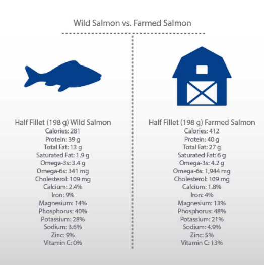

# Disparities Between Guidelines and Intake

What We Eat in America Survey Results Summary

| Based on recent data from this survey, the guidelines __emphasize the following concerns: |
| :--- |
| 1\) About 3/4 of the population has an eating pattern that is low in vegetables, fruits, dairy, and oils. |
| 2\) More than half of the population is meeting or exceeding total grain and protein foods recommendations but are not meeting the recommendations for the subgroups \(i.e., whole grains and seafood\) within each of these food groups. |
| 3\) Most Americans exceed the recommendations for added sugars, saturated fats, and sodium. |
| 4\) The eating patterns of many are too high in calories, as demonstrated by the high percentage of the population that is overweight or obese. |

simple substitutions : These include exchanging **high-calorie snacks for nutrient-dense snacks,** trading **fruit products with added sugar for real fruit,** shifting from r**efined grains** to **whole grains**, replacing **snacks** with **added sugars** with **unsalted snacks**, trading **butter** for **oils**, and consuming **no-sugar-added beverages** instead of those with added sugars.

In order to promote the intake of a diverse spectrum of protein-containing foods, **it is recommended that seafood \(such as salmon or tuna\)** is utilized as a main protein source twice per week.

However, not all seafood is created equal.

### Questioning Current Guidelines

they are not perfect and will likely change over time. Some recommendations have solid scientific backing but the evidence for other recommendations is limited.

**Nutritional Guideline Controversies** on the previous page is certainly not exhaustive, it demonstrates the point that the science of nutrition is a young and evolving field and better answers are being found as science progresses. 

As a Nutrition Coach, realize that many nutrition issues are not clear-cut and that recommendations may change over time.

While staying up-to-date with current research is certainly recommended, helping your clients improve their health and wellness does not require you to know every detail of the current controversies in nutrition.

With that said, it is important to remember that the current nutrition guidelines are established based on substantial amounts of research and the interpretation of research by committees of experts.

