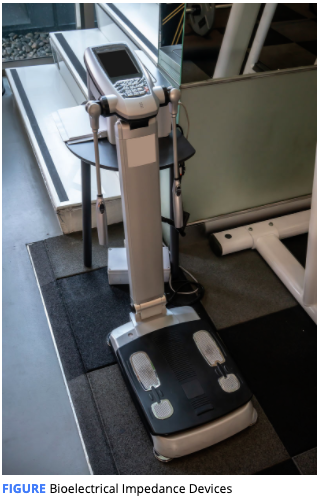
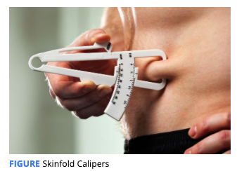
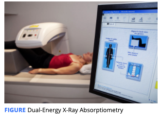

# Monitoring Body Composition

**Body composition** refers to all the separate compartments making up the human body. The composition of the body is one of several important factors to consider when evaluating an individual’s health and wellness. 

All methods of body composition attempt to divide the body into separate parts that have importance for the health and proper functioning of the body.

**Body mass index \(BMI\)**, which is calculated as an individual’s weight in kilograms divided by their height in meters squared, is another commonly used metric that considers all body weight equal

 **2-compartment models**  typically, these parts are fat mass and fat-free mass.

 **3-compartment model**  typically, these parts are fat mass, water, and everything

**4-Compartment Model**  these parts are fat mass, water, bone, and everything else

Body volume can be obtained by underwater weighing or air displacement plethysmography \(ADP\); water can be estimated by bioelectrical impedance analysis \(BIA\) and bone can be estimated using dual-energy X-ray absorptiometry \(DXA\).

While the 4-compartment model boasts impressive accuracy, it is typically unavailable outside of research environments.

#### Bioelectrical Impedance Analysis \(BIA\)

**Bioelectrical impedance analysis** **\(BIA\)** is a technology that estimates body composition by calculating the fluid content of an individual’s body using small currents of electricity. produces a 2-compartment model to split the body into fat mass and fat-free mass. **inexpensive**

These include **bioelectrical impedance spectroscopy \(BIS\)** and **electrical impedance myography** \(EIM\). While these devices have traditionally not been commonly available to the general population, some affordable devices are now being produced and marketed to individual consumers.

#### Skinfolds

The **skinfold method** is based on estimating the thickness of the fat layer under an individual’s skin. 

Additionally, measuring the thickness of the fat layer at specific locations can be used to get a general idea of **whether body-fat loss is occurring at a particular location. However, need some skills.** 

#### Ultrasound

**Ultrasound technology** uses high-frequency sound waves emitted by a probe to visualize different parts of the body.

In body-composition assessment, ultrasound can be used to determine the size or quality of a muscle as well as the thickness of the fat layer under the skin.

advanced version of **skinfold** calipers.

ultrasounds are most common in medical and research settings, some portable ultrasound transducers are becoming more affordable. As such, this method may become more available at health-and-fitness facilities in coming years.

#### Circumferences

Body shape varies between people and the shape of an individual’s body can provide some information about the distribution of fat and muscle. A simple way to obtain some information about body shape is to measure the circumference of certain body segments.

While this method may not be as accurate as some more advanced techniques, it may be a good choice when resources and equipment are limited.

#### Underwater Weighing

**Underwater weighing**, also known as hydrodensitometry or hydrostatic weighing, is a 2-compartment method that predicts body composition based on the overall **density** of the body.

This method involves the estimation of the 3-dimensional volume of the body through the measurement of an individual’s body weight while they are completely **submerged** under water.

When the individual’s body weight is divided by their body’s volume, the body density can be found.

#### Air Displacement Plethysmography

The technique of **air displacement plethysmography \(ADP\)** exhibits similarities to underwater weighing without the necessity for a client to be submerged. Instead of the displacement of water, the displacement of **air** is evaluated. 

During the assessment, the client sits inside the **chamber** while the device produces small changes in air pressure within the chamber. Based on the relationship between pressure and volume, the body volume of an individual is estimated.

#### Dual-Energy X-Ray Absorptiometry

During an assessment, the individual being evaluated lies on a DXA scanning table for less than 10 minutes while X-rays are passed through the body. The amount of radiation from a DXA scan is very low and is estimated to be about the same amount received during 3 hours of a normal life.

Performing these comparisons allows DXA to produce two different 2-compartment model comparisons: **bone vs. non-bone and non-bone lean mass vs. fat mass.**

DXA ultimately provides three body compartments \(**bone, fat, and non-bone lean mass**\) and is viewed by some as a 3-compartment model.

his can allow for determining the **distribution** of an individual’s body **fat**, which can impact disease risk, as well as evaluating where body composition changes are occurring within the body. DXA is typically only available in **medical** and **research** settings

Water is the most prevalent substance in the body. A 4-compartment model is more accurate than DXA because it specifically includes water as one of its compartments whereas **DXA does not asses**s water.

#### Infrared 3-Dimensional Scanning

Several such devices are commercially available and each operates using similar principles. Using infrared light sensors, a 3-dimensional model of an individual’s body can be produced.

they can represent an automated method of obtaining circumference estimates to use in body-fat equations \(as in traditional circumference methods\) or the volume of the body could potentially be used to predict body composition \(as in underwater weighing and air displacement plethysmography\).

Body Composition Assessment Method Comparison

<table>
  <thead>
    <tr>
      <th style="text-align:left"><b>Method(s)</b>
      </th>
      <th style="text-align:left"><b>Accuracy*</b>
      </th>
      <th style="text-align:left"><b>Pros</b>
      </th>
      <th style="text-align:left"><b>Cons</b>
      </th>
    </tr>
  </thead>
  <tbody>
    <tr>
      <td style="text-align:left"><b>Bioelectrical impedance analysis (BIA), bioimpedance spectroscopy (BIS), and electrical impedance myography (EIM)</b>
      </td>
      <td style="text-align:left">3&#x2013;4 (depends on model)</td>
      <td style="text-align:left">
        <ul>
          <li>Simple and quick</li>
          <li>Affordable (some models)</li>
          <li>Portable (some models)</li>
        </ul>
      </td>
      <td style="text-align:left">
        <ul>
          <li>Limited availability (some devices)</li>
          <li>Variable accuracy</li>
        </ul>
      </td>
    </tr>
    <tr>
      <td style="text-align:left"><b>Skinfolds</b>
      </td>
      <td style="text-align:left">3&#x2013;4 (depends on assessor)</td>
      <td style="text-align:left">
        <ul>
          <li>Affordable</li>
          <li>Fairly simple and quick</li>
          <li>Portable</li>
          <li>Provides regional information</li>
        </ul>
      </td>
      <td style="text-align:left">
        <ul>
          <li>Less accurate</li>
          <li>Unpleasant for some individuals</li>
        </ul>
      </td>
    </tr>
    <tr>
      <td style="text-align:left"><b>Ultrasound</b>
      </td>
      <td style="text-align:left">3</td>
      <td style="text-align:left">
        <ul>
          <li>Fairly simple and quick</li>
          <li>Provides regional information</li>
        </ul>
      </td>
      <td style="text-align:left">
        <ul>
          <li>Limited availability</li>
        </ul>
      </td>
    </tr>
    <tr>
      <td style="text-align:left"><b>Circumferences</b>
      </td>
      <td style="text-align:left">4</td>
      <td style="text-align:left">
        <ul>
          <li>Affordable</li>
          <li>Simple and quick</li>
          <li>Portable</li>
          <li>Provides limited regional information</li>
        </ul>
      </td>
      <td style="text-align:left">
        <ul>
          <li>Less accurate</li>
        </ul>
      </td>
    </tr>
    <tr>
      <td style="text-align:left"><b>Underwater weighing (hydrodensitometry)</b>
      </td>
      <td style="text-align:left">2</td>
      <td style="text-align:left">
        <ul>
          <li>Accuracy</li>
        </ul>
      </td>
      <td style="text-align:left">
        <ul>
          <li>Limited availability</li>
          <li>Expensive</li>
          <li>Not portable</li>
          <li>Unpleasant for some individuals</li>
        </ul>
      </td>
    </tr>
    <tr>
      <td style="text-align:left"><b>Air displacement plethysmography</b>
      </td>
      <td style="text-align:left">2</td>
      <td style="text-align:left">
        <ul>
          <li>Accuracy</li>
          <li>Fairly simple</li>
        </ul>
      </td>
      <td style="text-align:left">
        <ul>
          <li>Limited availability</li>
          <li>Expensive</li>
          <li>Not portable</li>
        </ul>
      </td>
    </tr>
    <tr>
      <td style="text-align:left"><b>Dual-energy X-ray absorptiometry</b>
      </td>
      <td style="text-align:left">1</td>
      <td style="text-align:left">
        <ul>
          <li>Accuracy</li>
          <li>Quick</li>
          <li>Provides regional information</li>
          <li>Provides bone density</li>
        </ul>
      </td>
      <td style="text-align:left">
        <ul>
          <li>Very-limited availability</li>
          <li>Expensive</li>
          <li>Not portable</li>
          <li>Small amount of radiation</li>
        </ul>
      </td>
    </tr>
    <tr>
      <td style="text-align:left"><b>Infrared 3-dimensional scanning</b>
      </td>
      <td style="text-align:left">N/A</td>
      <td style="text-align:left">
        <ul>
          <li>Simple and quick</li>
          <li>Visualization of body shape</li>
        </ul>
      </td>
      <td style="text-align:left">
        <ul>
          <li>Not portable</li>
          <li>Limited information on accuracy</li>
        </ul>
      </td>
    </tr>
  </tbody>
</table>

