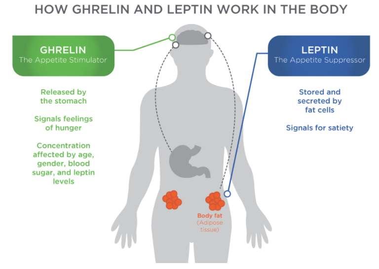
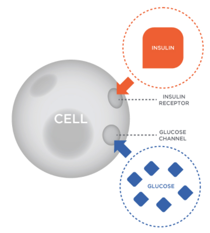
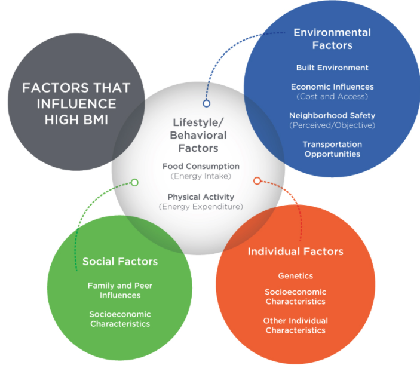
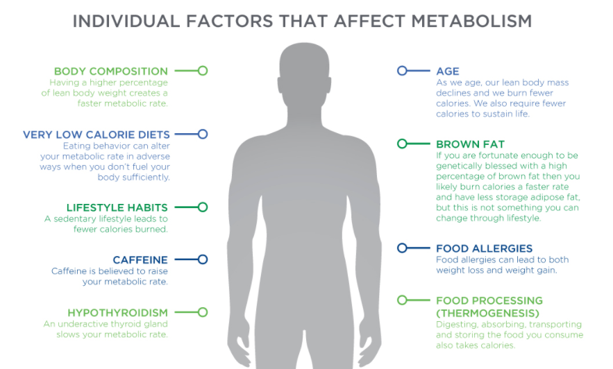

# Components of Energy In

## Appetite affects energy intake. 

factors that influence appetite

* Food in the stomach
* Leptin and ghrelin production
* Social factors
* Activity level    

### **Hormones** 

act on specific centers in the brain that affect the sensations of **hunger** and **fullness**, or **satiety**

### Leptin

_Leptin_ is a hormone produced by adipose cells that **decreases appetite** when released. 

Leptin is supposed to tell the brain that we have reached a state of desired caloric intake and how many calories are stored

Larger bodies \(e.g., those with higher BMI\) will have larger quantities of leptin**,** leptin resistance may play some role in common obesity.

### _**Ghrelin**_ 

is a hormone that is produced and released primarily by the stomach, with small amounts also released by the small intestine, pancreas, and brain.

### _**CCK** \(Cholecystokinin\)_ 

is a hormone released in the gastrointestinal system and is responsible for stimulating the digestion of fat and protein. 

CCK is secreted by cells of the upper small intestine.

### _NPY \(Neuropeptide Y\)_ 

is a neuropeptide hormone linked to the autonomic nervous system.

NPY is a specialized hormone produced in a part of the **brain** called the **hypothalamus**. NPY helps stimulate the sympathetic nervous system, which **stimulates appetite and fat storage**

### _Insulin_

is a hormone produced by the pancreas that is released when blood glucose levels are high, promoting the uptake of glucose for fuel or storage as glycogen. 

### _Glucagon_ 

**i**s a hormone that is released when blood sugars decrease below a certain threshold.

## Environmental Factors

Food intake is controlled by a number of biological and external factors, including **cultural and psychological influences, social-economic background, education, past experiences, portion size, and food palatability**

## Psychological Factors

Psychological distress may alter eating behaviors, resulting in the intake of energy-dense diets

Emotional eating \(or stress eating\) is using food to make yourself feel better—eating to satisfy emotional needs rather than to satisfy physical hunger.

**Practicing Mindful Eating**

* **Eat When Hungry:** No matter how powerless you feel over food and your feelings, it is possible to make a positive change.
* **Do Not Let Emotions Control Eating:** You can find healthier ways to deal with your emotions, learn to eat mindfully instead of mindlessly, regain control of your weight, and, finally, put a stop to emotional eating.
* **Engage All Six Senses:** As you serve and eat your meal, notice the sounds, colors, smells, and textures, as well as your mind’s response to them, not just the taste.
* **Modest Portions:** Moderation is an essential component of mindful eating.
* **Savor Small Bites:** Enjoy each bite.
* **Eat Slow:** Eating slowly may help you notice when you are feeling pleasantly satisfied so that you can stop before you have eaten too much.
* **Chew Thoroughly:** Take time to chew each bite thoroughly. 
* **Do Not Skip Meals:** Skipping meals can make it harder to make mindful choices.

### Individual Variation

there are different rates of absorption of nutrients from food across individuals as well.  ****Some foods require significant **enzymes** to break them down, which may or may **not be present** in the digestive tract of all individuals.

The bacterial cells in the human **gastrointestinal tract** \(GIT\) influence the rate of digestion and metabolism. Imbalance of the normal gut microbes can cause gastrointestinal conditions such as **inflammatory bowel disease** \(IBD\) and **irritable bowel syndrome** \(IBS\).

## Food Processing

Food processing changes the physical and chemical nature of the food we eat.

For example, eating 100 grams of peanuts versus 100 grams of peanut butter will result in differences in caloric density and energy absorbed.

