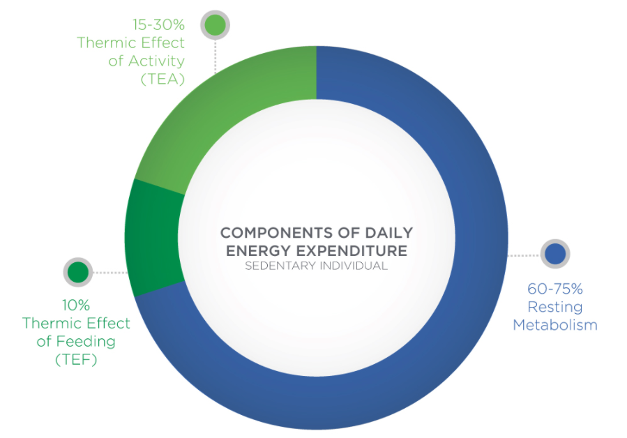
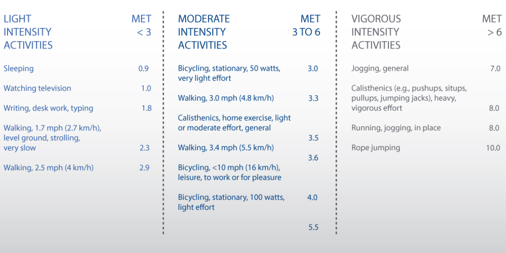

# Components of Energy Out

**The Energy out can be categorized into 4 groups:**

* Resting Metabolic Rate \(RMR\)
* The Thermic Effect of Feeding \(TEF\)
* The Thermic Effect of Activity \(TEA\)
* Non-Exercising Activity Thermogenesis \(NEAT\) 

## Resting Metabolic Rate

Resting metabolic rate \(RMR\) refers to the total number of calories burned when the body is completely at rest.

* breathing
* circulating blood
* organ functions
* basic neurological functions 

Factors :

* High resting metabolic rates 
  * lean body mass
  * high production of thyroid hormones
  * others
* low thyroid production
  * fat -&gt; decreases approximately 0.01 kcal\min for each 1% increase in body fatness.
  * age -&gt; RMR also declines with age: 2% and 3% per decade for men and women,

### **Metabolic Equivalent \(MET\)**

One MET is often used to describe RMR and energy expenditure.

One Metabolic Equivalent \(MET\) = 3.5 ml O2 / Kg/min.

## The Thermic Effect of Feeding \(TEF\)

The thermic effect of food \(TEF\) represents the increase in energy expenditure after consuming a meal.

Approximately 10% of daily energy expenditure is accounted for by the process of consuming, digesting and utilising food

Simple carbohydrates and fats have relatively lower thermic effects of energy compared to protein

## The Thermic Effect of Activity \(TEA\)

Spontaneous physical activity and planned sustained exercise can account for up to 15 to 30% of daily energy expenditure

## Non-Exercising Activity Thermogenesis \(NEAT\) 

NEAT is the energy expended for everything we do that is not sleeping, eating or exercising.

It is the energy we consume during daily activities, including walking at work, typing, walking to and from meetings and fidgeting.

  

## **Factors:** 

### Sleep

The effect of sleep deprivation or restriction on energy metabolism and weight gain is not well understood

**But**  inadequate sleep \(rest\) may result in a reduced RMR,  increase in energy intake above normal levels the following day.

ursing normal sleep patterns, metabolic rate reduces by around 15% and reaches a minimum in the morning 

### Hormones

Hormones are the chemical messengers helping the different parts of your body communicate with each other. They are transported in the blood to specific cells or tissues to help regulate body functions.

#### Thyroid Hormones

Thyroid hormones \(TH\) help regulate metabolism and also control essential steps involved in growth and development. It increases oxygen consumption and rates of ATP breakdown

Thyroid hormones stimulate both **lipogenesis** and **lipolysis**; 

increasing insulin-dependent entry of glucose into cells and **glycogenolysis** to break down glycogen for energy during exercise and recovery.

Hyperthyroidism, or excess TH, creates a condition characterised by **increased** resting energy expenditure, weight loss, **reduced** cholesterol levels, increased lipolysis and **gluconeogenesis**

**lipogenesis:**The biological process of combining free fatty acids with glycerol to form triglycerides.

**Lipolysis**: The biological process of breaking stored triglycerides into free fatty acids and glycerol.

**glycogenolysis:** The process of breaking down the glycogen molecule into its individual glucose units for entry into the energy pathways.

**gluconeogenesis:** A metabolic pathway that results in the generation of glucose from **non-carbohydrate carbon substrates** such as lactate, glycerol and glucogenic amino acids.

#### Cortisol

Cortisol is produced by the adrenal glands and is released in response to stress.

Cortisol is released during periods of stress and leads to an increase in heart rate, blood pressure and elevated glucose levels.

Cortisol works to quickly increase blood glucose levels and works against insulin to try and keep glucose levels elevated by stimulating a process called gluconeogenesis.

#### Testosterone

Testosterone is a hormone that plays a key role in carbohydrate, fat and protein metabolism.It has a major influence on body-fat composition and muscle mass in men.

Testosterone deficiency is associated with an increased fat mass \(central adiposity in particular\), reduced insulin sensitivity and impaired glucose tolerance, which may be related to diabetes and risk for heart disease

