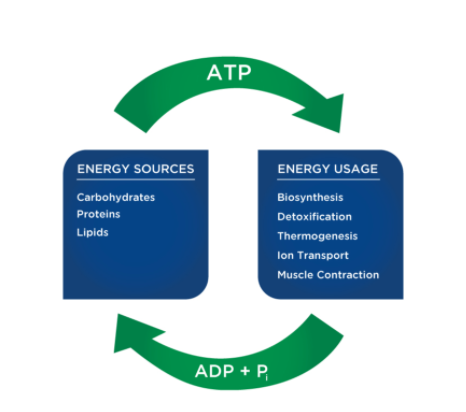
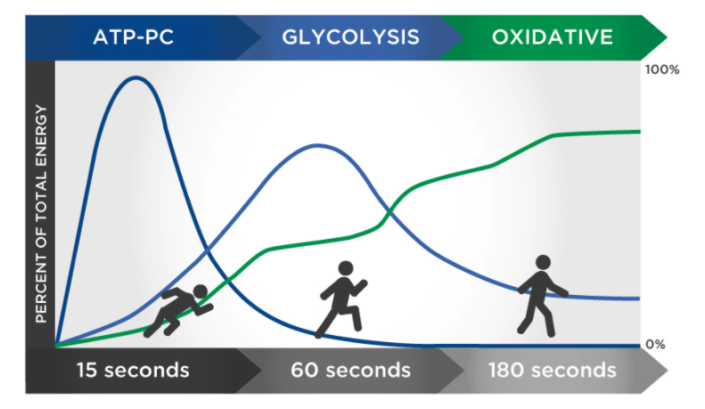
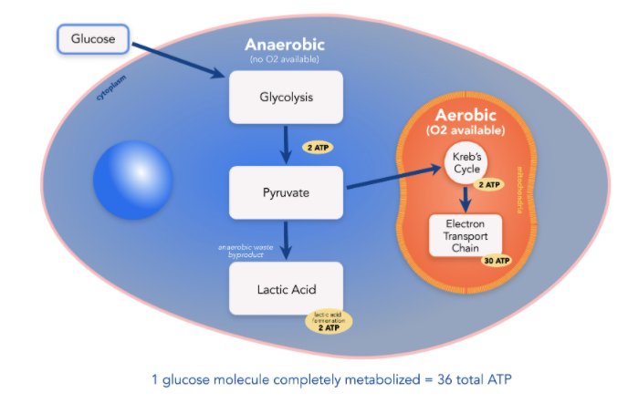
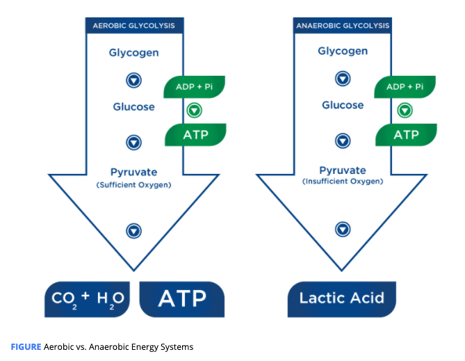

# Metabolic Energy Systems

Food is made up of carbohydrates, fats, and proteins, and these nutrients are broken down into their simplest forms \(glucose, fatty acids, and amino acids\) during digestion.

The human body can only store approximately 80 to 100 grams of ATP, which is only enough energy for a few seconds of high-intensity activity.

### ATP-PC System

ATP-PC stands for adenosine triphosphate-phosphocreatine.

Energy released from the breakdown of phosphocreatine, uses the phosphate molecule to produce more ATP.

The ATP-PC system is the quickest way to resynthesize ATP

* It is the primary energy system used for all-out exercise.
* It can last up to about 10 seconds.
* A limited amount of PC is stored in skeletal muscle.
* Fatigue happens very quickly with this system.
* Creatine kinase is the enzyme that breaks down phosphocreatine \(PC\) into creatine and an inorganic phosphate \(Pi\).
* The energy released in the breakdown of PC allows ADP and Pi to form more ATP. 
* PC stores are replenished after about 2 minutes of rest.
* If activity continues at a high intensity, other energy systems will be called on.

### Anaerobic \(Glycolytic\) Energy System

 **Glycolysis** means the breakdown \(-lysis\) of glucose through a series of enzymatic reactions. Glycolysis uses glucose in the blood or glycogen to form ATP rapidly without oxygen. 

If glucose is used, two ATPs are generated.

If glycogen is used, three ATPs are formed.

Pyruvate is either transported and used to support further energy production in the Krebs cycle or converted into lactic acid \(lactate + hydrogen ion\).

If lactic acid becomes the end product, it is called anaerobic glycolysis.

If pyruvate is used further in the Krebs cycle, it becomes part of aerobic glycolysis or aerobic respiration.

The availability of the oxygen determines the fate of the end product for glycolysis.

During short bouts of high-intensity exercise \(anaerobic metabolism\), pyruvate will be converted to lactate. Lactate is an energy substrate that is used to support metabolism during high-intensity exercise.

The lactate is then quickly removed from the muscle cell, protecting the cell from becoming too acidic so exercise can continue for a little longer. The conversion of pyruvate to lactate prevents the muscle from becoming too acidic.

### Aerobic Energy System

The fuel comes from a combination of fat and carbohydrates. carbohydrates first then fat.

The Krebs Cycle : 

The aerobic system also includes the Krebs cycle **and the electron transport chain. Both use blood glucose, glycogen, plasma-free fatty acids, or intramuscular triglycerides as fuels** to resynthesize ATP in the mitochondria.

**Glucose and glycogen** are **first** **metabolized** through glycolysis with the result being **pyruvate**.

**Pyruvate** is used to form acetyl-CoA, which enters the Krebs cycle.

The electrons produced in the Krebs cycle are then transported through the electron transport chain where ATP and water are produced.

Complete oxidation of glucose via glycolysis, the Krebs cycle, and the electron transport chain produces around 36 molecules of ATP for every molecule of glucose broken down.

Pyruvate converts several enzymes that have lost an electron back into their original state. It is in the electron transport chain where these coenzymes undergo oxidation to convert ADP back into ATP.

ADP back to ATP, only fat is the source. 

#### Fat Oxidation

When fat is broken down into free **fatty acids** and **glycerol** \(**lipolysis**\), the free fatty acids are transported into the mitochondria where the **carbon atoms** are used to produce **acetyl-CoA** in a process called **beta-oxidation**. The oxidation of free fatty acids yields more ATP molecules than the oxidation of glucose or glycogen. 

one molecule of palmitic free fatty acid can produce 129 ATP

