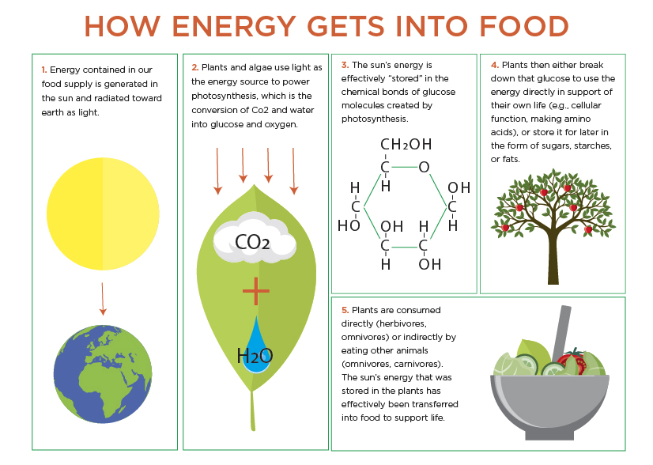
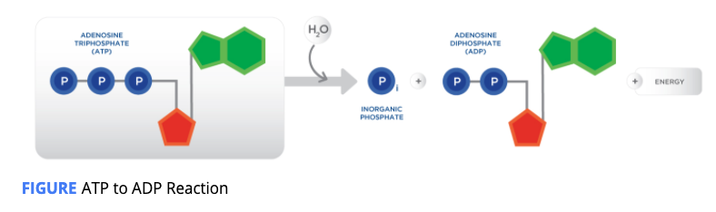
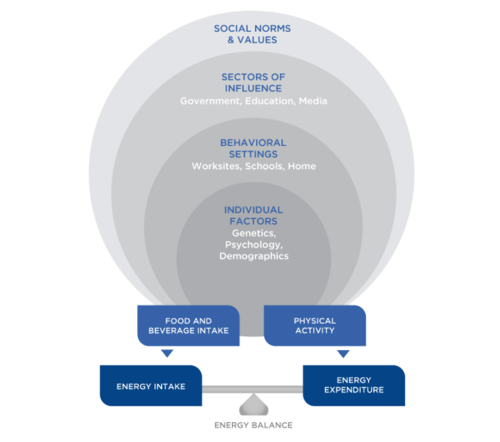

# Thermodynamics and Energy Balance

**What is Energy?  ATP**

**Adenosine triphosphate \(ATP\)** is a chemical compound that provides energy to drive muscle contraction, transmission of nerve impulses, and the vast majority of chemical reactions that facilitate human life. 

The breakage of one phosphate linkage \(to form adenosine diphosphate or ADP\) provides free energy to fuel physiological processes

## Thermodynamics

Thermodynamics describes the relationship between heat and energy \(mechanical, electrical, or chemical\) and how these are converted into one another.

_**First Law of Thermodynamics:   E**_nergy can be transformed from one form to another, but cannot be created nor destroyed

## Metabolism

Chemical processes occurring within the body to convert food to energy.

The primary molecules that store energy in chemical bonds, and are transferred to a useable energy currency, ATP, are carbohydrates and fats, as well as protein.

\_\_

\*\*\*\*

Energy comes from the food we eat: **carbohydrates**, **protein**, **fat, alcohol.**

\*\*\*\*

