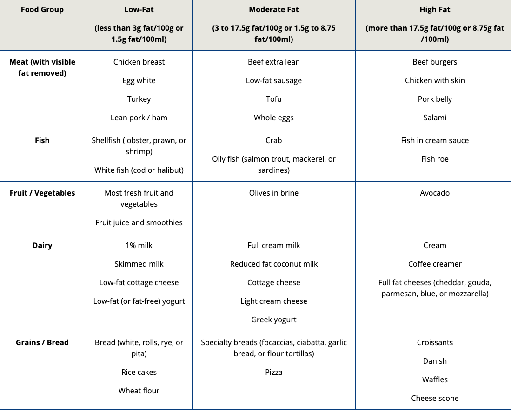

# Accommodating In A Dietary Program

**Dietary Reference Intakes \(DRIs\) and** _**Australian Dietary Guidelines**_  to set an acceptable macronutrient distribution range \(**AMDRs**\) for fat of between **20% to 35%** of total calories per day for dietary fat.

**The British Nutrition Foundation** \(2018\) and the **Joint Food and Agriculture Organization \(FAO\)**/**World Health Organization \(WHO\)** Expert Consultation \(2010\) recommend dietary fat intake to be **no more than 35%** and **not to exceed more than 30%,**

 _**2015–2020 Dietary Guidelines**_ **for** _**Americans**,_ individuals should consume less than **10% of calories from saturated fats.**

**FAO/WHO and** _**Australian Dietary Guidelines**_   not more than 11% of calories should come from saturated fat.

**Food Choice:** 

**Bake, broil, or grill meats and avoid frying.**

Read Food label  
5% or less of DV for a nutrient is considered low, and 20% or more of a nutrient is considered high.

**% DV is based on a 2,000-calorie diet.**

