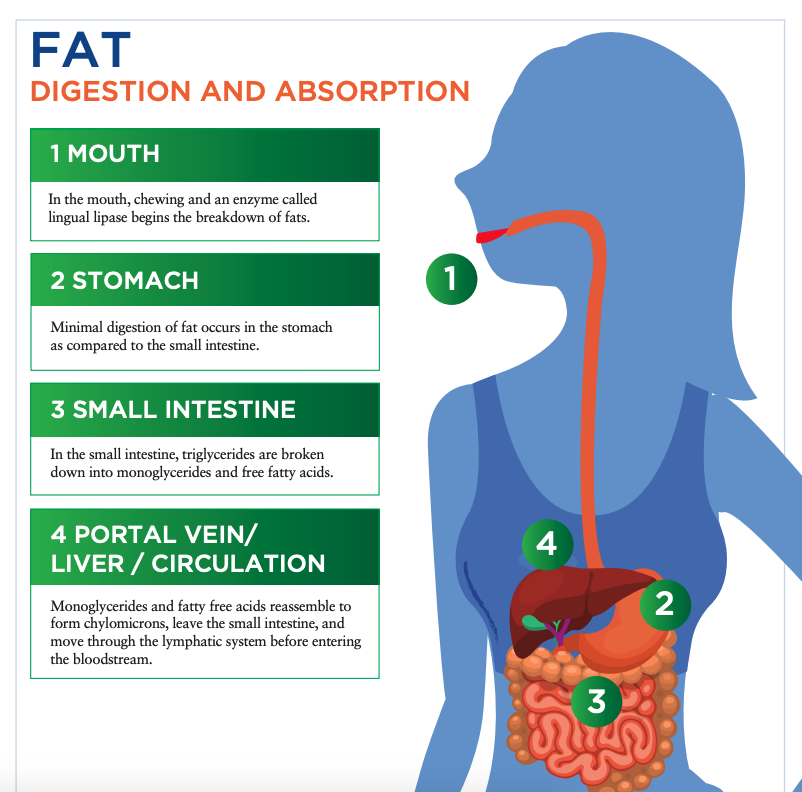
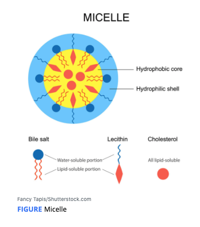
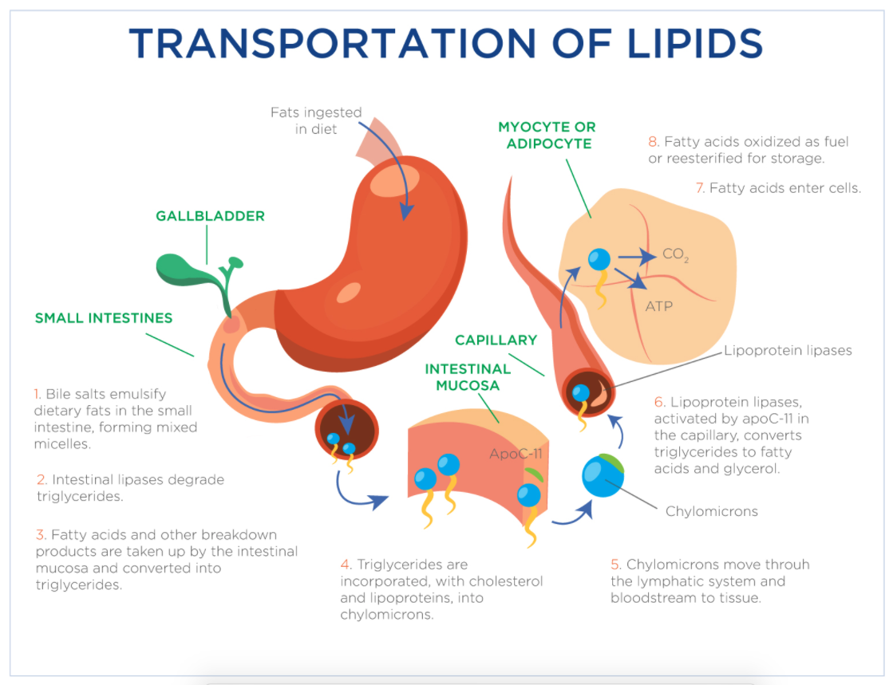
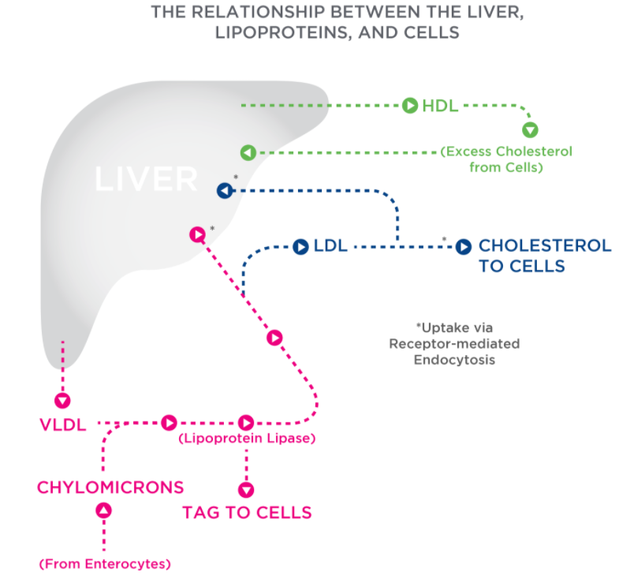
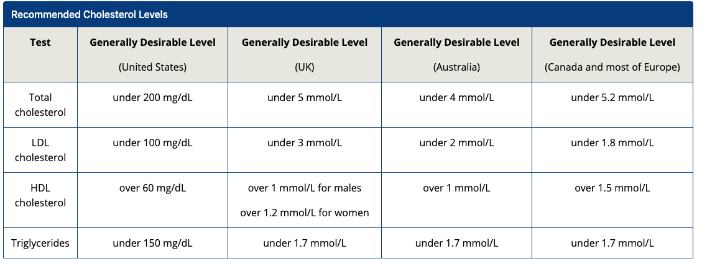
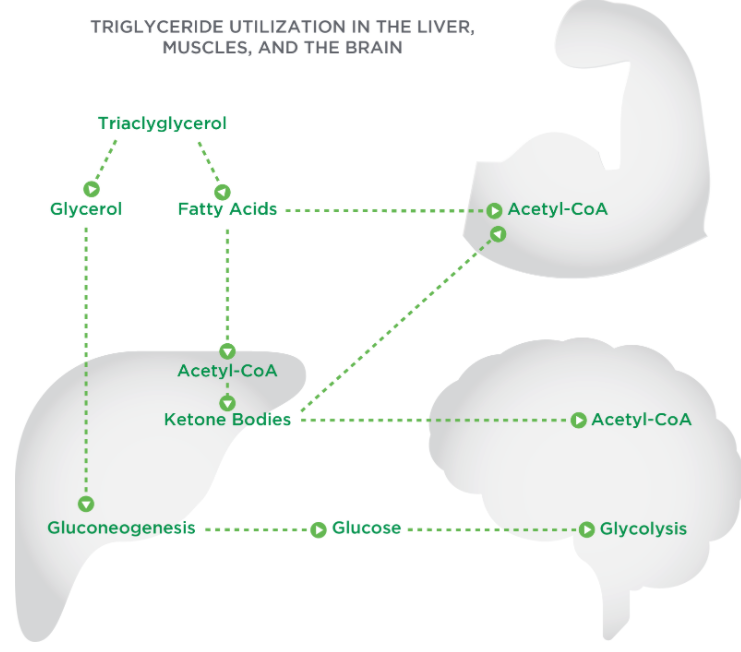

# Digestion and Absorption

## The Mouth and Stomach

The first step to digestion of triglycerides

The chewing of food combined with a small amount of phospholipids, which act as an **emulsifier**, allow the digestive enzymes to work.  **\[Mouth\]**

The enzyme **lingual lipase** breaks down the triglycerides, separating fat from the water-soluble components of food,  **\[Mouth\]**

**gastric lipase** begins breaking down triglycerides into diglycerides and free fatty acids \[stomach/small intestine\]

**emulsifier:** A substance used to bind a hydrophobic and hydrophilic compound.

## The Small Intestine

In the small intestine, a small amount of **bile** attracts fat molecules and holds onto them while being held by the water. 

Pancreatic lipases break down triglycerides into monoglycerides and free fatty acids.

For absorption to occur, the bile salts surround the monoglycerides and free fatty acids to form **micelles** 

A compound comprised of bile salts \(water-loving\) surrounding monoglycerides, free fatty acids, and fat-soluble vitamins \(water phobic\) in order for absorption to occur.

Inside of the micelle are products of **lipid digestion** and **fat-soluble vitamins** \(all the water-phobic substances\). On the outside of the micelle is a **water-soluble lining,** allowing it to travel through the bloodstream.

Triglycerides, cholesterol, and phospholipids, plus a protein carrier, form a **lipoprotein**.

This large **lipoprotein**, called a **chylomicron**, enters the **lymphatic system** and moves toward a large vein that drains into the heart. 

The chylomicrons \(from digestion\) and very-low-density lipoproteins ****\(VLDLs\) both move through the bloodstream to deliver triglycerides to the cells of the body. 

Once in the cell, the lipoprotein lipase breaks down the triglycerides into fatty acids and a glycerol for the cell to use.

**Lymphatic** **System:** An extensive network of vessels passing through almost all bodily tissues that produce and transport lymph \(colorless fluid of white blood cells\). 

**Lipoprotein** **Lipase:An** enzyme found in the endothelium of the cells that breaks down triglycerides into fatty acids and a glycerol for the cell to use.

**Endothelium:Cells** that line the inner surface of blood vessels and other lymphatic tissue.

## The Liver

cholesterol  **and**  triglycerides

low-density lipoprotein \(**LDL**\) and high-density lipoprotein \(**HDL**\).

LDLs and HDLs carry cholesterol \(not triglycerides\).

**LDL** \(bad\) :

 deliver cholesterol _to_ the liver

deliver cholesterol _to_ the cells -&gt; used in cell membranes  or  to help in the synthesis of steroid hormones

 **chylomicrons** and **VLDLs** bring **triglycerides** to the **cells** 

**HDL** \(Good\) : 

retrieving excess cholesterol from the cells and bringing it _back_ to the liver

## Fat Metabolism and Storage

Chylomicrons and VLDLs deliver triglycerides to the cells

1. broken down\( **beta-oxidation** \) to fatty acids and glycerol for the cells to use
2. In adipose \(fat\) cells, the fatty acids are combined with a glycerol to become a triglyceride for storage in the adipose tissue.
3. muscle cells, the fatty acids may be stored or made into **acetyl-CoA.**
4. In the liver, acetyl-CoA is broken down into ketone bodies when rates of fatty oxidation are very high.
5. the liver converts glycerol into glucose via gluconeogenesis ****

**beta-oxidation :**The process that occurs within the cell’s mitochondria to produce glycerol and fatty acids.

**acetyl-CoA:** A molecule that participates in biochemical reactions in protein, carbohydrate, and lipid metabolism, producing energy.

**ketone bodies:** A group of incompletely metabolized fat fragments that are normally produced during fat metabolism in the absence of adequate carbohydrates.

