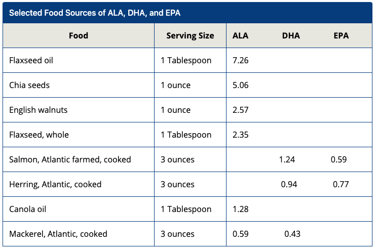
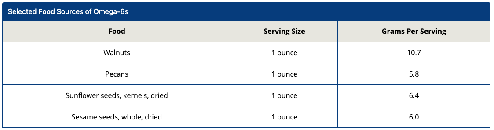
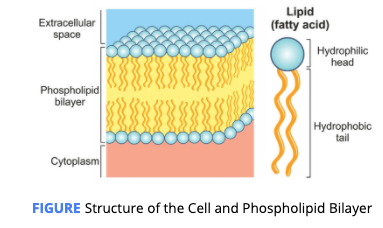

# Functions

## Fats as Major Source of Energy

The body’s system turns to fat stored in the adipose tissue when carbohydrates are not available. 

## Fats as Source of Essential Fatty Acids

**Omega-3** and Omega-6 fatty acids are PUFAs.

### **mega-3 \(ALA, EPA, DHA\)**

**Alpha-linolenic acid \(ALA\)** is mostly found in plant oils such as walnuts, flaxseeds and flaxseed oil, and chia seeds.

**Alpha-linolenic acid** is most commonly used for diseases of the heart and blood vessels,

**Alpha-linolenic acid** is thought to decrease the risk of heart disease by helping to maintain normal heart rhythm and heart pumping. It might also reduce blood clots. Although alpha-linolenic acid seems to benefit the cardiovascular system and might reduce the risk of heart disease, research to date does not show it has a significant effect on cholesterol levels.

 **Eicosapentaenoic acid \(EPA\)** and **docosahexaenoic acid** **\(DHA\)** omega-3 fatty acids are found in cold-water fatty fish and shellfish such as salmon, mackerel, and crab.

EPA : anti-inflammatory activities in the body in addition to serving as structural components of the brain and eye tissue.

Anti-inflammatory properties of omega-3s:

* beneficial for those who have rheumatoid arthritis
* development of eye and brain development in a growing fetus , in late stages of pregnancy
* high levels of omega-3s may lower levels of depression
* protective against Alzheimer’s disease

### omega-6 fatty acids

**Source** :plant oils, including soybean, safflower, and canola, as well as nuts and seeds, including pecans, walnuts, sesame seeds, and sunflower seeds.

beneficial for heart health

The **issue** is that most of the general public's omega-6 intake comes from processed foods, such as chips, crackers, and pastries.

**omega-3 fatty acid recommend :** 

* omega-3 fatty acid is 1.6 grams and 1.1 grams per day
* NIH: research on omega-3 supplementation is either inconclusive or does not indicate that omega-3 supplements are beneficial
  * Eating fish high in EPA and DHA compared to taking an omega-3 supplement may provide more significant health benefits.
* pregnant women eat at least 8- to 12-ounces of a variety of seafood that is low in mercury.
  * high mercury levels are: shark, swordfish, king mackerel, and tilefish.
  * **recommend** salmon, herring, trout, and mackerel are low in mercury.

  
 **omega-6**

AI is 17 grams for men and 12 grams for women.

chia and flax seeds have large amounts of ALA

**Adequate Intake \(AI\) :** The recommended average daily intake level based on observed or experimentally determined estimates of nutrient intake by groups of apparently healthy people that are assumed to be adequate - the AI is used when an RDA cannot be determined.

## Fats Metabolize Fat-soluble Vitamins

The fat-soluble vitamins, including vitamins A, D, E, and K, use fat to be absorbed and stored within the body.

**Fat-soluble vitamins** are stored in the liver or adipose tissue until they are needed by the body.

## Body Fat

What we discussed above are the functions of dietary fat. body fat is important for a number of reasons, including the body’s **cell membrane structure** and function, as well as **insulation and temperature regulation.**

### **cell membrane structure**

Phospholipids are the main component of the cell’s membrane.

Cells are encircled by a **membrane**. This membrane is responsible for protecting the inside of the cell and for **selective permeability**. 

**Membrane :**A thin, soft, pliable layer that acts as a boundary, lining, or partition around an organism or cell.

**Selective Permeability:** Monitors what materials enter and exit a cell.

### **insulation and temperature regulation.**

\*\*\*\*

\*\*\*\*

