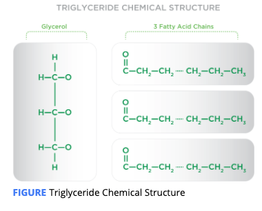
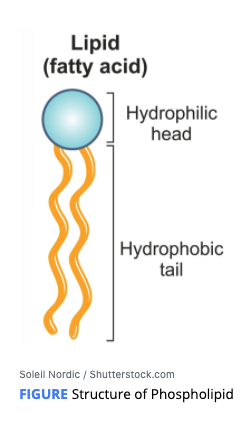

# What is Fat

Fat is hydrophobic and is not soluble in water. 

Fat contains 9 kcals/gram.

Fat -&gt; Lipids

  
**Lipids** compounds that are **fatty acids** or their derivatives. 

* **Simple lipids** such as fatty acids,  Organic compounds with long hydrocarbon chains that are saturated or unsaturated.
* **compound lipids** such as **phospholipids C**omprised of **Two** fatty acids, a phosphate group, and a glycerol molecule. The phosphate group head is water soluble and the fatty acid tail is water insoluble. They align themselves to form the cell membrane.
*  **derived lipids** such as **cholesterol**.  
  A lipid-like waxy substance found in all cell membranes, most body tissues, and body fluids – the body needs some cholesterol to make steroid hormones and vitamin D. Some cholesterol is obtained from foods like eggs, cheese, and shellfish. Most cholesterol is produced by the body.

  \*\*\*\*

## Simple Lipids

**Fatty acids** are the **building blocks** of fats. They are comprised of long hydrocarbon chains.

### **Saturated Fatty Acids**

Fatty acids that have the maximum number of hydrogen molecules and contain only single bonds between their carbon atoms. Foods high in saturated fatty acids are usually solid at room temperature \(like butter\) 

Saturated fatty acids are found mostly in animal products: cheese, beef, pork, chicken, butter, full fat dairy, and egg yolks.

### **Unsaturated Fatty Acids**

Fatty acids that have one or more double bonds between the carbon atoms in the carbon chain. These are typically liquid at room temperature, relatively unstable, and are prone to oxidative damage.

\*\*\*\*

#### **Monounsaturated fatty acids \(MUFAs\)--**heart-healthy diet

Unsaturated fats that have one unsaturated carbon molecule \(two hydrogen atoms instead of four\) or one double bond.

**Source** : olive oil; nuts such as almonds, cashews, and pecans; canola oil; avocados; olives; and nut butters like peanut or almond butter

#### polyunsaturated fatty acids \(PUFAs\).

Unsaturated fats that have two or more double bonds between carbon molecules.

**Source** :walnuts, sunflower seeds, flax oil, or salmon and corn, soybean, and safflower oil

Research has shown that substituting these fats for saturated or trans fats or refined carbohydrates can significantly **decrease a person’s risk of cardiovascular disease**

\*\*\*\*

#### Trans Fat \(No Safe\)

An artificial fatty acid that occurs when hydrogen is added to liquid vegetable oils \(unsaturated fat\) to make them more solid \(saturated fat\) and have a more stable shelf life.

**Source**:   trans fat is partially hydrogenated oils \(PHOs\) , as well as fried foods such as French fries, doughnuts, fried chicken, baked goods, snacks, and nondairy coffee creamer.

*  raising **low-density lipoproteins** \(LDLs\), Lipoprotein that carries cholesterol from the liver to the cells, known as **bad cholesterol**.
* **triglycerides**, The primary storage and transportable form of **fats** in the body, composed of three free fatty acids bound to a glycerol backbone.
* lowering **high-density lipoproteins** \(HDL\),Lipoprotein that carries excess cholesterol away from the cells to the liver where it is turned into bile or excreted, known as the **good cholesterol**.
* increasing inflammation
* promoting **endothelial dysfunction ,** Damage that occurs to the endothelium, the thin layer surrounding blood vessels.

In 2015, this type of fat was determined to not be Generally Recognized as Safe \(GRAS\) by the FDA

#### **Triglycerides**

The primary storage and transportable form of fats in the body, composed of three free fatty acids bound to a glycerol backbone.

Most **dietary fat** is comprised of triglycerides.  **Dietary fat :**The fat and oils found in food that is consumed.

it is also the main component of **adipose tissue \(body fat\)** in our bodies.This layer of fat **under the skin .**

Triglycerides are involved in the transportation of fats in the bloodstream. they come directly from the fats or from the carbohydrates we eat.

\*\*\*\*

## Compound lipids

The compound lipids include **phospholipids** and **lipoproteins**

### **phospholipids**

Comprised of two fatty acids, a phosphate group, and a glycerol molecule – the phosphate group head is water soluble and the fatty acid tail is water insoluble. They align themselves to form the cell membrane.

### **lipoproteins**

Lipoproteins are particles in the blood comprised of proteins, phospholipids, triglycerides, and cholesterol.

A combination of fat and protein that transports cholesterol and other lipids to and from various tissues through the blood.

## Derived Lipids

Cholesterol helps in the production of steroid hormones as well as vitamin D. Some cholesterol is obtained from foods like eggs, cheese, and shellfish; however, most cholesterol is produced by the liver.

**fatty acids:** Organic compounds with long hydrocarbon chains that are saturated or unsaturated.

**Hydrophobic:**   Water fearing – will not dissolve in, or react with, water.

