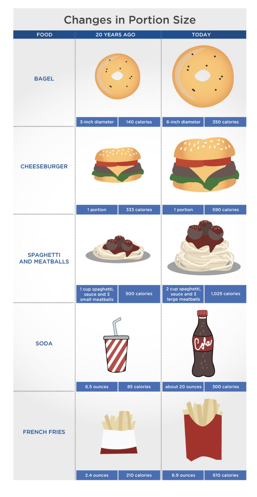
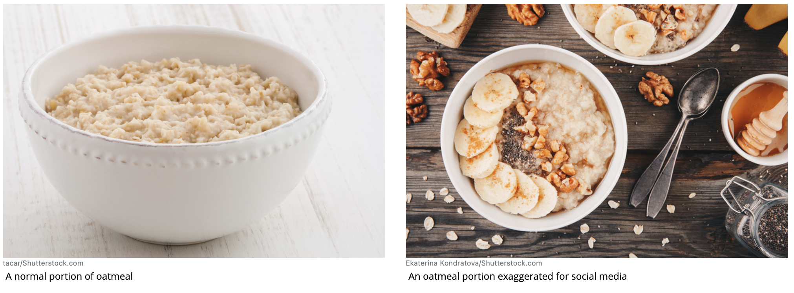
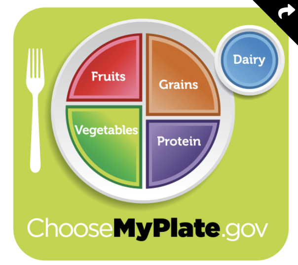
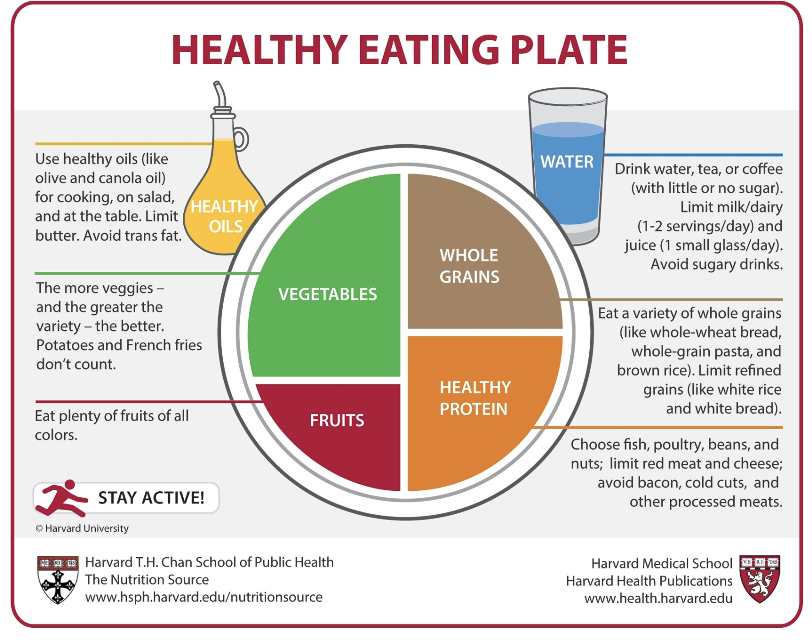
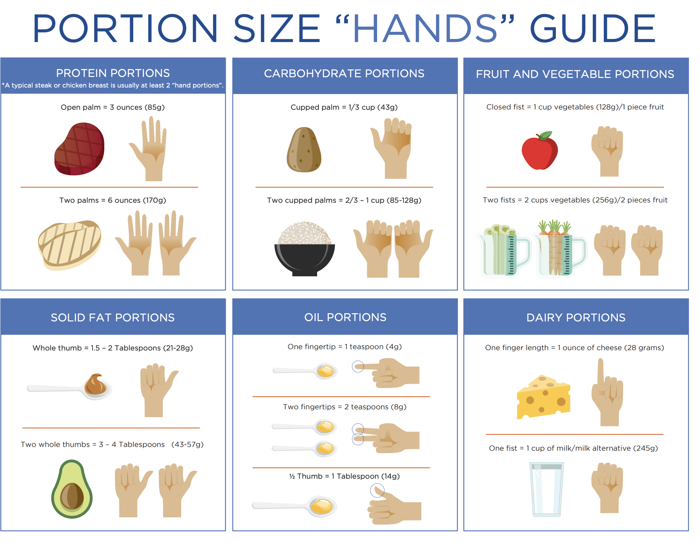

# Portion Sizes

### Serving Size vs. Portion Size

A _portion_ is the amount of food or food product that an individual chooses to put on their plate or consume in a sitting. 

The _serving_ _size_ for a food or food product is typically a specific quantity that serves as a reference amount for the nutrition content and value of that food. 

An individual’s portion _may be more or less than the standard serving size_ for a food item, depending on various factors such as their needs, the type of food being consumed, the eating occasion, and other components of the meal in question.

### Portion Distortion

These rising portion sizes may have contributed to an increase in average caloric consumption for each individual likely due to the fact that when presented with larger amounts of food, people tend to eat more.

Social-media platforms are another area in which food portions may be exaggerated.

Images of oatmeal and smoothie bowls, toast slathered with peanut butter, pancake stacks with drizzles of syrup, and salads garnished with multiple toppings can all _appear_ to be healthy and appetizing.

### Weight Management and Portion Control



One approach promoted by the USDA and supported by the Academy of Nutrition and Dietetics \(AND\) as well as various educational organizations is to use the USDA MyPlate guide.

The Harvard School of Public Health has a similar version called the Healthy Eating Plate.

[https://www.hsph.harvard.edu/nutritionsource/healthy-eating-plate/](https://www.hsph.harvard.edu/nutritionsource/healthy-eating-plate/)

Both images do not indicate a _**specific**_ **portion size for foods** within each group, so there is no specified amount in ounces or grams for protein, grains, fruit, vegetables, or oils on either plate. However, both images still demonstrate the concepts of portion control and portion management through the relative spaces according to each food group on a plate. 

The USDA MyPlate and the Harvard Healthy Eating Plate may not be helpful for portion control if **plate sizes are very large.**

One solution to help with overall portion control is to use smaller plates at meals. Using a 7- or 9-inch plate instead of one that is 11 or 12 inches in diameter

Another solution for managing portions is to learn how to approximate appropriate portion sizes of foods using common visual cues such as the palm of a hand, a fist, a tennis ball, etc. This strategy can be used to estimate portion sizes regardless of plate size.

### Portion Sizing in the UK and EU

Portion Recommendations in the UK

<table>
  <thead>
    <tr>
      <th style="text-align:left"><b>Food Group/Food</b>
      </th>
      <th style="text-align:left"><b>Portion Size (Visual Approximation)</b>
      </th>
    </tr>
  </thead>
  <tbody>
    <tr>
      <td style="text-align:left">
        
<b>Protein</b>
        

        
Meat/Poultry

        
Fish

        
Eggs

        
Beans/Lentils/Chickpeas

        
Soy Protein (Tofu/Tempeh)

        
Nuts/Nut Butter

      </td>
      <td style="text-align:left">
        
60&#x2013;90 grams (size of a deck of cards)

        
140 grams (palm of hand)

        
2 eggs

        
150 grams (4 tablespoons)

        
100 grams (4 tablespoons)

        
30 grams (1 tablespoon)

      </td>
    </tr>
    <tr>
      <td style="text-align:left">
        
<b>Carbohydrates</b>
        

        
Bread

        
Pasta/Rice (Cooked)

        
Potatoes (Cooked)

        
Cold Cereal

        
Hot Cereal (Uncooked)

      </td>
      <td style="text-align:left">
        
1 medium slice

        
2&#x2013;3 tablespoons

        
1 medium baked potato or 2 egg-sized new potatoes (boiled)

        
3 tablespoons

        
3 tablespoons

      </td>
    </tr>
    <tr>
      <td style="text-align:left">
        
<b>Vegetables</b>
        

        
Peas/Carrots/Mixed Vegetables/Corn

        
Tomatos/Peppers

      </td>
      <td style="text-align:left">
        
80 grams (3 heaping tablespoons)

        
80 grams (1/2 pepper or whole tomato)

      </td>
    </tr>
    <tr>
      <td style="text-align:left">
        
<b>Fruit</b>
        

        
Berries/Grapes

        
Apples/Pears/Bananas/Oranges

        
Small Fruit (Kiwis/Plums/Apricots)

      </td>
      <td style="text-align:left">
        
80 grams (small handful or 10&#x2013;12 grapes)

        
80 grams (1 medium-sized fruit)

        
80 grams (2 pieces of fruit)

      </td>
    </tr>
    <tr>
      <td style="text-align:left">
        
<b>Dairy</b>
        

        
Milk (or Non-Dairy Alternate)

        
Yogurt

        
Cheese (Hard)

      </td>
      <td style="text-align:left">
        
200 milliliters (1 glass)

        
125 grams (3 tablespoons)

        
30 grams (matchbox- or chess-piece size)

      </td>
    </tr>
    <tr>
      <td style="text-align:left">
        
<b>Oils/Fats</b>
        

        
Oil

        
Solid Fat (Butter/Spreadable Butter)

      </td>
      <td style="text-align:left">
        
3 grams (1 teaspoon)

        
5 grams (1 teaspoon)

      </td>
    </tr>
  </tbody>
</table>

