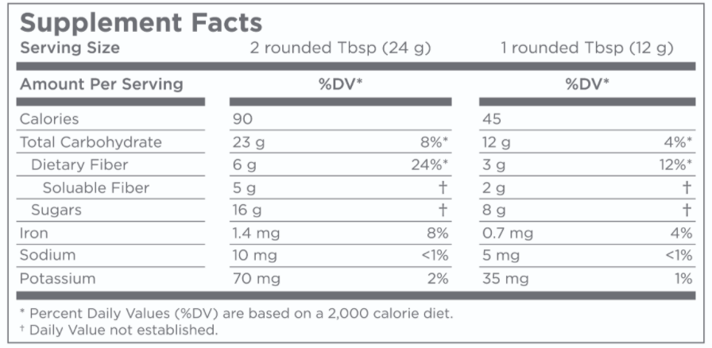
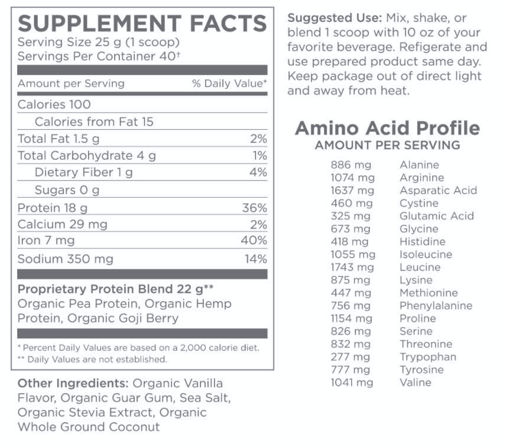

# Supplement Facts Labels

As on the nutrition facts label, the supplement facts label must list information on the following values/nutrients when they are present in measurable amounts \(any amount greater than zero\). If these nutrients are _**not**_ **present** in any measurable amount in the supplement, they may be **omitted** from the supplement facts label.

* Total Calories
* Calories from Fat
* Total Fat
* Saturated Fat
* Cholesterol
* Sodium
* Carbohydrates
* Dietary Fiber
* Sugars
* Protein
* Vitamins A and C
* Calcium and Iron

Amounts for other **vitamins** and **minerals** _**must**_ be listed if they are specifically added to the supplement or if a claim is made about them on the dietary supplement label. 

Supplement fact labels can also differ slightly depending on the _supplement type_.

Because the supplement is a protein blend and claims to provide all the essential amino acids, it must also list all the amino acids provided on the supplement label.

vitamin D supplements typically provide **well over 100%** of the %DV. This is because the absorption of vitamin D supplements by the body is highly inefficient. Even though a pill may have over 1000% of the average person’s vitamin D needs, nowhere near that amount will actually be absorbed into the bloodstream when taken orally.

#### Supplement Labels Outside the United States

Similar to the %DV in the United States, the %NRV indicates what percentage of the recommended amount of a vitamin or mineral is provided in the specified serving \(and/or 100 grams\) of a dietary supplement.

Consumers can use the %NRV \(**Nutrient Reference Values\)** to evaluate a dietary supplement and see how it contributes to their daily needs for a vitamin or mineral and how it may fit into the context of their diet.

