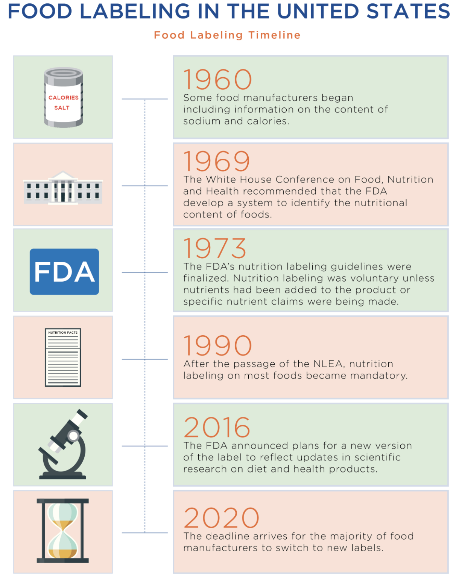
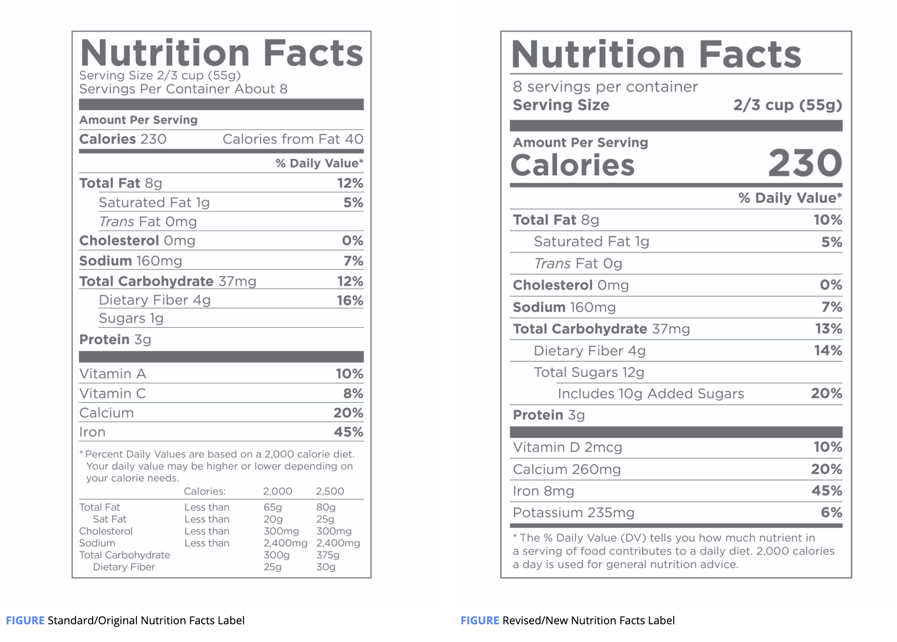
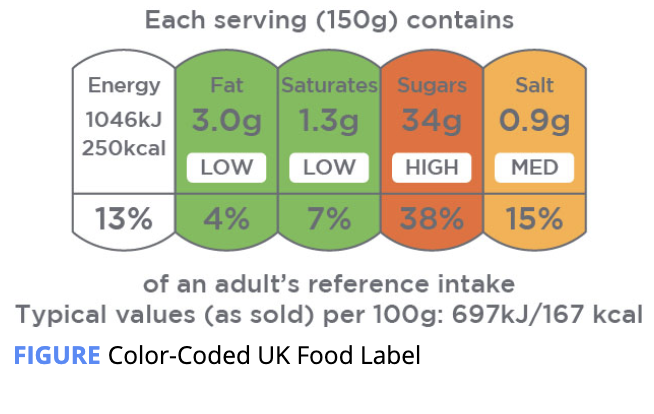

# Food Labels

Most packaged food items are **required** by the **FDA** to display a label that identifies the name of the product, the quantity of product in the package, the name and address of the manufacturer, the ingredient list, the nutrition facts label, and **a statement on any common allergens in the food.**

\*\*\*\*

### History

New Label :

* The revised nutrition facts label displays the calorie information in larger and bolder font.
* Calories from fat are no longer required on the revised label.
* The revised label includes both total and added sugars.
* Vitamins A and C are no longer required on the revised label.
* Potassium and vitamin D have been added to the new label.

The nutrition facts label is required to display the following information:                                       

* The number of **servings per container**
* **Serving size**
* **Total calories** per serving
* Amount of **total fat** per serving \(in grams\), **saturated fat** \(in grams\), and **trans fat** \(in grams\)
* **Cholesterol** \(in milligrams\)
* **Sodium** \(in milligrams\)
* **Total carbohydrates** \(in grams\)
* **Dietary fiber** \(in grams\)
* **Total sugars** and **added** **sugars** \(in grams\)
* **Protein** \(in grams\)
* **Amounts** and the **Percent Daily Value** for the following vitamins and minerals: vitamin D \(in micrograms\), calcium \(in milligrams\), iron \(in milligrams\), and potassium \(in milligrams\)

The prior/standard nutrition facts label required vitamins A and C to be listed but these are no longer required on the new version of the label.

 **Percent Daily Value** for the listed nutrients. The Percent Daily Value indicates how much one serving of the food item contributes toward the recommended daily value for that particular nutrient \(fat, carbohydrates, vitamin D, etc.\) _based on a 2000-calorie diet._ 

The Academy of Nutrition and Dietetics \(AND\) recommends that consumers generally choose products that provide 5% or less of total fat, saturated fat, cholesterol, and sodium and 20% or more for fiber, vitamins, and minerals

Percent daily values are provided for added sugar as current guidelines recommend limiting added sugar to no more than 10% of daily calories.

### Food Labels Outside the United States

in the UK and EU, **it is provided for a standard 100 grams of a dry product or 100 or 200 milliliters of a liquid product.** For comparison, a hundred grams of a dry food product and a hundred milliliters of liquid are both approximately 3 1/2 ounces.

In the EU, nutrition labels will also provide a percent **Reference Intake** \(%RI\) on the nutrition facts label, which serves a similar purpose as the percent daily values on a U.S. nutrition facts label

#### Color Coding on UK and EU Food Labels

It is  required to list all ingredients in a packaged food product in _decreasing order of prevalence,_

In the EU and UK, manufacturers are also required to list the percentage of an ingredient in a product if it is mentioned in the name of the product, highlighted or noted on the food label, and/or an ingredient that is typically associated with the product \(Gov.UK, n.d.\).

Encourage clients to look at the ingredient list for products they buy and to select foods with five or less ingredients \(not including added vitamins and minerals\) and ingredients that they recognize.

Product Nutrition Claims

| **Nutrient Term** | **Definition** |
| :--- | :--- |
| Low Calorie | Contains 40 calories or less per serving |
| Calorie Free | Contains less than 5 calories per serving |
| Low Cholesterol | Contains 20 milligrams or less per serving and 2 grams or less of saturated fat per serving |
| Cholesterol Free | Contains less than 2 milligrams of cholesterol per serving |
| Low Fat | Contains less than 3 grams of fat per serving |
| Reduced Fat | Contains at least 25% less fat per serving than the regular product \(for a similar serving size\) |
| Low Saturated Fat | Contains 1 gram or less of saturated fat per serving and no more than 15% of calories from saturated fat |
| Saturated Fat-Free | Contains less than 0.5 grams of saturated fat per serving and no greater than 0.5 grams of trans fat per serving |
| Fat Free | Contains less than ½ gram of total fat per serving |
| % Fat Free | Contains X% non-fat macronutrients by weight \(e.g., 98% fat-free\) |
| No Trans Fat | Contains less than 0.5 grams of trans fat per serving \(does not mean completely free of trans fats\) |
| No Sugar | Contains less than ½ a gram of sugar per serving |
| No Added Sugar | Contains no added sources of sugar \(but may still contain a large amount of natural sugar, e.g., dried fruit\) |
| Low Sodium | Contains less than 140 milligrams of sodium per serving |
| Very Low Sodium | Contains less than 35 milligrams of sodium per serving |
| No Salt Added | Contains no added salt \(may still contain sodium if naturally in the food\) and must state that it is not sodium free |
| Sodium Free | Contains less than 5 milligrams of sodium per serving |
| Light/Lite | Contains 50% less fat or sodium or 1/3 fewer calories than the regular product \(for an equal serving size\) |
| Gluten Free | Contains less than 20 parts per million \(ppm\) of gluten\* |
| Certified Gluten Free | Certified by an independent organization to contain less than 10 ppm of gluten per serving |

Reference Amounts in the UK

<table>
  <thead>
    <tr>
      <th style="text-align:left"><b>Nutrient</b>
      </th>
      <th style="text-align:left"><b>Reference Ranges</b>
      </th>
    </tr>
  </thead>
  <tbody>
    <tr>
      <td style="text-align:left">Total Fat</td>
      <td style="text-align:left">
        
<b>Low in Fat: </b>Contains 3 grams fat or less per 100-gram serving

        
<b>High in Fat:</b> Contains more than 17.5 grams of fat per 100-gram serving

      </td>
    </tr>
    <tr>
      <td style="text-align:left">Saturated Fat</td>
      <td style="text-align:left">
        
<b>Low in Saturated Fat: </b>Contains 1.5 grams or less of saturated fat
          in 100-gram serving

        
<b>High in Saturated Fat: </b>Contains more than 5 grams of saturated
          fat per 100-gram serving

      </td>
    </tr>
    <tr>
      <td style="text-align:left">Sugar</td>
      <td style="text-align:left">
        
<b>Low in Sugar: </b>Contains 5 grams or less of total sugars per 100-gram
          serving

        
<b>High in Sugar: </b>Contains more than 22.5 grams of total sugar per
          100-gram serving

      </td>
    </tr>
    <tr>
      <td style="text-align:left">Salt</td>
      <td style="text-align:left">
        
<b>Low in Salt: </b>Contains 0.3 grams or less of salt per 100-gram serving

        
<b>High in Salt: </b>Contains more than 1.5 grams of salt per 100-gram
          serving

      </td>
    </tr>
  </tbody>
</table>

Food labels may also contain various other popular terms that may influence a consumer’s purchasing decisions. Terms such as _**Natural**_**,** _**Non-GMO**_**,** _**Cage-Free**_**,** _**Organic**_**, or** _**Certified Organic**_ ****on a food label may encourage consumers into selecting a particular product. 

* **100% Organic:** The product contains only organic ingredients, i.e., those produced using organic standards \(not including water and salt\).
* **Organic:** The product contains at least 95% organic ingredients \(not including water and salt\).
* **Made with Organic Ingredients:** The product contains at least 70% organic ingredients. The remaining 30% are still subject to various standards, including the use of non-genetically modified organism \(Non-GMO\) ingredients.

Additional Popular Food Label Terms

| **Term** | **Meaning** |
| :--- | :--- |
| **Cage-Free \(on poultry products\)** | Chickens had access to roam outside the cage; there is no guarantee that they did. |
| **Grass-Fed \(on beef products\)** | Fed grass versus grain or corn for primary source of food, no government standards or regulation. |
| **Natural** | No true definition, meat and poultry cannot contain artificial ingredients, colors, or preservatives. |
| **Pasture Raised** | Spent time on pasture or outdoors for a period of time, no clear indication of how much time, and no government standards or regulation. |

