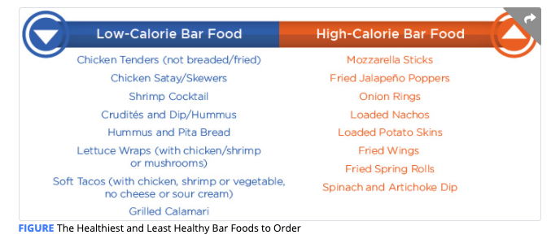

# Dining Out

Restaurant portions are sometimes large and can lead to excess intake. Meals may be prepared with extra sauces, fats, and rich gravies that can add extra calories; dishes may be coated in butter prior to serving \(both for flavor and presentation\).

Other studies suggest that the increase in dining away from home may be one of the contributors to the rise in childhood obesity rates

There are two main considerations for dining out: the frequency of dining out and the dining occasion

## Dining At Restaurants

#### When Possible, Look at the Menu Ahead of Time

Reviewing the menu in advance can allow an individual to plan ahead and select a few options that fit within their nutrition plan.

Avoid arriving at the restaurant excessively hungry as this may increase the risk of overeating.

#### Look for Key Words on the Menu That Indicate How a Dish is Prepared

**Cooking Methods**

the options on a menu that are the **lowest in calories** and added fats are generally dishes that are p**oached, steamed, roasted, or broiled** \(without added fats\). **Grilled foods** are generally lower in calories and added fats than fried foods **but restaurants may slather extra fat** on grilled, broiled, or roasted meats and fish to keep them moist.  **Baked** dishes may sound healthy but they can be baked in **heavy sauces or in a pastry crust**, both of which are calorically dense.

| **Cooking Method/Preparation** | **Description** |
| :--- | :--- |
| **Braised** | Food is sautéed first and then cooked at a lower temperature in liquid. |
| **Broiled** | Food is cooked by exposing it to a source of radiant heat at a high temperature \(higher than for roasting\). The heat source may be a grill, oven with a broiler feature, or live coals. The heat source is typically above the food, though not always, and the food is turned during cooking. |
| **Baked** | Food is cooked using convection heat in an oven. It may be precooked and finished in the oven or prepared entirely in the oven. Food may be baked dry or in a liquid/casserole and may or may not include a sauce. |
| **Battered** | Food is coated in batter and then deep-fried at a high temperature. |
| **Creamed** | The food has been prepared by simmering or poaching it in milk or a cream-based liquid. |
| **Crispy** | Typically refers to food that has been fried – It may or may not be coated in a batter. Some crispy foods may be baked rather than fried but this may not always be stated. |
| **Fried** | Food is deep-fried in oil. |
| **Grilled** | Food has been cooked using dry, radiant heat directly applied to the surface of the food \(e.g., on a grill pan or on a grill over coals\). Fat may be added to the food during the process. |
| **Oven-Baked/Roasted** | Food is baked dry or roasted in the oven. |
| **Pan-Fried** | Food has been fried in a small amount of oil or other fat in a pan. |
| **Poached** | Food has been cooked in liquid \(either water or wine\) at a lower temperature than used for simmering and with no added fat. |
| **Sautéed** | Food is cooked at high heat in a small amount of fat in a shallow pan. |
| **Simmered** | Food has been cooked in hot liquid at a temperature below the boiling point of water. |
| **Smoked** | Food \(usually meat\) has been cooked by exposing it to smoke from a burning or smoldering substance \(usually wood\). |
| **Smothered** | Food \(usually meat\) is browned on the stove and then cooked at low heat covered in gravy in a covered pan. |
| **Steamed** | Food has been cooked in steam, possibly in a small amount of water, with no added fat. |
| **Stir-Fried** | Food is cut into small pieces and then cooked in a small amount of hot oil in a wok while being stirred continuously. |
| **Tempura** | Food that is battered and deep-fried. |

Ask for Sauces, Dressing, and/or Cheese on the Side

 Use a Plate for Shared Appetizers 

Avoid the Bread Basket or Limit to One Piece 

Balance Calories From Alcohol and Dessert 

Set a Limit on Alcohol

#### \*\*\*\*

### Meeting Friends at the Bar

**Set a drink limit**

**Start with water or a non**-**alcoholic drink**

**Avoid drinking on an empty stomach or if hungry**

**Choose protein**-**based and vegetable appetizers at the bar**

\*\*\*\*

Healthy fats such as **olives, olive oil, avocados** \(all good sources of mono-unsaturated fats\), and nuts \(such as almonds and walnuts\) can **enhance** the flavor of meals and aid in the absorption of fat-soluble vitamins.

How to Choose a Healthy Meal

<table>
  <thead>
    <tr>
      <th style="text-align:left"><b>Process</b>
      </th>
      <th style="text-align:left"><b>Questions to Consider</b>
      </th>
    </tr>
  </thead>
  <tbody>
    <tr>
      <td style="text-align:left"><b>1. Pick a protein.</b>
      </td>
      <td style="text-align:left">
        <ul>
          <li>Is it lean?</li>
          <li>If not, is there a leaner version that is cooked differently? (Is it grilled
            or poached versus fried?)</li>
          <li>Is it an appropriate portion size? If not, can you request a smaller portion
            or save a portion for later?</li>
          <li>Is there adequate protein? If not, can you request a slightly larger portion?</li>
        </ul>
      </td>
    </tr>
    <tr>
      <td style="text-align:left"><b>2. Pick at least two vegetables.</b>
      </td>
      <td style="text-align:left">
        <ul>
          <li>Are vegetables available with the lunch option? Are they included in the
            meal?</li>
          <li>Can you request additional vegetables either on the side or to be added
            to the meal?</li>
          <li>How are the vegetables prepared? Are they raw or cooked? If cooked, are
            they prepared in a healthy manner: grilled or roasted versus fried?</li>
          <li>Are the vegetables breaded or covered in a sauce? Can you request sauce
            on the side?</li>
        </ul>
      </td>
    </tr>
    <tr>
      <td style="text-align:left"><b>3. Pick a healthy, high-fiber starch.</b>
      </td>
      <td style="text-align:left">
        <ul>
          <li>What are the starch options available for the meal?</li>
          <li>If grain-based, is it a whole grain or a refined grain?</li>
          <li>How much starch does the meal provide?</li>
          <li>Is it an appropriate portion? If in excess, can you request a smaller
            portion or save some for a later time?</li>
          <li>Is starch prepared in a healthy manner? Does it contain added fat (oil,
            butter, or cheese)?</li>
        </ul>
      </td>
    </tr>
    <tr>
      <td style="text-align:left"><b>4. Pick a healthy fat.</b>
      </td>
      <td style="text-align:left">
        <ul>
          <li>Is fat included in the preparation of the meal?</li>
          <li>Is a healthy fat part of the meal?</li>
          <li>If not, what options are available&#x2013;olive oil, avocado, nuts, seeds?</li>
          <li>Is the amount a healthy portion? If not, can you request less or request
            it on the side?</li>
        </ul>
      </td>
    </tr>
  </tbody>
</table>

