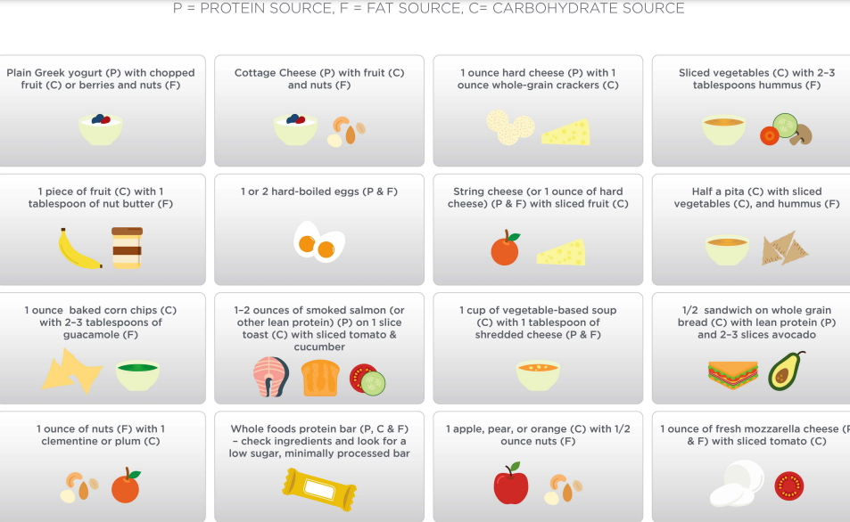
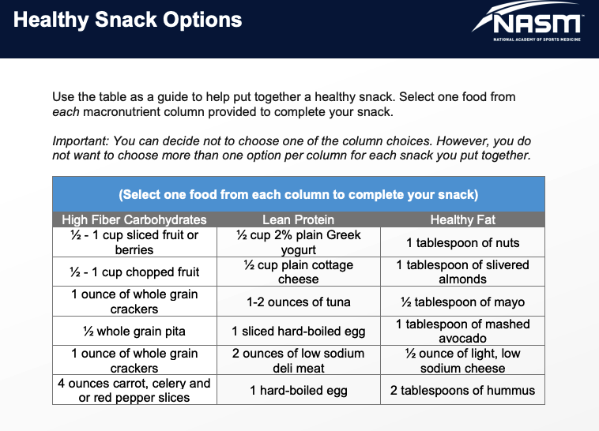

# Healthy Snacking and Creating Healthy Habits

Is snacking healthy? This is a question that many individuals ask and the answer is that it **depends**. Snacking can be healthy **if the food choices for snacks fit into the overall caloric** and nutrient needs for an individual. However, the excessive consumption of energy-dense, nutrient-poor snack foods beyond an individual’s caloric needs can contribute to undesirable weight gain.

### Pros and Cons of Snacking

For many individuals, snacks serve as a buffer between meals to help control hunger.

However, snacks can contribute to weight gain if they add to an individual’s caloric intake beyond their energy needs. This can happen for a variety of reasons:

1. Snacking excessively on energy-dense foods
2. Mindless and excessive snacking due to boredom or other emotions  
3. Late-night snacking on high-calorie foods

### Healthy Snacks

An ideal snack may be a combination of a high-fiber carbohydrate and a lean source of protein to promote satiety

portion control with high-calorie snacks such as nuts remains important.

Guidelines to Choosing Healthier Snack Options

| **Look for** _**least-processed**_ **food items.** | Most delis will have some fresh fruit available and this is usually the healthiest and least-processed food choice. With packaged foods, clients should look for items with the least number of ingredients \(ideally five or less\) and an overall healthy nutrient profile \(low in saturated fat, sodium, and added sugars\). |
| :--- | :--- |
| **Look for a lean protein and carbohydrate-based snack.** | Focusing on identifying a lean protein snack food from the options available \(e.g., a vending machine\) can also help clients gravitate toward a healthier food choice versus selecting a high-sugar and high-fat option. At a deli or drug store, some lean protein options include string cheese, yogurt, and cottage cheese in the refrigerated case. A low sugar, minimally processed protein bar may also be a healthy choice. |
| **If a protein source is not available, choose a healthy fat or a minimally processed, low-sugar carbohydrate option.** | This may be the case when faced with the options available in a vending machine. Most vending machines may not always have a healthy protein option available but will typically have a package of dry, roasted nuts or trail mix. These may be the least processed items available among the vending machine choices. A carbohydrate snack that is also low in added sugar, such as a whole grain, low-sugar protein or granola bar may also be a viable option. As with all packaged foods, clients should look at the serving size and nutrition facts panel on the item to remain cognizant of the nutritional value of the product in their diet. |

## Creating Healthy Habits

