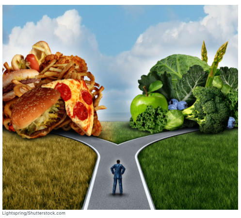
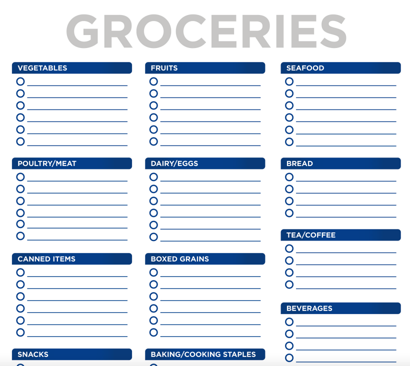

# Grocery Shopping

Plan-Ahead Strategies for Healthy Eating in Various Scenarios

<table>
  <thead>
    <tr>
      <th style="text-align:left"><b>Scenario/Situation</b>
      </th>
      <th style="text-align:left"><b>Plan-Ahead Strategies</b>
      </th>
    </tr>
  </thead>
  <tbody>
    <tr>
      <td style="text-align:left"><b>Grocery Shopping</b>
      </td>
      <td style="text-align:left">
        <ul>
          <li>Select recipes/meals and foods in advance.</li>
          <li>Write a grocery list.</li>
          <li>Avoid shopping at busy times.</li>
          <li>Avoid shopping when hungry.</li>
        </ul>
      </td>
    </tr>
    <tr>
      <td style="text-align:left"><b>Dining Out</b>
      </td>
      <td style="text-align:left">
        <ul>
          <li>Look at the menu ahead of time.</li>
          <li>Call in advance to request accommodations.</li>
          <li>Request substitutions or alternates at the restaurant.</li>
          <li>Have an idea of what to order ahead of time.</li>
        </ul>
      </td>
    </tr>
    <tr>
      <td style="text-align:left"><b>Parties/Holiday Events</b>
      </td>
      <td style="text-align:left">
        <ul>
          <li>Let the host know in advance of any dietary restrictions.</li>
          <li>Offer to bring a healthy dish.</li>
          <li>Have a light snack prior to the event.</li>
          <li>Set a drink limit ahead of time.</li>
        </ul>
      </td>
    </tr>
    <tr>
      <td style="text-align:left"><b>Travel</b>
      </td>
      <td style="text-align:left">
        <ul>
          <li>Pack heathy, non-perishable snacks for the journey.</li>
          <li>Research some restaurants at the destination ahead of time.</li>
          <li>Write out a list of healthy meals to stick to at restaurants.</li>
          <li>Look up one or two local grocery stores at your destination.</li>
          <li>Write a list of healthy foods to obtain at the local store and stock up
            on arrival.</li>
        </ul>
      </td>
    </tr>
    <tr>
      <td style="text-align:left"><b>Between-Meal Snacks</b>
      </td>
      <td style="text-align:left">
        <ul>
          <li>Write out a list of healthy snacks to stick to: both sweet and savory.</li>
          <li>Prepare and pack snacks ahead of time for the week.</li>
          <li>Keep a healthy snack (non-perishable) at your desk or in your bag for
            hunger emergencies.</li>
        </ul>
      </td>
    </tr>
  </tbody>
</table>

