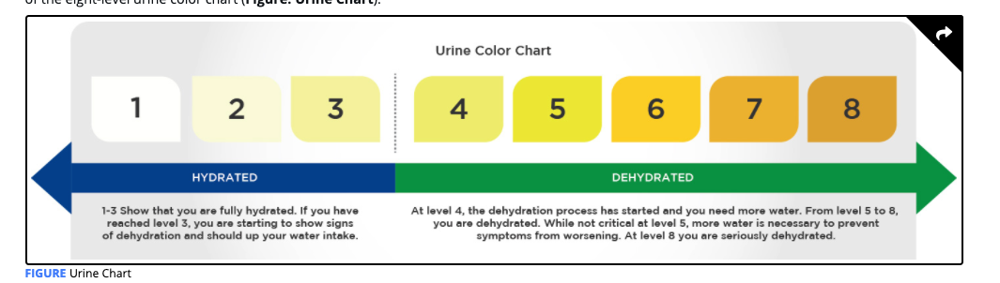

# Developing Hydration Strategies

## Defining Hydration Status

Dehydration for clients is often caused by excessive sweating or lack of fluid intake.

Measurement of plasma osmolality or sodium concentration requires a blood draw and expensive analyzers to determine a clinical definition of hydration status.

### Sweat-Loss Assessment

Sweat-loss assessment allows the Nutrition Coach to determine if their clients do indeed experience major fluid deficits and if any intervention is needed.

Calculating Sweat Loss

<table>
  <thead>
    <tr>
      <th style="text-align:left">
        
Initial weight _______________ kg

        
- post-weight in _______________ kg

        
+ fluid consumption between weigh-ins _______________ kg

        
- urine volume _______________ kg

        
<b>Sweat-loss volume  _______________ kg (L)</b>
        

      </th>
    </tr>
  </thead>
  <tbody>
    <tr>
      <td style="text-align:left">
        
<b>Example Problem</b>
        

        
Joe ran for 1 hour at a pace of 8 minutes per mile in 74 &#xB0;F weather
          with low humidity. His nude, pre- and post-weights were 70.0 and 68.5 kilograms,
          respectively. He drank 0.350 kilograms (liters) of water from his bottle.
          He did not use the restroom during his run.

        
Initial weight 70.0 kg

        
- post-weight in 68.5 kg

        
+ fluid consumption between weigh-ins 0.350 kg

        
- urine volume 0 kg

        
<b>Sweat-loss volume 1.850 kg (L)</b>
        

      </td>
    </tr>
  </tbody>
</table>

The American College of Sports Medicine \(Sawka et al., 2007\) recommends that **fluid intake should not exceed sweat-loss volume** and a **fluid deficit should be limited to less than 2% of body mass.**

\*\*\*\*

There is ongoing debate concerning whether a 2% loss in body mass from dehydration is a valid indicator of performance impairment

**Exercise Associated Hyponatremia \(EAH\):** A potentially serious medical condition in which the plasma sodium falls below 135 mmol/L, usually the result of fluid intake greatly exceeding sweat losses during prolonged exercise.

EAH is a potentially deadly medical condition most commonly caused by fluid intake that greatly exceeds sweat loss, which dilutes ECF sodium levels. -- leads to weakness, cramping, vomiting, disorientation, or confusion. 

## Pre-Exercise Hydration Status Assessment

### Thirst and Body Mass as Indicators of Hydration Status

it has been proposed that athletes record their morning body weight after making voids over a 3-day period and use a 1% decrease from the 3-day body-mass average as a marker of hypohydration

thirst sensation and change in body mass are likely great indicators of pre-exercise hydration status if fluid intake after the previous exercise bout is highly insufficient, b

### Urinalysis as Indicator of Hydration Status

Urine osmolality, color, and specific gravity are also used to gauge real-time hydration status.

Urine-specific gravity may be an option for Nutrition Coaches looking for a more objective way to determine if clients are adequately rehydrating between training 

**Urine-specific gravity:** A measurement that represents the ratio of solutes in the urine versus distilled water. : which the pathway of light is bent \(or refracted\) after traveling through a liquid in comparison to light passing through water that has no solute content.

a USG exceeding 1.020 has been used as a dichotomous hydrated/dehydrated measure.

## Fluid Intake During and Between Training

Nutrition Coaches should only **intercede** when **intervention** is actually **needed**

A simple recommendation is that if fluids are freely accessible during training and sweat losses will be less than about **3%** of body mass, no formal hydration advice concerning beverage consumption is needed during exercise.

### Fluid Intake During Exercise

fluid consumption can take place without difficulty

The athlete should also practice their competitive fluid-intake routine strategy during training to determine if fluid consumption volume or beverage type will result in gastrointestinal distress.

