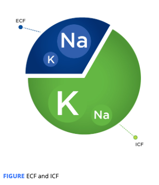
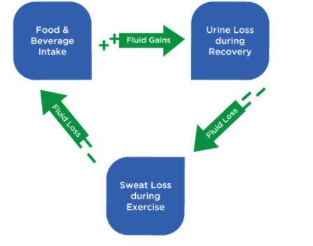

# The Physiology of Hydration

## The Physiology of Hydration

Water constitutes 50 to 70% of total body mass. 

Intracellular Fluid \(ICF\) : The water contained within a cell’s membrane, makes up approximately 2/3 of total body water.

Extracellular Fluid \(ECF\)T: he water found outside of the body’s cells – ECF is found between cells and transported throughout the body via arteries, veins, and capillaries.

The first is sodium \(Na+\), the major ECF solute, while the second is potassium \(K+\), the major ICF solute.

**Electrolytes** are molecules that contain a **negative or positive charge**.

**osmolality**. **t**he regulatory mechanism that describes the processes that dictate total **body water levels and water compartment movement** in the body

Most **solutes** located in these spaces cannot **freely cross** the cell membrane barriers separating ECF and ICF, but water has a unique capability. With sodium being the primary ECF solute, its **concentration** is a primary factor in determining the amount of **water** that will enter a cell body

When large quantities of **sodium** are **ingested** without a similar increase in water, plasma osmolality increases and increased thirst drive follows

**ECF osmolality.** Humans experiencing great total-body water losses will not naturally attempt to match sweat losses with fluid

**Thirst** **sensation** is also related to the other two major actions that cause a loss of body water. These losses come in the form of **sweating or urine production,**

\*\*\*\*

Sensors in the body known as **baroreceptors** detect these changes and can stimulate thirst drive. 

Baroreceptors: Specialized nerves that can sense change in pressure in the heart or blood vessels.

Sweat is **hypo-osmotic**, and one of the major adaptations of training in a warm environment is a shift to even less salty sweat. 

This movement of fluid from the ICF space keeps total blood volume from decreasing and serves to maintain blood pressure but also limits the increase of plasma osmolality, the major dipsogenic stimulus.

