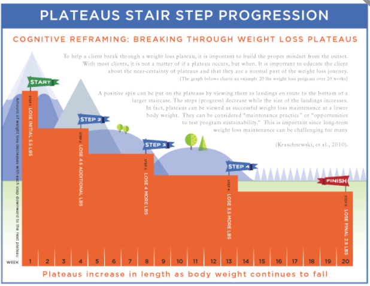

# Cognitive Reframing: Breaking Through Weight-Loss Plateaus

To help a client break through a weight-loss plateau, it is important to build the proper mindset from the outset.

A positive spin can be put on the plateaus by viewing them as landings en route to the bottom of a larger staircase. In fact, plateaus can be viewed as successful weight-loss maintenance at a lower body weight.

### Re-Establishing an Energy Deficit

Because a plateau is due to energy intake matching energy expenditure, the way to break a plateau is to re-establish a deficit. This can be done by reducing energy intake, increasing energy expenditure, or by both.

* Reduction in energy density of food choices \(i.e., food with similar volume but less calories\)
* Reduction in portion size
* Reduction in frequency of intake

Dealing with underreporting can be challenging for a coach.

In some cases, an increase in prescribed calorie intake may useful, as it may improve adherence.

**Increasing energy expenditure** is another tool to help break plateaus. Increasing energy expenditure can be done in one of three ways:

* Increasing formal exercise volume
* Increasing nonexercise physical activity
* Increasing recreational physical activity

Increasing exercise volume can mean increasing the duration or frequency of exercise sessions.

1. If there is room to decrease calorie intake and a client’s self-reported hunger levels are not too high, then reducing calorie intake may be the best method.
2. If there is room to decrease calorie intake but hunger levels are high, then an increase in activity may be a better option.
3. If calorie intake is already low and the client is reporting accurately, then an increase in activity is preferable.
4. If calorie intake is low but underreporting is suspected, then an increase in calorie intake \(to improve adherence\) or efforts to improve self-reporting accuracy combined with an increase in activity may be best.
5. If there is not much room to increase formal exercise in the client’s daily schedule, then efforts to improve recreational activity or nonexercise activity \(particularly in short bouts throughout the day\) may work best.

### Improving Dietary Adherence

#### Physiological

Dieting results in strong increases in hunger and feelings of hunger are associated with lapses in adherence。

Actual weight loss is sometimes greater with smaller deficits, likely due to better adherence

The quality and composition of the diet can also be modified to improve **satiety**, which would promote better adherence. Lower **energy density**, higher protein, and higher fiber intakes are all associated with greater satiety

#### Environmental

**Reduce food cues and visibility**

**Create effort barriers**  Altering the food environment to increase availability of healthier choices and decrease the availability of less-healthy choices may improve eating behavior

* Keep less-healthy food in a locked cabinet.
* Keep foods in a less-prepared form \(e.g., whole oranges versus sliced oranges\).
* Only keep foods in the house that need to be prepared or cooked \(not premade or prepackaged\).
* Keep energy-dense and problem foods out of the personal environment.

**Optimal Foraging Theory \(OFT\)** refers to how human brains assign value to food. OFT is defined by the calories gained from a food relative to how much energy and time is needed to obtain it. Energy-dense foods provide a lot of calories and are easy to obtain and, thus, provide high value to the brain. Making such foods difficult to obtain \(like keeping them out of the house\) reduces the value of these foods.  

#### Psychological

**Education** It is important to understand the rationale for required dietary changes.

**Motivation**  Sustained motivation is important for long-term success. Motivation can be improved by increasing awareness of the benefits of progressing toward and achieving goals. By regularly working toward and achieving goals, a sense of personal control and self-efficacy

**Awareness of a plan and goals associated with that plan:** While motivation can be important, it can fluctuate; thus, it is important to maintain behavioral changes even when motivation decreases.

**Active self-regulation and self-monitoring:**  Self-monitoring \(such as dietary tracking or regular self-weighing\) is also associated with better dietary adherence

**Social support:** Support from family or friends is important to help maintain dietary adherence. Support groups can also help. Within the context of social support, encouragement

**Cognitive and behavioral skills:** These include skills to both prevent lapses in adherence and cope with temporary lapses in dietary adherence.

**Flexible over rigid approaches:** Flexible approaches to dieting allow for occasional divergence from plans and for flexibility in food choices.

**Managing feelings of deprivation:** Feelings of deprivation are associated with low dietary adherence

**Tailoring dietary characteristics to the individual:** Several dietary-programming elements should be individualized to a person’s preferences, tolerances, and goals.

