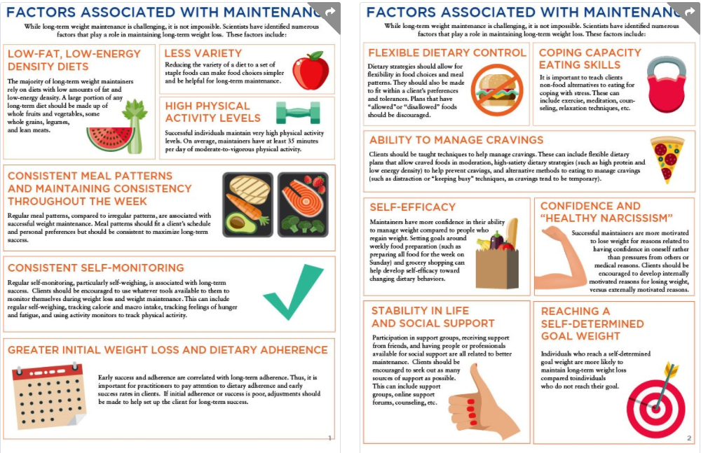

# Long-Term Weight Maintenance

Reasons for low success rates include **impaired satiety signals** \(Cornier, Grunwald, Johnson, & Bessesen, 2004\), increased **biological drive to regain weight** \(Polidori, Sanghvi, Seeley, & Hall, 2016\), **hyperpalatable food environment,** **constant food cues** and easy access \(Morris, Beilharz, Maniam, Reichelt, & Westbrook, 2015\), **long-term reductions in physical activity energy expenditure** \(Rosenbaum, Hirsch, Gallagher, & Leibel, 2008\), and **experiences of higher burden because maintaining weight loss** requires much more effort compared to lean people \(Kruseman, Schmutz, & Carrard, 2017\).Impaired Satiety Signals.

### Factors Associated With Regain

**Sedentary lifestyle:** Randomized controlled trials \(RCTs\) show that weight regain is more likely when physical activity energy expenditure is low

**Disinhibited eating:** People that tend to have no restraint regarding their eating habits are more likely to regain weight

**Dichotomous view of foods and a rigid approach to dieting:** Rigid approaches are an all-or-nothing approach to dieting and allow for very little flexibility. 

**Binge eating:** Binge eating includes the consumption of large quantities of food while feeling a lack of control over eating. 

**Emotional eating, psychosocial stress, and low coping capacity**

**Lack of social support**

**Psychopathology:** Depression or other psychiatric diagnoses may be associated with regain risk, although the research findings have not been consistent

**Medication-induced appetite elevation:** Some medications may increase appetite and lead to weight regain. 

**Excessive loss of fat-free mass:** The percentage of weight loss from fat-free mass during a diet is a predictor of subsequent weight regain

**Diet burnout:** Long-term weight maintenance takes increased effort 

Factors Associated With Weight Loss Plateaus, Weight Maintenance, and Weight Regain

|  | **Plateau** | **Maintenance** | **Regain** |
| :--- | :--- | :--- | :--- |
| Elevated appetite | ↑ | ↓ | ↑ |
| Hyperpalatable, energy-dense food environment | ↑ | ↓ | ↑ |
| Dietary adherence | ↓ | ↑ | ↓ |
| Low-energy density and/or low-fat diets |  | ↑ | ↓ |
| Less dietary variety |  | ↑ | ↓ |
| Consistent meal patterns throughout the week |  | ↑ | ↓ |
| High physical activity |  | ↑ | ↓ |
| Self-monitoring | ↓ | ↑ | ↓ |
| Greater initial weight loss |  | ↑ | ↓ |
| Reaching self-determined goal weight |  | ↑ | ↓ |
| Flexible dietary control | ↓ | ↑ | ↓ |
| Intuitive eating |  | ↑ | ↓ |
| Coping skills and overcoming situational barriers | ↓ | ↑ | ↓ |
| Ability to manage cravings, temptation, and lapses | ↓ | ↑ | ↓ |
| Self-efficacy |  | ↑ | ↓ |
| Confidence and healthy narcissism |  | ↑ | ↓ |
| Life stability |  | ↑ | ↓ |
| Social support | ↓ | ↑ | ↓ |
| Disinhibited eating \(no restraint\) |  | ↓ | ↑ |
| Dichotomous view of foods and rigid dietary control | ↑ | ↓ | ↑ |
| Psychopathology |  | ↓ | ↑ |
| Medication-induced appetite elevation |  | ↓ | ↑ |
| Binge eating |  | ↓ | ↑ |
| Emotional and stress-related eating | ↑ | ↓ | ↑ |
| Excessive loss of fat-free mass |  | ↓ | ↑ |
| Diet burnout |  | ↓ | ↑ |
| Weight-cycling history |  | ↓ | ↑ |

\*\*\*\*

#### Weight-Cycling History

A previous history of **weight cycling** is associated with increased risk of weight regain

Previous failed attempts to maintain weight loss may alter a person’s confidence to be able to achieve long-term success.

#### Diet Breaks as an Adherence Tool

The increased biological drive to regain weight combined with the hyperpalatable, easy-to-access food environment can make long-term adherence difficult. Willpower is generally insufficient to overcome these challenges. The physiological, psychological, and environmental factors can be overwhelming. Thus, an appropriate dietary strategy for a client is one that makes adherence as easy as possible while minimizing any suffering.

 **Intermittent dietary strategies** can be a useful tool to help enhance long-term adherence. 

**Intermittent dietary strategies** Alternating periods of energy restriction with periods of maintenance or diet breaks.

