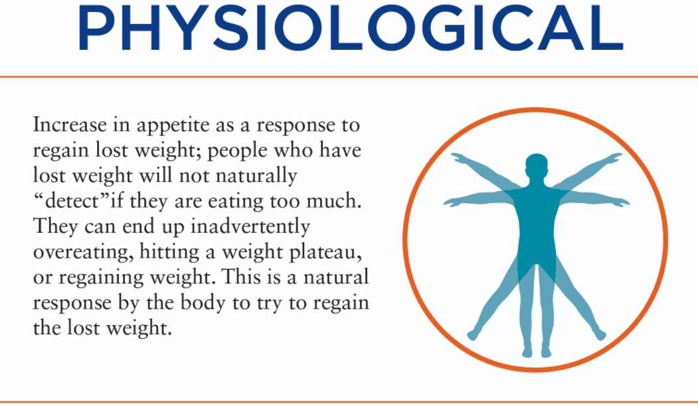
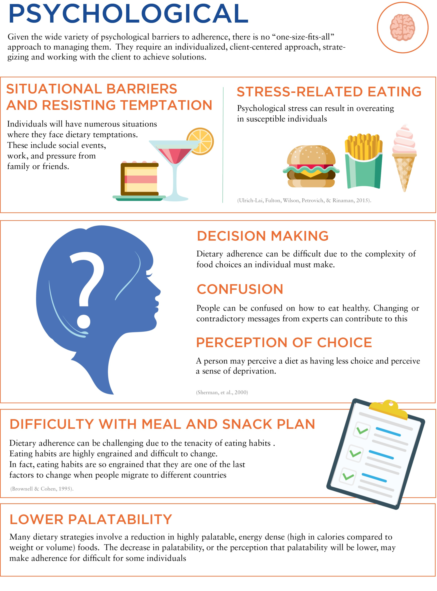
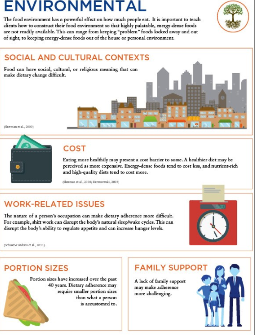

# Managing Plateaus and Maintaining Weight Loss

Two major **challenges** that people face include weight-loss plateaus and preventing weight regain.

## Weight-Loss Plateaus

Almost everyone experiences weight-loss plateaus in the quest to lose weight. A weight-loss **plateau** can be defined as a period of stalled progress of **1 month or longer** 

Weight change is a function of **energy balance**. When people consume fewer calories than they expend, they establish an energy deficit and lose weight. If weight loss stops, it means there is no longer a deficit. Energy consumption has reached a new equilibrium with **energy expenditure.** 

\*\*\*\*

### Lapses in Dietary Adherence

An **increase in energy intake** so that energy intake matches energy expenditure is the main reason for a weight-loss plateau. Weight-loss success is strongly related to **dietary adherence** rather than diet type or macronutrient composition 

Dietary adherence also predicts weight regain after weight loss; in fact, people with low dietary adherence show greater weight regain at 1 to 2 years compared to people with high adherence

### Causes of Dietary Adherence Lapses

* Physiological
* Psychological
* Environmental

#### Physiological

When the body is placed in an energy deficit, there are strong signals to try to bring the body back into energy balance.

Do not experience a decrease in hunger during overfeeding

The physiological increase in appetite is strong.

There is a biological drive to increase calorie intake by approximately 100 calories for every kilogram of weight loss

#### Psychological

#### Environmental

The abundance of **hyperpalatable**, energy-dense foods has a significant role in the obesity epidemic.

**hyperpalatable:** Foods that are ultra-processed and made to be highly appealing to our senses.

## 

