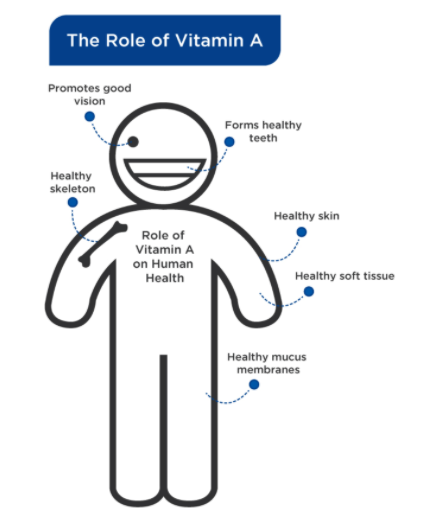

# Fat-Soluble Vitamins

**Fat-soluble** vitamins are defined as those that dissolve in fats and oils 

fat-soluble vitamins can be stored in the body’s fatty tissue.

they must also be absorbed along with fats in the diet, meaning that they are not easily absorbed without dietary fat present in ingestion

Vitamins A, D, E, and K are the fat-soluble vitamins.

### Vitamin A

Vitamin A is a group of **compounds** referred to as **retinoids**.

**retinoids:**A class of chemical compounds that are vitamers of vitamin A.

**compounds:**  A thing that is composed of two or more separate elements.

The most common retinoids are **retinol**, **retinal**, and **retinoic acid**.

Forms and Functions of Vitamin A

| **Chemical** | **Description** |
| :--- | :--- |
| Retinol | Retinol is often referred to as vitamin A1. It is converted into retinal in the human body. |
| Retinal | Retinal is one of the other main forms of vitamin A and is converted into retinoic acid in the human body. Retinal is important as it converts light into signals that the brain turns into vision. |
| Retinoic Acid | Retinoic acid directly affects expression of genes. Retinoic acid is often used as a treatment of some skin conditions, such as acne, as it can control protein production that contributes to acne. |

\*\*\*\*

Roughly 33% of children under the age of 5 have vitamin A deficiency worldwide, with 670,000 children under 5 dying each year due to vitamin A deficiency and another 250,000 going blind

_**Where is it found in foods?**_

Vitamin A is found primarily in fish, specifically fish oils such as cod liver oil. It is also found in butter, eggs, some cheeses, and beta-carotene-rich foods such as carrots, squash, and kale.

In cases where vitamin A deficiency is a concern, a **registered dietitian nutritionist** can help with supplementation guidelines after the adequate dietary sources are incorporated regularly.

### Vitamin D

Vitamin D plays many critical roles in human health, including **immune** function, **bone** formation, and calcium metabolism

vitamin D can be manufactured in the body through the conversion of **cholesterol** \(7-dehydrocholesterol\) to the active form of vitamin D \(D3\) by sunlight.

recent evidence has indicated that dietary vitamin D and supplemental vitamin D are indeed necessary for many people.

_**Where is it found in foods?**_

Vitamin D is found in many of the same foods as vitamin A: salmon, sardines, mackerel, tuna, cod-liver oil, shiitake mushrooms, fortified milk, and fortified cheese.

### Vitamin E

 **vitamin E** is a class of compounds.The **most** **common** ones are known as the **tocopherols** and the **tocotrienols**, each of which has **four** **types**: alpha, beta, gamma, and delta.

Vitamin E is one of the main antioxidant molecules in the body and it protects cells from oxidative damage.

Vitamin E deficiency can lead to neurological disorders that include uncontrolled movement and slurred speech.

_**Where is it found in foods?**_

Vitamin E is primarily found in nuts and seeds \(e.g., almonds, sunflower seeds, wheat germ, hazelnuts, and pine nuts\) as well as oils derived from them. It is also found in fish, such as salmon, as well as butter and avocado.

Most people do not need to supplement with vitamin E

### Vitamin K

**Vitamin K** is the name for a family of compounds known as the phylloquinones \(vitamin K1\) and menaquinones \(vitamin K2\).

Vitamin K is involved in regulating blood homeostasis by controlling clotting

It also plays critical roles in bone formation and remodeling as well as working synergistically with vitamin D.

 K1 can be obtained in the diet from plants

K2 is the product of bacterial fermentation and must either be made by the gut bacteria or consumed in supplemental form, come from some animal foods, or be derived from bacteria.

_**Where is it found in foods?**_

Vitamin K is primarily found in dark, leafy greens, such as kale, collard and mustard greens, swiss chard, mustard parsley, romaine, green-leaf lettuce, & Brussels sprouts.

This can be achieved by doing the following:

* Consuming fatty fish at least once a week
* Consuming several servings of vitamin-rich nuts and seeds \(two to three\) per day
* Consuming several servings of fortified dairy products \(two to three\) per day

