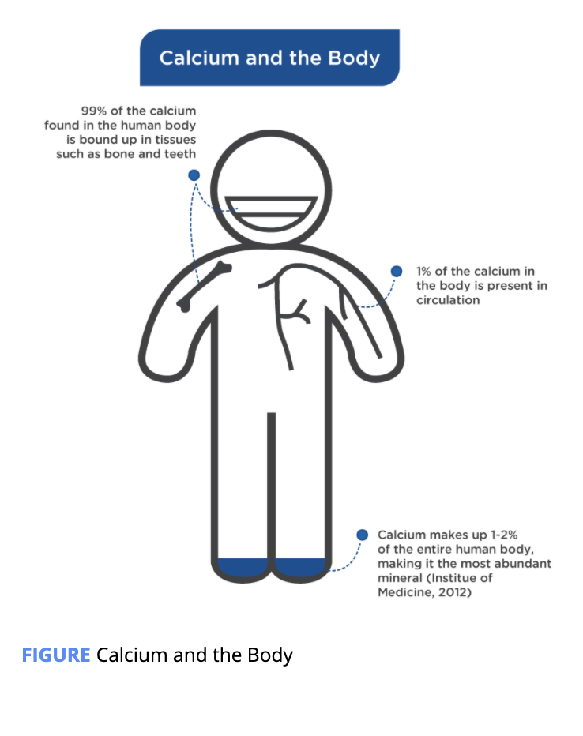
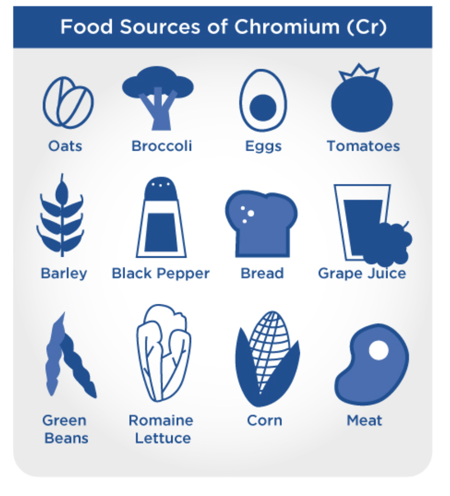
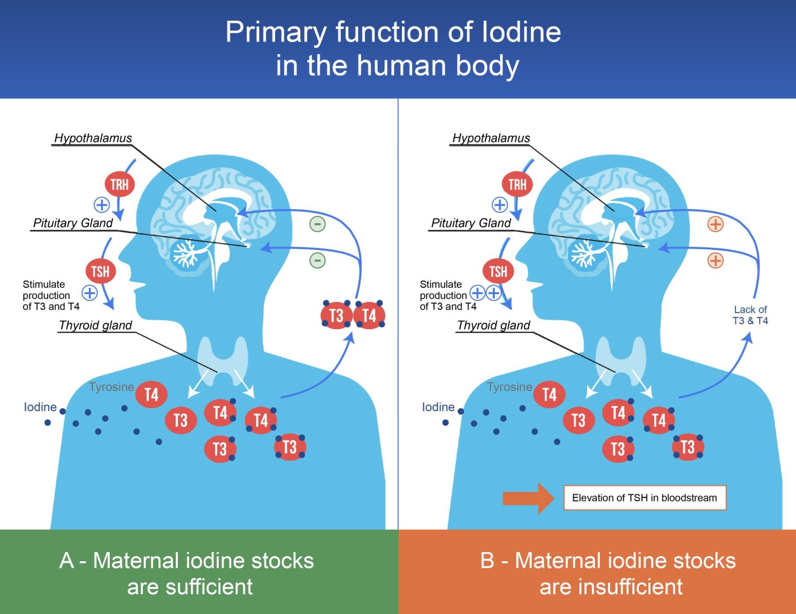
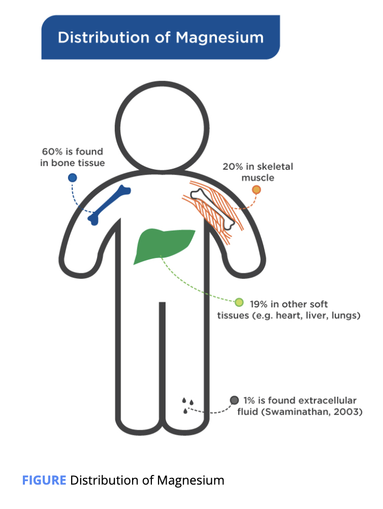
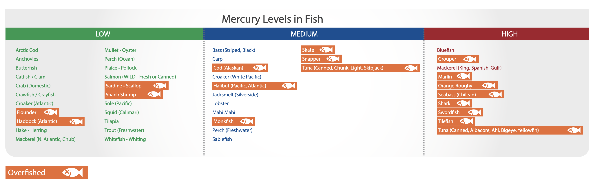

# Minerals

Similar to vitamins, minerals are not made by the body; they must be consumed in the diet or be supplemented.

### Calcium

The levels of calcium in the blood are very tightly controlled, with levels of **calcium ranging between 8.4 to 9.5 mg/dL.**

it is the critical mineral in the crystalline structure that makes up bone tissue. In addition to its structural role, calcium is also essential for skeletal muscle contraction along with other electrical signaling functions.

Osteoporosis **:** A condition of weakened bones where bones lose their density – calcium is a key piece of bone structure and calcium deficiency can lead to osteoporosis.

Vitamin D is involved in the active absorption of calcium from the digestive tract and absorption of calcium varies with the amount of calcium consumed.

### Chromium

**Chromium** is considered a **trace element** as the required intake is low \(0.2 to 45 micrograms per day\).

**trace element :** An element that is only required in minute amounts in the human body.

Chromium 3+ is the form found in food and is the biologically active form while chromium 6+ is a toxic form that results from industrial pollution

Chromium has been implicated in regulating **insulin** signaling, with some data suggesting that it may enhance insulin sensitivity and/or decrease insulin resistance

### Copper

Copper is an essential mineral and helps balance the **redox system** in the human body. There are several disorders that come from copper metabolism issues. 

**redox system:**The process and reaction between two substances in which one substance is oxidized and the other reduced.

Copper is needed in minute quantities, ranging from 600 to 700 micrograms \(0.6 to 0.7 milligrams\) per day.

### Fluoride

Fluoride is a **nonessential mineral**

preventing cavities in teeth.

**h**igher doses consumed chronically \(&gt;2mg/kg\) can result in mottled and pitted tooth enamel.

ingestion of 10 to 25 mg/day for extended periods of time \(7 to 20 years\) can damage bones.

### Iodine

Similar to chromium, iodine is considered a trace mineral

precursor to thyroid hormones

### Iron

Iron is central in hundreds of metabolic processes, with the storing, transporting, and delivery of oxygen via **hemoglobin** and **myoglobin** being the most important of its myriad roles. 

**Hemoglobin**: An iron-containing protein found on red blood cells that binds oxygen and other molecules for transport in the blood.

**Myoglobin**: A protein that carries and stores oxygen in muscle cells.

Iron deficiency prevalence varies from 5% in North America to upwards of 60% in Africa and is responsible for roughly 50% of all cases of anemia

Dietary iron is found in two major forms: **heme** and **nonheme** iron. 

Heme : A form of dietary iron found only in animal meat.

Nonheme: A form of dietary iron found in plant-based foods.

Research indicates can **improve** **athletic** **performance**.

### Magnesium

**Magnesium** is involved in over 300 biochemical reactions that span the full spectrum of human metabolism: from digestion to nervous system activity to glucose regulation and protein synthesis

Like calcium, magnesium is found in large quantities in the human body, with roughly 20 to 30 grams found in the average adult human

Magnesium is conjugated to ATP

It is also intimately involved in the metabolism of carbohydrates, fats, and proteins and in the ion channels that regulate calcium flux and potassium flux across membranes.

Magnesium is important in many **chronic** **diseases**, specifically **diabetes**.

lowered fasting glucose, LDL-c, and triglycerides and raised HDL-c in people with Type 2 diabetes 

### Mercury

**Mercury** is a trace element that finds its way into the human diet, has no necessary function, and is **highly toxic**, especially during development in utero and early childhood.

recommended by the World Health Organization \(2017\) is 2 µg/kg per day.

### Phosphorous

Phosphorus is found everywhere in the body and is required for energy production and maintaining cellular viability.

**Cell viability** is a measure of the proportion of live, healthy cells within a population.

, which is part of adenosine triphosphate \(ATP\),

excessive phosphorous intake from processed foods may increase the risk of cardiovascular disease and osteoporosis and accelerate established kidney disease;

not need to be supplemented

### Potassium

Potassium is present in all tissues in the body

maintaining concentration gradients, fluid volume, and cardiac rhythm

potassium which is primarily an intracellular fluid

**Intracellular fluid** \(ICF\) is the cytosol within the cell. Extracellular **fluid** \(ECF\) surrounds the cells serves as a circulating reservoir. 

