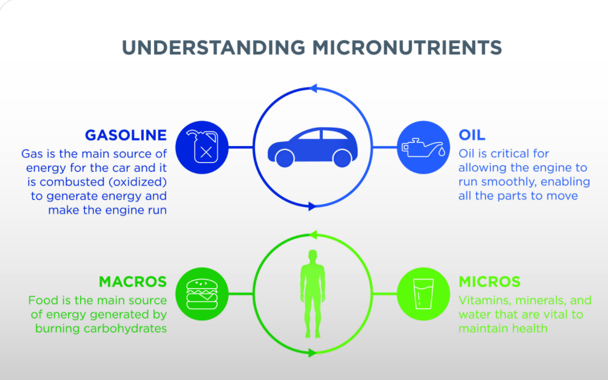
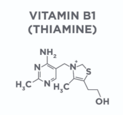
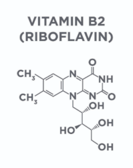
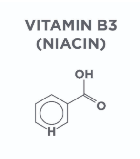
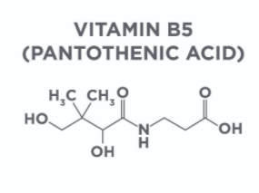
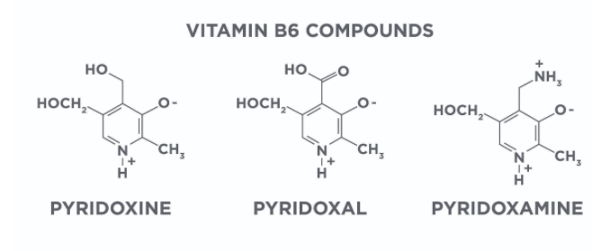
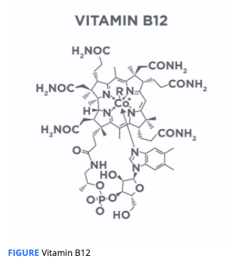
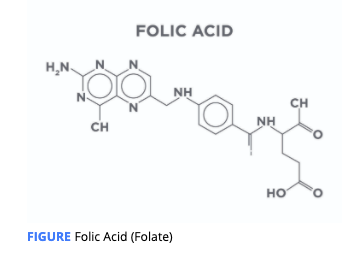

# Water-Soluble Vitamins

Macronutrients and micronutrients are defined by the quantity in which they are needed in the diet.

Micronutrients are critical to maintaining robust human metabolism and overall human health. 

Deficiencies in micronutrients are the cause of diseases like scurvy \(vitamin C deficiency\), rickets \(vitamin D deficiency\), and blindness \(vitamin A deficiency\). Additionally, deficiencies in micronutrients such as magnesium can impair glucose metabolism and deficiencies in **selenium** can result in **muscle pain** and **bone disorders**.

## **Water-soluble**

 vitamins are defined as vitamins that can dissolve in water. Due to this ability, they are **not stored in the tissue** of the body but are present in the blood and other water-based fluids.

These vitamins are excreted in the urine and must be replaced daily for optimal health.

### Vitamin B1 \(Thiamine\)

**Vitamin B1**, commonly referred to as thiamine, is critical in the metabolism of sugar and amino acids as well as central nervous ****system function. 

Vitamin B1 is found in high concentrations in **skeletal muscle**

higher levels of physical activity are more likely to have low levels of vitamin B1**.**

**Deficiency in vitamin B1:**  **beriberi** and **Wernicke encephalopathy**. 

Beriberi : A condition of thiamine deficiency that affects either the cardiovascular system, the nervous system, or both.

Wernicke Encephalopathy:  A disease of the brain that is the direct result of thiamine deficiency – It causes confusion and makes people uncoordinated.

_**Where is it found in foods?**_

fortified _**,**_ enriched grains, animal meats, squash, black beans, and flax seeds.

in almost all cases, supplementation is **not necessary.**

\*\*\*\*

### Vitamin B2 \(Riboflavin\)

 is critical in the metabolism of proteins, carbohydrates, and fat and is a component of **flavin adenine dinucleotide \(FAD\)**, an essential part of the **antioxidant system** in the body. 

 **flavin adenine dinucleotide :**A key molecule in regulating oxidation-reduction reactions, which are responsible for managing the oxidative balance in the body.

_**Where is it found in foods?**_ found in a wide range of food sources: beef, fish, pork, milk, mushrooms, peanuts, avocados, and eggs.

supplementation in most cases is not necessary.

### Vitamin B3 \(Niacin\)

shares many similarities with vitamin B2

It is also a component of a dinucleotide, specifically, **nicotinamide adenine dinucleotide \(NAD\)**. NAD plays a critical role in the Kreb’s cycle and electron transport chain and is responsible for much of the ATP production in our cells.

NAD is involved in the production of many other macromolecules

**Deficiency in vitamin B3:** inflammation of the skin, headache, diarrhea, memory loss, and, in severe cases, it can lead to death.

_**Where is it found in foods?**_  beef, fish, pork, milk, mushrooms, peanuts, avocados, and eggs

supplementation is not required for most people. Also, supplementation with vitamin B3 is not effective at improving athletic performance.

### Vitamin B5 \(Pantothenic Acid\)

is a component to co-enzyme A \(CoA\)

plays a fundamental role in the production of cholesterol, fatty acids, and other molecules, such as coenzyme Q10 \(CoQ10\)

involved in the metabolism of proteins, carbohydrates, and fatty acids.

**Deficiency in vitamin B5:**  is quite rare, occurs in cases of severe malnutrition

_**Where is it found in foods?**_  

similar foods as vitamins B1, B2, and B3

### Vitamin B6

represents a class of several related \(but different\) molecules, pyridoxal, pyridoxine, and pyridoxamine

These are involved in the **breakdown of glycogen** into glucose and the production of glucose and neurotransmitters. 

alter fuel metabolism slightly during exercise, shifting it to use more carbohydrates and less fat

**Deficiency in vitamin B6:** uncommon,  1.5% of the people studied. most people do not require supplementation, including athletes, it may be of use for people with diabetes to reduce the risk of complications.

_**Where is it found in foods?**_

_**f**_ortified grains, eggs, organ meats,potatoes, bananas, parsnips, and some nuts

### Vitamin B7

vitamin H

it is a cofactor in many **carboxylase enzymes**, which are responsible for transferring carbon dioxide molecules and the metabolism of carbohydrates, fatty acids, cholesterol, and amino acids

**Deficiency in vitamin B7:** Biotin deficiency is rare,

_**Where is it found in foods?**_ organ meats, fish, nuts and seeds, and dairklxzy

### Vitamin B12

**Vitamin B12** stands out among the **B-complex vitamins** in that it is the largest, comes in many forms, and contains a heavy **metal/mineral** in its molecular structure

Vitamin B12 is involved in many different metabolic processes, including **DNA synthesis**, **red blood cell production**, and in maintaining **proper neurological function**

\*\*\*\*

**Deficiency in vitamin B12:**   vitamin B12 deficiency can lead to anemia \|  neurologic disorders \| a host of other diseases and disorders.

deficiency is more common with vitamin B12 than the others.

For example, vitamin B12 deficiency in children and young adults in developed nations is between &lt;1 to 3%, while vitamin B12 deficiency has been reported at 70 to 80% in developing countries.

Deficiency is more common in people who consume a vegetarian or vegan diet

vitamin B12 status should be checked in pregnant women as vitamin B12 status may impact fetal and infant health.

_**Where is it found in foods?**_

fortified grains, shellfish, fish, beef, and dairy.

### Folic Acid \(Folate\)

Folate helps regulate single-carbon transfers, both accepting and donating single carbons to chemical reactions

**Deficiency in vitamin** Folic Acid**:**  _****_deficiencies in folate are uncommon in young, otherwise healthy individuals in developed countries but are higher in lower socio-economic groups

In pregnant women, folate supplementation may improve hemoglobin levels and reduce birth complications 

it may also help with recovery from depressive disorders

_**Where is it found in foods?**_

Folate is found in similar foods as B12: fortified grains, seafood, lean meats and poultry, eggs, legumes \(beans and peas\), nuts, seeds, and soy products.

Folate, like vitamin B12, deserves attention and blood levels of folate should be measured routinely in specific populations: pregnant women, people with depressive disorders, and in people with a history of anemia.

### Vitamin C

_**c**_ommonly referred to as ascorbic acid, is one of the more robust vitamins.

vitamin C is important for maintaining your antioxidant system and minimizing disease risk

 it has been shown to reduce exercise-induced muscle damage and reduce post-exercise soreness known as **delayed-onset muscle soreness \(DOMS**\)

Deficiencies in vitamin C can lead to diseases such as scurvy as well as less-serious conditions such as dry skin.

deficiencies in vitamin C are uncommon

_**Where is it found in foods?**_

Vitamin C is found primarily in bright colored fruit_**,**_ bell peppers, cruciferous vegetables, dark leafy greens, and tomatoes.

a large single serving of vitamin C can result in GI distress and sometimes lead to diarrhea.

### Choline

two main roles of choline are to aid in providing structure for cell membranes and as a critical molecule for the production of the neurotransmitter acetylcholine

changing how the genes are expressed by adding specific tags, methyl groups, to your DNA.

The body manufactures choline in the liver but does not make enough to cover all the choline needs of the body, meaning that choline must be consumed in the diet.

organ dysfunction, primarily fatty liver and damage to muscle tissue

potential benefit of choline for reducing risk of heart disease

might improve athletic performance by increasing how much or how long muscles can contract by increasing the amount of acetylcholine in muscle tissue.

_**Where is it found in foods?**_

organ meats and egg yolks. It can also be found in oysters; dark, leafy greens; cauliflower; and mushrooms.

Supplementation with choline in athletes does not appear to provide benefit and is not necessary.

### Summary

In order to prevent micronutrient deficiencies for water-soluble vitamins, a person should consume a diet that includes the following:

1. Animal meats or animal by-products such as dairy or eggs
2. Green, leafy vegetables and other bright-colored vegetables
3. A variety of nuts and seeds
4. Micronutrient-rich grains and legumes
5. Enriched or fortified grains or oils in moderate quantities

\*\*\*\*

