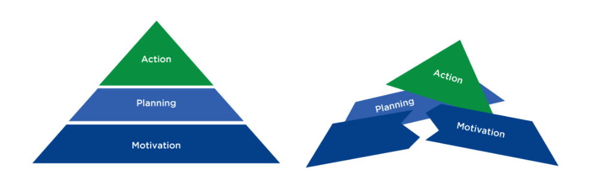

# Introduction

**Motivational Interviewing \(MI\)** is a counseling style that aims to help individuals get unstuck from **ambivalence** and to increase personal motivation for change

**ambivalence:** The state of having mixed feelings about change – a client with ambivalence wants to change and at the same time does not want to change.

motivational interviewing **is a way of being with clients.** This way of being with people is non-confrontational; indeed, it is a **collaborative**, **empathetic**, and **goal-oriented style of communication.** Effective motivational interviewing helps clients discover their own reasons for change by **providing acceptance, compassion, and active listening.**

knowledge does not guarantee action.

Once knowledge is acquired about the benefits of a certain behavior, the client needs to contemplate the desirability and feasibility of the action.

 The rewards of unhealthy eating are very **proximal**, meaning they are immediate. The rewards of healthy eating are much more **distal**, meaning they are not realized until later in the future

Individuals must move through two general change phases: a **motivational phase** and a **planning phase**. 

In the initial deliberative stages, clients create a motivational foundation for implementing change. In the implemental stage, clients plan when, where, and how to act. Plans will fail to drive action if a person questions the desirability or feasibility of the chosen goal

New information has a directional influence on the planning phases of goal striving. If a client does not believe the goal is desirable or if they believe they lack the capabilities to achieve the goal, they will fail to plan

