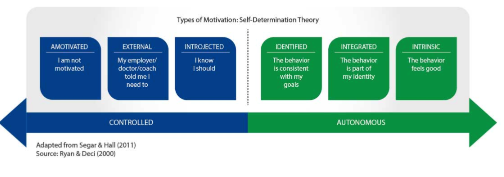
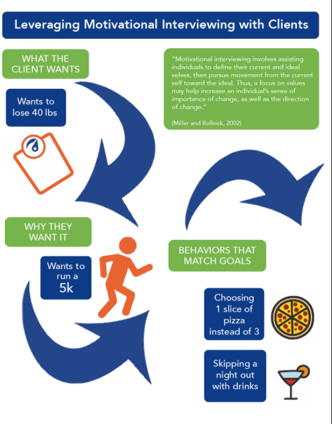
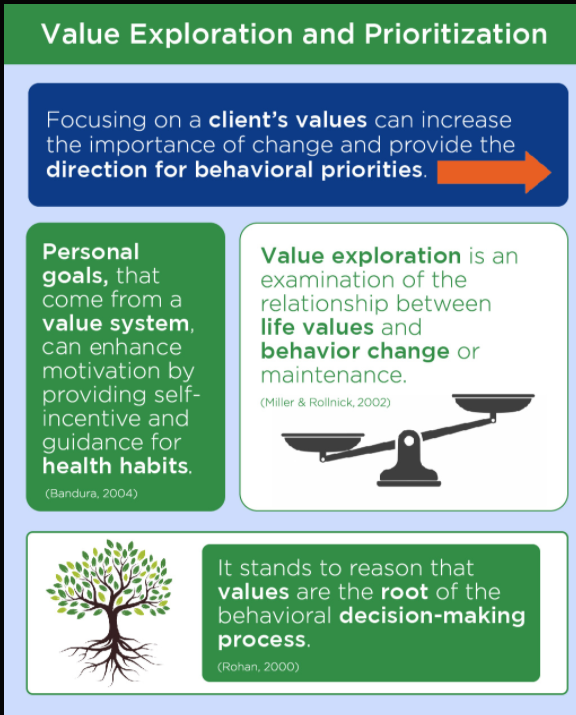

# Motivational Foundations

Motivation Example Comparison

| **Motivation** | **Example** |
| :--- | :--- |
| Amotivation | I will not eat healthy because I do not want to eat healthy. |
| Extrinsic  | I will eat healthy because, if I do not, I could face health problems. |
| Intrinsic | I will eat healthy because I really enjoy knowing that I am fueling my body with the best nutrients possible.  |

Motivational interviewing is a client-centered method for enhancing intrinsic motivation to change by exploring and resolving ambivalence.

**Self-Determination Theory \(SDT\)** is a motivational theory that is closely aligned with MI \(Patrick & Williams, 2012\). SDT postulates that motivation can lie anywhere on a continuum from **amotivation**, to **extrinsic motivation**, to **intrinsic motivation**. 

Motivational regulation varies along a continuum and is reflective of the level to which a behavior is integrated into an individual’s values or identity. When behaviors have been **internalized** and are reflective of the self, yet are still extrinsic, they are considered autonomous and extrinsically motivated.

**Controlled Motives:** Those with motives who feel outside or internal pressure to do certain behaviors.

**Autonomous Motives:** Behaviors that are enacted with a sense of volition and choice – autonomously motivated people want to do the behavior.

Motivational Regulation Examples

| **Motives** | **Motivational Regulation** | **Example** |
| :--- | :--- | :--- |
| **Controlled Motives** | External | Losing weight because there is a weight-loss challenge at work and the winning team gets a prize |
| Introjected | Losing weight because of the guilt of being overweight |  |
| **Autonomous Motives** | Identified | The client believes that achieving and maintaining a healthy weight is personally important. |
| Integrated | Losing weight because being healthy and fit is consistent with the client's other health goals \(e.g., running a half marathon\) |  |
|  |  |  |

**unconditional positive regard** **\(UPR\) :** Unconditional positive regard is the support of a person regardless of what they say or do. It is necessary, then, to make the support of a client's behavior unconditional.

Individuals that are met with **negative** regard are less likely to communicate true feelings, have the desire to change, and lack awareness of true internal feelings. As a partner in the change process, do not create motivation; instead, d**raw this motivation out.**

A person experiences **ambivalence** when there are competing demands between desirable behaviors. For example, a client’s desire to improve their body composition by making home-cooked meals may compete with their desire to relax after a long day of work.

As a Nutrition Coach, it is your job to help the client move through this ambivalence. When a client is working through ambivalence, listen for **change talk**. Change talk may sound like this:

**From :** _“I want to start making healthy meals, but I don’t think I have the time.”_

_**To:** I don’t want to have a heart attack like my father.”_

### Value and Goal Exploration

Human behavior is regulated by the interaction of self-generated motivation and external influences.

Self-regulation skills help clients resist negative external influences and are necessary for goal-directed behavior. Focusing on and clarifying client values can help the client appreciate and prioritize behaviors that lead to outcomes that are more important than any goal incongruent behaviors.

**value exploration**. Value exploration is a systematic examination of the relationship between life values and behavior change or maintenance

**Value prioritization** When values are prioritized, behaviors are linked with the client’s personal sense of a desired identity.

While **attitudes** and **goals** are subject to **change**, **values** are durable in serving as an ideal foundation for change efforts.

**Value beliefs guide** the judgment of behavior as either good or not good. Clients are better equipped to achieve health-related goals when the behaviors necessary for success are congruent with their deeply held values or are intrinsically and or autonomously motivated compared to extrinsic and controlled.

A value exploration gives meaning to behavior. When a client eats spinach to lose weight, this may be perceived as a negative experience if it does not have meaning. But, ask the client why they want to lose weight. Maybe in college they were very fit and always saw that as a part of their identity.

Values help a client define the best version of themselves.

Values represent the clients' _why_. The client who wants to lose 15 pounds wants to feel confident, safe, and healthy. When making health changes, there are any number of ways to achieve the _why_.

It is important to understand three different relationships between **problematic** behaviors and **values** \(Miller & Rollnick, 2002\):

* Self-oriented: The behavior is good for the individual but bad for others.
* Short-sighted: The behavior is good for the individual now but bad for the individual later.
* Inefficient: The behavior satisfies some needs or values but prevents others.

For the most part, short-sighted and inefficient relationships with values and behaviors will be the ones that health-and-fitness professionals must help clients address. These two often go hand in hand. Take, for example, the client who wants to lose weight but fulfills the need to socialize and the value of friendship by drinking and going out for pizza every weekend with friends. These social bonds are built around behaviors that are incongruent with the client’s goals. The client's behavior is fulfilling one need at the expense of the goal. The client’s value to be social is not negative but how the client is achieving the value is inefficient if they wish to be healthy. A good coach can help the client find ways to still fulfill a need without preventing the fulfillment of another. Find the client's values that are related to their goal. Find out what values negative behaviors fulfill and help the client find alternative ways to achieve their needs in goal-congruent ways.

#### Autonomy Support

In the self-determination theory, there are three basic psychological needs: competence, relatedness, and autonomy. Whether or not they are met, these psychological needs are used to categorize environments as opposing or supporting of positive human functioning.

Behaviors that are autonomous occur when the behavior is valued and is personally important, congruent with a client’s identity, or when it is in line with values, goals, and needs.

MI is client-centered coaching; this means acceptance of the client’s freedom to change or not to change. MI is also a collaboration with the client: by telling the client what to do without them specifically asking, the Nutrition Coach is robbing them of their autonomy.

