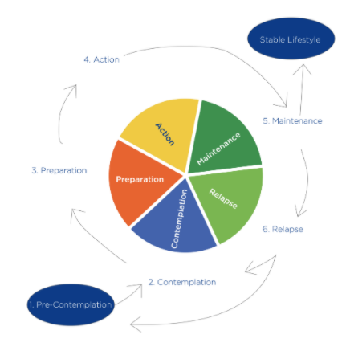

# Stages of Change and Motivational

If the client is ambivalent about change but the coach moves forward with action steps, there will be a disconnection in the coach–client relationship.Previously, motivational and planning phases of behavior change were discussed.

The six stages of change in the TTM are precontemplation, contemplation, preparation, action, maintenance, and termination

### Tailoring Interventions to a Client’s Readiness

Motivational interviewing can be used within other psychological frameworks. ****MI and TTM were developed separately. However, the stages of change in the TTM have provided a logical framework for the role of MI while MI provides directions for how to move people along the stages of change continuum. 

A **continuum** is something that keeps on going, changing slowly over time, like the **continuum** of the four seasons.

---------------------------------------------------------------------------------------------------------------

A client asks their coach for advice. In those instances, a coach can draw from the successes of other clients. For example, a coach might say the following:

1. “Well, another one of my clients who has a very busy schedule like you, started doing intermittent fasting and he has found that it works very well for him.”
2. “One of my clients made a drink rule for herself when she goes out. For every drink she has, she also has a glass of water.”

After you have presented a menu, it is important to ask if any of the options sound feasible to the client.

During the contemplation stage, the coach’s goal is to help the client get out of ambivalence by helping them see more pros of changing.

If a client can see how changing will help them live up to their values, they may move from contemplation to preparation.

Clients in the **preparation** phase need to create a plan that they feel will work for them. Once they make a plan, commitment toward following the plan needs to be enhanced.

During **preparation** stage, the coach may present a menu of common barriers that clients may encounter.

During the **action** stage, coaches can help clients by teaching them how to make effective plans.

During the **maintenance** phase, it is imperative to identify relapses early. Encourage the client to accept a slipup as just a slipup. Accept that it happened and get back on track. Remind them that one bad meal or even one bad day does not undo everything they have worked toward.

Stages of Change and Actions to Take With Your Client

<table>
  <thead>
    <tr>
      <th style="text-align:left"><b>Stage</b>
      </th>
      <th style="text-align:left"><b>Action</b>
      </th>
    </tr>
  </thead>
  <tbody>
    <tr>
      <td style="text-align:left"><b>Precontemplation</b>
      </td>
      <td style="text-align:left">
        <ul>
          <li>Provide empathetic and reflective listening.</li>
          <li>Do a value exploration to see how the client&#x2019;s behaviors fit in
            with their values.</li>
          <li>Build report.</li>
          <li>Avoid arguments.</li>
          <li>Begin with a small change and provide affirmation for each success.</li>
          <li>Enhance self-efficacy.</li>
        </ul>
      </td>
    </tr>
    <tr>
      <td style="text-align:left"><b>Contemplation</b>
      </td>
      <td style="text-align:left">
        <ul>
          <li>Help clients resolve ambivalence and encourage change.</li>
          <li>Have clients get bloodwork done to examine biomarkers of health. Relevant
            health information may encourage change.</li>
          <li>Use decisional balance sheets.</li>
          <li>Provide affirmations.</li>
          <li>Continue to enhance self-efficacy.</li>
        </ul>
      </td>
    </tr>
    <tr>
      <td style="text-align:left"><b>Preparation</b>
      </td>
      <td style="text-align:left">
        <ul>
          <li>Assess strength of commitment to change.</li>
          <li>Help clients develop feasible plans.</li>
          <li>Help clients make specific action plans that dictate when, where, how,
            and with whom a behavior will occur.</li>
        </ul>
      </td>
    </tr>
    <tr>
      <td style="text-align:left"><b>Action</b>
      </td>
      <td style="text-align:left">
        <ul>
          <li>Revise plans as needed.</li>
          <li>Foster strong self-efficacy.</li>
          <li>Harness social support.</li>
          <li>Create and follow through on plans.</li>
        </ul>
      </td>
    </tr>
    <tr>
      <td style="text-align:left"><b>Maintenance</b>
      </td>
      <td style="text-align:left">
        <ul>
          <li>Encourage clients to organize their environment so that temptations to
            relapse are minimal.</li>
          <li>Strengthen commitment to the goal.</li>
          <li>Identify relapses early.</li>
          <li>Encourage clients to forgive relapses and return to their routine.</li>
          <li>Harness social support.</li>
          <li></li>
        </ul>
      </td>
    </tr>
  </tbody>
</table>

