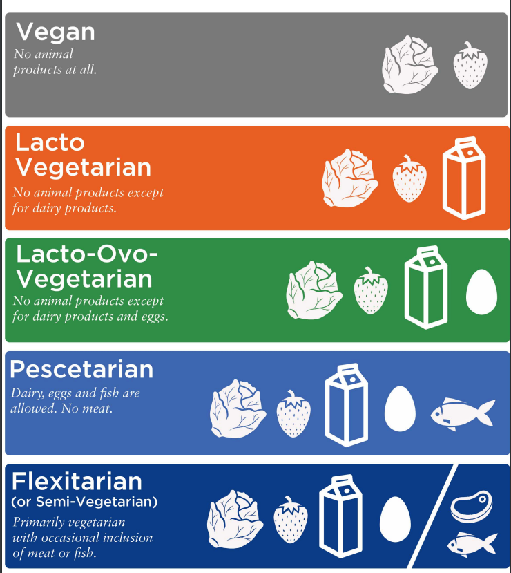

# Diet Approaches Based on Food Choices and/or Restrictions

**Mediterranean Diet**

The Mediterranean diet was originally conceived based on observations of the good health experienced by populations living by the Mediterranean \(predominantly Greece, Italy, and Spain\).

When adherence to the diet is sufficiently high, it is also associated with decreased mortality.

Plant foods such as fresh vegetables, fruit, grains, and nuts make up the basis of the diet in addition to liberal use of **olive oil**. Fish, poultry, and dairy like **cheese** and **yogurt** are included in moderate amounts while **red meat consumption is low.**

Current evidence strongly supports the Mediterranean diet as a health-promoting diet.

#### Vegan Diet and Vegetarian Variations

An examination of observational research suggests that vegans and vegetarians have a reduced risk of heart disease and cancer, but there is no difference in all-cause mortality

\*\*\*\*

Vegetarian diets can improve blood glucose levels in diabetics.

there are some potential **pitfalls :**

\*\*\*\*

1. **Protein Intake** – **** attention should be paid to plant sources of protein in the diet and, if necessary, a vegan-friendly protein supplement \(e.g., pea protein powder\) can be used.
2. **Protein Quality** – to maximize the **anabolic response** to feeding, one may consider increasing the protein dose from plant-based sources, supplementing with additional amino acids such as leucine, or using a combination of plant-based sources in a meal to provide a more favorable amino acid profile for maximizing muscle protein synthesis.
3. **Vitamin B12** – ****it is advisable to supplement with vitamin B12.
4. **Omega 3 Fatty Acids** – **** in diets that do not include fatty fish, it may be advisable to supplement with an EPA + DHA supplement. Vegan-friendly EPA/DHA supplements are available with the fats extracted from microalgae.
5. **Calcium** – ****  Vegans can obtain calcium from several sources with leafy green vegetables being a particularly good source.
6. **Iron** – The absence of meat in the diet removes a good source of iron. In addition, **the iron found in plant-based foods is non-heme iron as opposed to the heme iron found in animal products**. Non-heme iron has a much lower **bioavailability** than heme iron, meaning vegan clients may require even **higher iron intakes to** maintain adequate iron status. The Institute of Medicine recommends an intake of **1.8 times that of non-vegetarians** \(Position of the American Dietetic Association, 2009\).
7. **Creatine** – Red meat, poultry, and fish are the best sources of creatine within the diet. Therefore, vegan and vegetarian clients may tend to have l**ower muscle creatine stores** \(Rogerson, 2017\). Creatine has demonstrated clear and consistent benefits for exercise performance \(Kreider et al., 2017\) and emerging research has suggested it can have benefits on health, including mitigating age-related loss of muscle mass and strength and **reducing risk of neurological disorders such as traumatic brain injury and Parkinson’s disease** \(Riesberg et al., 2016\).

### Paleo Diet \(Paleolithic Diet\)

