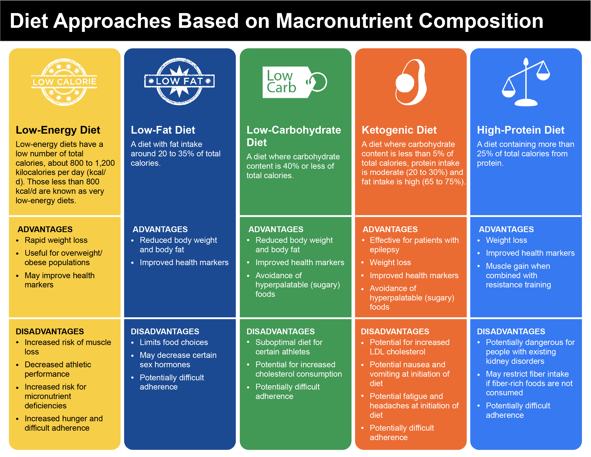

# Diet Approaches Based on Macronutrient Composition

### Low-Energy Diets \(Low-Calorie Diets\)

Typically, low-energy diets will be of about 800 to 1,200 kilocalories per day \(kcal/d\).

Research has consistently shown clear improvements in health markers when overweight or obese patients lose body fat, even when those losses are moderate

Negative Effects of Low-Calorie Dieting and Rapid Weight Loss

| Increased risk of lean body mass loss, particularly in those who are already relatively lean |
| :--- |
| Decreased athletic performance |
| Lowered ability to recover from exercise |
| Increased hunger versus more moderate calorie reduction \(although not always the case\) |
| Decreased food options |
| Difficulty in consuming sufficient amount of micronutrients |

Losses in lean body mass \(e.g., muscle\) can be largely or almost entirely mitigated through the inclusion of high protein intake and resistance training

Protein Intakes While Dieting

| **Suggested Intake \(g/kg\)** | **Suggested Intake \(g/lb\)** | **Reference** |
| :--- | :--- | :--- |
| 1.2 to 1.6 g/kg body weight | 0.5 to 0.7 g/lb body weight | Leidy et al., 2015 |
| 1.6 to 2.4 g/kg body weight | 0.7 to 1.1 g/lb body weight | Hector & Phillips, 2018 |
| 2.3 to 3.1 g/kg fat-free mass | 1.0 -to 1.4 g/lb fat-free mass | Helms et al., 2014 |

### Low-Fat Diets \(LFD\)

The advice to decrease dietary fat intake to 20 to 35% of total calories has been given for many decades at a public health level. Diets below that lower cut-off of 20% of total calories are often referred to as very low-fat diets \(VLFD\).

Potential Negative Impacts of Extremely Low-Fat Intakes

| Can **limit inclusion of fo**ods with positive health impacts \(e.g., nuts, seeds, olive oil, etc.\) |
| :--- |
| Can make the **diet more difficult t**o adhere to due to food restrictions |
| May lead to **decreases in sex hormone**s such as **testosterone** \(Hämäläinen et al., 1983\) |
| Can lead to **increases in triglyceride levels** in the blood in the short-term \(Lichtenstein & Van Horn, 1998\) |
| Theoretically, can increase the risk of an **essential fatty acid deficiency** at consistent extremely low-fat intakes \(&lt;10% of total calories\) |
|  |

Overall, diets with a fat intake of **20 to 35% appear** to be positively associated with health and can potentially help achieve a **calorie deficit** in cases where weight loss is desired.

Positive Impacts of Dietary Fat

| Humans cannot make essential fatty acids, so they must be obtained via the diet. |
| :--- |
| Fat allows us to absorb fat-soluble vitamins: A, D, E, and K. |
| Cell walls contain fat. |
| Fats are involved in hormone production. |
| Helps avoid problems with low-fat diets |

### Low-Carbohydrate \(LC\) Diets

Studies typically classify a diet as low-carbohydrate if the carbohydrate content is 40% or less of total calories.

Low-carbohydrate diets have been shown to be beneficial for body-weight and fat reduction in both short- and long-term studies, However, when compared to diets of a higher carbohydrate amount, but matched for calories, **meta-analyses** have indicated that LC diets do not seem to be superior for fat loss .

When people adopt a low-carbohydrate diet, there can be an unintentional increase in the protein content of the diet. As higher protein intakes lead to greater satiety \(i.e., feeling of fullness\), this may lead to a decrease in calorie intake.

A low-carbohydrate diet is most likely a suboptimal approach for many competitive athletes, particularly in sports with considerable energy contribution from the **anaerobic system** 

A low-carbohydrate diet **can be safely used as part of a healthy lifestyle**; however, its health impact is dependent on the foods selected and not merely the macronutrient composition.

### Ketogenic Diets

The ketogenic diet has been around since the 1920s as a diet plan to reduce seizures for patients with epilepsy\(癫痫\). 

It involves consuming a large percentage of calories from fat, moderate percentage of protein, and very little carbohydrate.

Ketosis is a natural metabolic state that occurs when the body starts producing ketones \(ketone bodies\) from fat. The body can use these ketones as a fuel \(substrate\) source to generate energy in place of glucose \(which is now scarce\).

A ketogenic diet typically requires carbohydrates to be restricted to less than 50 grams per day \(or **5% of total calories**\), **protein** intake to be moderate \(**20 to 30%** of calories\), and the remaining calories to be made up from dietary **fat** \(usually **65 to 75%** of calories\).

Long-term ketogenic diets are capable of leading to greater weight loss than traditional low-fat diets.

However, when calories and protein are matched between diets, a ketogenic diet does not lead to more fat loss than a non-ketogenic or higher-carbohydrate diet

A well-formulated ketogenic diet **may be safe to consume** for many people with the presumption that the diet is comprised of mostly whole, **minimally-processed foods** and is providing adequate micronutrients and fiber.

Ketogenic diets have shown to lead to improvements in cardiovascular disease risk in certain people, notably, decreases in blood triglycerides and increases in high-density lipoprotein cholesterol

even in cases where fat mass is decreased, a **ketogenic diet can lead to increases in LDL cholesterol**

### High-Protein Diet

A high-protein diet is typically defined as one containing more than 25% of total calories from protein or above 1.2 grams of protein per kilogram of body weight \(g/kg\) or 0.54 g/lb.

Much of these benefits are based on the ability for high-protein diets to preserve or increase fat-free mass \(FFM\), increase satiety, and increase the **thermic effect of feeding \(TEF\)**. They show more body-fat reduction per unit of body weight loss when compared to low-protein diets. 

For clients trying to build muscle mass, it seems that a protein intake of 1.6 g/kg \(0.73 g/lb\) will likely maximize the muscle gain that occurs in response to resistance training

a broad general recommendation would be to advise clients to consume 20 to 40 grams of protein in three to four meals across the day.

while it is well-recognized that high-protein diets can be detrimental to those with existing kidney disorders, there is no strong evidence that high-protein diets are dangerous for healthy individuals.

