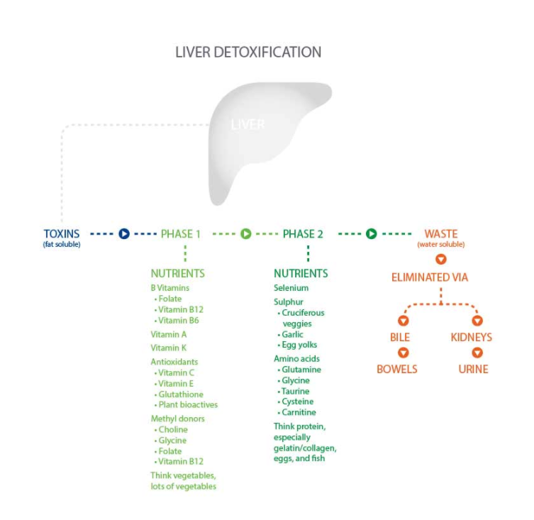

# DETOXES AND CLEANSES

Usually, a combination of highly restrictive dieting and expensive supplementation for no more than a couple weeks, **detox and cleansing programs** claim to purify the body of ill-defined toxins that are sapping people’s health. 

There is **little to no** research on detox programs, with their perceived benefits being the simple result of extreme calorie restriction

The human body has the natural ability to detoxify. It does it on a daily basis to stay alive and healthy.

