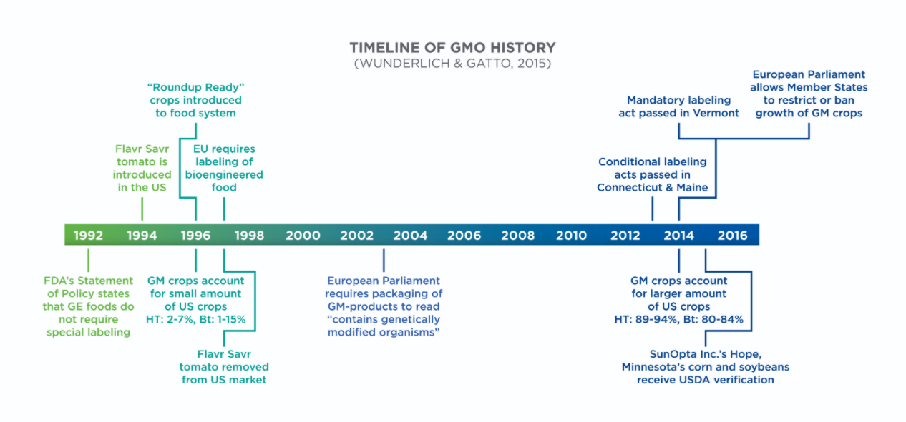
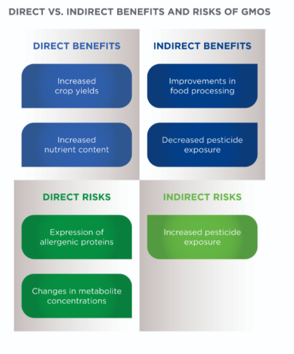
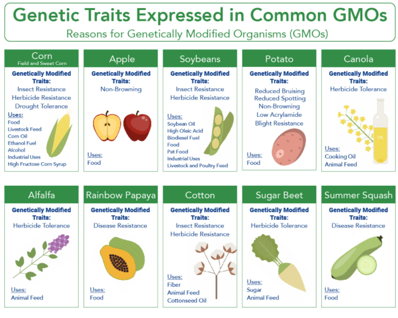
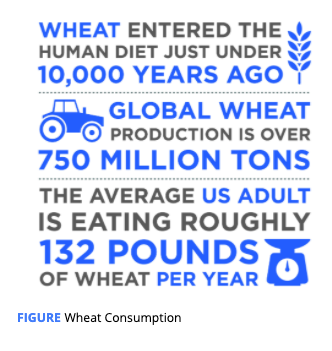
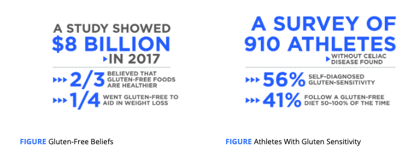

# GMOs and Gluten-Free

## Genetically Modified Organisms

**Genetically modified organisms** **\(GMOs\)** are defined by the World Health Organization \(2014\) as “organisms \(i.e. plants, animals or microorganisms\) in which the genetic material \(DNA\) has been altered in a way that does not occur naturally by mating and/or natural recombination.” 

Additionally, certified organic foods in the United States are not allowed to contain GMOs.

### Potential Risks of GMOs

Direct effects are best demonstrated by the ways in which genetic modification expresses itself, not always in ways that can be anticipated.

the expression of allergenic proteins and changes in metabolite concentrations, including toxic ones, that result from poorly understood regulatory pathways in plants in response to genetic modification

Indirect effects come from how GMOs are used in agricultural practices. Currently, most genetically modified crops are aimed at providing the plant with inborn resistance to either pests or pesticides or both.

There is still much work to be done on determining the short- and long-term effects of widespread GMO acceptance. Many of the risks of GMOs are speculative, but they are scientifically plausible.

the client can actively avoid GMO products by looking for foods certified to be non-GMO or certified organic.

## Gluten-Free Diets

Some people, however, cannot tolerate wheat: those who have a **wheat allergy** \(allergic reaction\), those who have **celiac disease** \(an autoimmune condition\), and those who have **non-celiac gluten sensitivity** \(NCGS, a food sensitivity\) 

The signs and symptoms of a wheat allergy are like other food allergies and include eczema, asthma, nausea, and, in more severe cases, anaphylactic shock.

there is overlap with general intestinal distress from fermentable, poorly absorbed, short-chain carbohydrates: **fermentable, oligo-, di-, monosaccharides, and polyols \(FODMAPs\)** 

When working with clients following a gluten-free diet, it is important to determine whether they feel best following a low-FODMAP diet, a gluten-free diet, or a combination of the two.

FODMAPs may be a possible concern for clients who present with gastrointestinal issues.

### Going Gluten-Free

there is **nothing** special about a gluten-free diet that would help someone lose weight \(Marcason, 2011[\)](https://paperpile.com/c/Cv3Z5O/VEaI), **nor** are there performance **benefits** of going gluten-free

Surveys comparing gluten-free to gluten-containing products have reported minimal nutritional differences other than a lower protein content of gluten-free foods

working with the client to select **whole-meal grains** and **pseudograins**, which are higher in fiber and several vitamins and minerals, is important for nutrient adequacy

