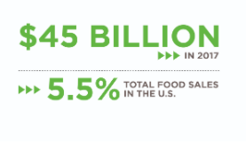
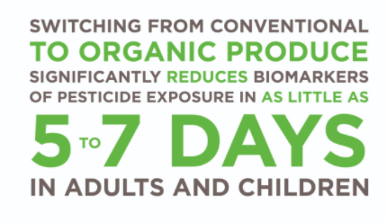
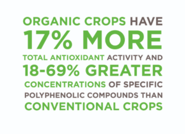

# Organic, Grass-Fed, and Pasture-Raised

### Organic vs. Conventional

_conventional_ refers to the predominant type of intensive agriculture and animal husbandry methods in the United States where the use of pesticides and **concentrate feed** are common. _Organic_ refers to practices that adhere to the USDA’s certified organic criteria.

Many synthetic pesticides have been linked to **cancer** \(Goodson, et al., 2015\), hormone **disruption** \(Vandenberg et al., 2012[\)](https://paperpile.com/c/Cv3Z5O/flkX), and **neurological disorders** \(Burns, McIntosh, Mink, Jurek, & Li, 2013\). **Organic** produce has **four-fold** **lower** levels of pesticide residues than conventional produce \(Barański et al., 2014; Smith-Spangler et al., 2012\).

**A lower pesticide exposure** through eating organic produce can be considered a health benefit, especially for pregnant women, **infants, and children** who are in developmental stages where pesticide exposure can have profound developmental effects

controlled trials have demonstrated that switching from conventional to organic produce significantly reduces biomarkers of pesticide exposure in as little as 5 to 7 days in adults and children

**Plant polyphenols\(**organic\) are believed to be one of the reasons eating a diet rich in plants is associated with numerous health benefits such as beneficial effects on the brain, cancer, inflammation, and the cardiovascular system

