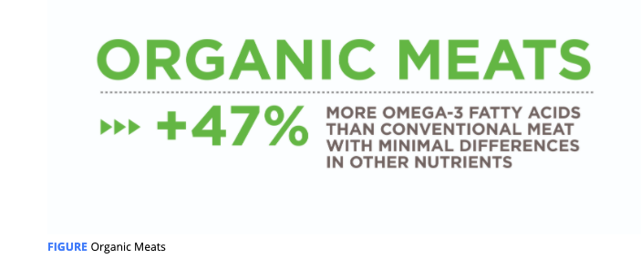

# Organic, Grass-Fed, and Pasture-Raised

### Organic vs. Conventional

_conventional_ refers to the predominant type of intensive agriculture and animal husbandry methods in the United States where the use of pesticides and **concentrate feed** are common. _Organic_ refers to practices that adhere to the USDA’s certified organic criteria.

Many synthetic pesticides have been linked to **cancer** \(Goodson, et al., 2015\), hormone **disruption** \(Vandenberg et al., 2012[\)](https://paperpile.com/c/Cv3Z5O/flkX), and **neurological disorders** \(Burns, McIntosh, Mink, Jurek, & Li, 2013\). **Organic** produce has **four-fold** **lower** levels of pesticide residues than conventional produce \(Barański et al., 2014; Smith-Spangler et al., 2012\).

**A lower pesticide exposure** through eating organic produce can be considered a health benefit, especially for pregnant women, **infants, and children** who are in developmental stages where pesticide exposure can have profound developmental effects

controlled trials have demonstrated that switching from conventional to organic produce significantly reduces biomarkers of pesticide exposure in as little as 5 to 7 days in adults and children

**Plant polyphenols\(**organic\) are believed to be one of the reasons eating a diet rich in plants is associated with numerous health benefits such as beneficial effects on the brain, cancer, inflammation, and the cardiovascular system

The higher concentration of polyphenols with organic farming is likely the result of greater stress on the plant \(wounding, pest attacks, disease, etc.\) that signal it to produce more polyphenols: a known defense mechanism of plants that benefits survival \(Zaynab et al., 2018\). Less pesticide and fertilizer use with organic farming means a greater stress exposure to organic crops.

### Meats, Milk, and Eggs

ue to differences in livestock living conditions and feed, organic livestock will have less exposure to environmental toxicants such as pesticides and other **persistent organic pollutants** **\(POPs\)**

However, there is little to no research investigating differences between organic and conventional meats for pesticides, mycotoxins, and other contaminants

When discussing conventional meat with clients, two points need to be emphasized: the accumulation of POPs in animals is an established occurrence but there is little investigation into POP concentrations in conventional and organic meats. If this issue concerns clients and they have barriers toward purchasing organic meats, opting for low-fat meats can help reduce POP exposure due to their accumulation primarily within fat tissue.

Importantly, this increase comes almost entirely from **alpha-linolenic acid** **\(ALA\)**, which is **not** readily converted into the long-chain omega-3 fatty acids associated with the health benefits: EPA and DHA

**No systematic reviews or meta-analyses have been conducted for eggs.** However, individual studies suggest that, while differences in fatty acids, vitamins, and minerals do exist, **they are too small to be of real-world significance**

organic livestock live healthier and more humane lives than conventional livestock but this **translates into minimal nutritional differences** in their meat, milk, and eggs.

## Grass-Fed and Pasture-Raised

beef from grass-fed and finished cattle is leaner, contains more omega-3 fatty acids, including EPA and DHA, and vitamins A and E

The extent of the differences are variable, however, because the nutritional content of beef depends heavily on the type of forage crops that are eaten by the animal, the animal’s age and breed, and the season

Overall, opting for grass-fed and finished cattle will have the greatest nutritional impact if your client does not regularly consume seafood or regularly eat high-fat cuts of meat because the nutritional differences are **largely confined to the meat’s fat content.**

