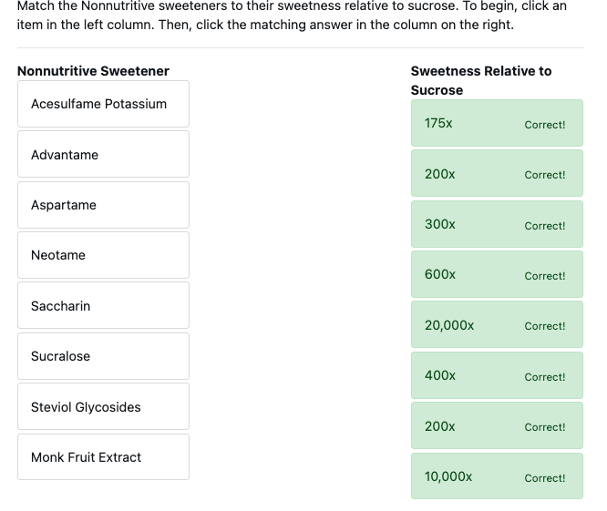

# Quiz

Pastured eggs have how much more DHA than conventional eggs?

3.5 times

What are the major differences between fructose and glucose? Check all that apply.

Fructose is metabolized primarily within the liver.

Promotes overeating and consequential weight gain compared to glucose.

The body continues to create energy from fructose even if the body doesn’t need it.

There is no difference in how the body metabolizes fructose compared to glucose.

