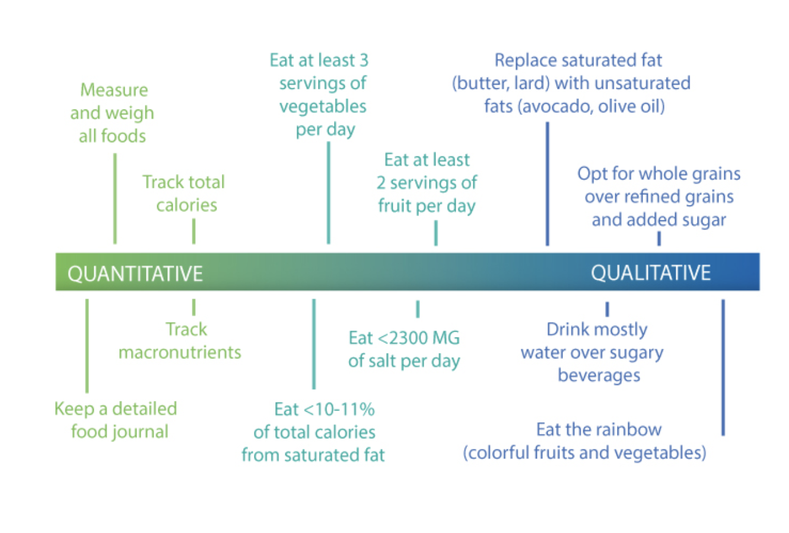
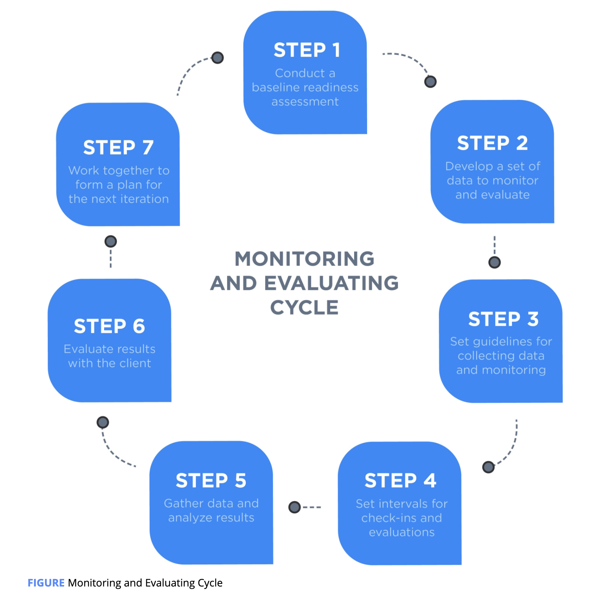

# Translate Numbers to Food and Habits



One can take a high-level approach \(macromanagement\) or a detailed, fine-tuned approach \(micromanagement\). Some individuals do extremely well with broader guidelines to follow while others thrive with incredibly precise instructions for measuring, tracking, and monitoring their food intake.

teaching them the skills to monitor their food intake without carrying a food scale around and how to be more intuitive by relying on habits is likely to ensure longer-term success.

The next step, once the overall approach is set, is to translate the numbers \(calories and macronutrients\) into food and habits

Coach can use a nutrition database \(e.g., the **USDA Nutrition Database**\) and create a list of food options that meet the daily nutrition needs for their client. This information can be shown to clients to help them build their own meals and snacks that fit within their daily life.

### Monitor and Evaluate

 **monitoring** is observing a client and collecting data on the process and execution of the program. **Evaluation** is the objective assessment of what is being monitored.

When monitoring a client, the focus should be on the process; identify the areas of the process that are working and which ones are not.

Furthermore, there are some aspects of nutrition behaviors to be monitored that are more difficult to measure objectively and require a discussion with clients. Examples of these things might be food beliefs, moods, feelings, and quality of life.

Monitoring and evaluating a client can be broken down into the following steps:

1. Conduct a baseline readiness assessment.
2. Develop a set of data to monitor and outcomes to evaluate.
3. Set guidelines for collecting data and monitoring.
4. Set intervals for check-ins and evaluations.
5. Gather data and analyze results.
6. Evaluate the results with the client.
7. Work together to form a plan for the next iteration.

#### Step 1: Conduct a Baseline Readiness Assessment

All progress should be measured relative to an individual's starting point. A baseline assessment can define a client’s starting point and provide valuable information regarding next steps.

Person-centered interviewing techniques such as motivational interviewing can also help the Nutrition Coach understand a client’s food beliefs, identify their current level of readiness and motivation to change, and identify the barriers that might get in the way of adhering to the nutrition plan.



{% embed url="https://nasmu.nasm.org/file.php/10359/pdf/Chapter\_18/Diet\_Record\_%28Food\_Log%29\_Worksheet.pdf" %}

#### Step 2: Monitor Data and Evaluate Outcomes

After completing a baseline assessment, the next step is to identify the scope for the first round of monitoring and evaluation. In other words, create a simple list of goals and behaviors to track.

In addition to collecting, monitoring, and evaluating _hard data_ \(e.g., calories, macronutrients, or foods eaten\), it is important to do the same for more _soft data_. 

Example Habit-Based Goals

| Eat more slowly – put the fork down in between bites. Focus on the food: its taste, texture, and smells. |
| :--- |
| Eat until you're approximately 80% full. Once you are about 80% full, stop your meal and allow your body time to adjust to feeling satiated. |
| Drink at least 8 cups of water per day and aim to stay hydrated throughout the whole day. |
| Set a new sleeping schedule. Aim for 8 hours each night. |
| Substitute saturated or trans fats \(whole cream, butter, or lard\) for unsaturated fats \(avocado or olive oil\). |
| Eat at least one serving of lean protein with each meal \(e.g., seafood, white-meat poultry, eggs, lean beef, or soy\). |
| Fill half your plate with colorful fruits and vegetables each meal. |
| Drink primarily calorie-free drinks \(e.g., water, black coffee, unflavored iced tea, etc.\). Minimize calorie-dense drinks \(e.g., soda, juice, or energy drinks\). |
| Take a 5-minute break; avoid sitting for more than 3 hours at a time. |
| Aim for 150 minutes of moderate aerobic activity per week such as walking or brisk jogging. |
| Practice destressing techniques \(e.g., meditate, unplug from technology for an hour, go for a walk, listen to music, or focus on a fun hobby\). |
| Celebrate your wins and revisit any of these habits you are still having trouble maintaining. |
| Anticipate high-risk situations, identify triggers, and develop coping/problem-solving strategies for lapses. |
| Develop a social support network. |
| Replace negative self-talk \(especially during weight-loss plateaus\) with constructive and positive outlets \(e.g., write down and acknowledge your own accomplishments\). |

#### 

#### Step 3: Set Guidelines for Collecting Data and Monitoring

It is important to set guidelines for collecting data and monitoring. These guidelines include what data is to be recorded, how often it is to be recorded, which party is responsible for collecting what, and how it is to be recorded \(notebook, e-mail, spreadsheets, mobile apps, etc.\).

 A **behavioral contract** that is created and signed by both the Nutrition Coach and client can serve as positive reinforcement for the guidelines and expectations set and can be referred to in later sessions when reviewing client progress.

#### Step 4: Set Intervals for Check-Ins and Evaluations

Setting intervals for check-ins and evaluations is important for keeping continuity and holding the client and the nutrition coach accountable for maintaining a monitoring and evaluation process. Check-ins also help to decrease the likelihood that clients will revert to old behaviors by identifying any setbacks early in the process.

#### Step 5: Gather, Organize, and Analyze Data

The data analysis should be simple and focus on the most important aspects such as average daily and weekly calorie intake, average daily and weekly calorie surpluses and deficits, and adherence \(or lack thereof\) to habit-based goals.

#### Step 6: Evaluate the Results With the Client

The **teach-back method** is an evidence-based technique that the Nutrition Coach can use when discussing key findings to increase the client’s comprehension of new information, promote accurate retention of the key findings once the session has ended, and improve adherence to the recommended plan

#### Step 7: Work Together to Form a Plan for the Next Iteration

