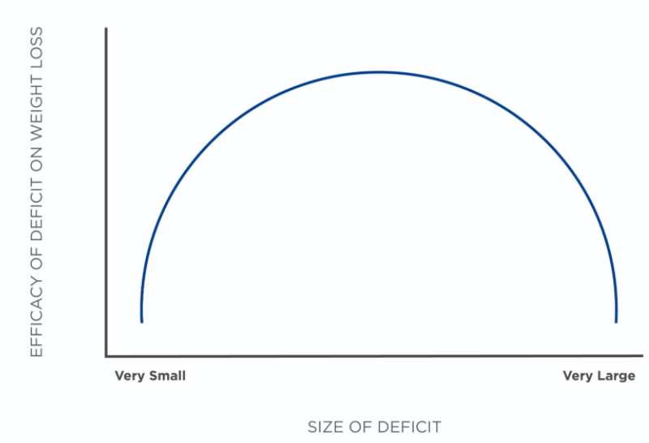

# Programming Introduction

**Programming** is formally defined as the action or process of scheduling something. In the context of nutrition coaching, programming can be defined as the process or scheduling of a nutrition plan in which the plan is set into motion to achieve a specific goal.

Applying these principles can be achieved by employing seven defined, but integrated steps:

1. Set a goal.
2. Determine the total daily energy requirements adjusted for the goal.
3. Set the protein macronutrient target.
4. Set the fat macronutrient target.
5. Set the carbohydrate macronutrient target.
6. Individualize and convert numbers to food and habits.
7. Monitor, evaluate, and adjust. 

### Set a Goal

The first step in the programming process is to define the end outcome for the program.

#### Weight \(Fat\) Loss

While some people may set weight-loss goals based on previous body weight or an **arbitrary number**, a Nutrition Coach must understand what thresholds and targets can **improve client health while still being feasible to achieve.**

In addition to outcome goals ranging from 5 to 10% of weight loss from starting body weight, there are well-researched rates of weight loss that are realistic and backed by science.

For example, for most people who are overweight or obese, roughly 0.5 to 1% of total body weight loss per week are realistic and feasible goals for initial weight-loss periods that likely will not comprise an individual’s adherence to the recommended nutrition program. In most people, this translates to roughly 1 to 2 pounds \(0.4 to 0.9 kilogram\) of weight loss per week.

#### Setting Deficits for Weight \(Fat\) Loss

There are two main things to consider when setting a calorie deficit for an individual: the total amount of weight loss desired and the time frame.

One can think about this as a traditional U-curve \(**Figure: U-Curve**\) in which very-small deficits do not provide enough of a deficit to accumulate and result in meaningful change while very-large deficits are unsustainable or often lead to poor adherence and are not more effective than moderate deficits \(Tsai and Wadden, 2006\).

Example for setting goal. 

Setting deficits based on body weight, the relative deficit changes substantially. This might be a more realistic way to calculate deficits. Take two very different examples: a 130-pound \(58.96-kilogram\) person who is aiming to lose roughly 10 pounds \(4.53-kilograms\) and a 325-pound \(147.41-kilogram\) person who is aiming to lose 125 pounds \(56.69 kilograms\).

Case 1: 130-pound \(58.96-kilogram\) woman losing 1% body weight per week

            **Weekly weight loss:** 130 x 1% = 1.3 lb \(.58 kg\)

            **Weekly deficit required:** 1.3 lb x 3,500 kcal/lb = 4,550-kcal deficit

            **Daily deficit required:** 4,550 / 7 days = 650-calorie-per-day deficit

Case 2: 325-pound \(147.41-kilogram\) woman losing 1% body weight per week

            **Weekly weight loss:** 325 x 1% = 3.25 lbs \(1.47 kg\)

            **Weekly deficit required:** 3.25 pounds x 3,500 kcal/lb = 11,375-kcal deficit

            **Daily deficit required:** 11,375 / 7 days = 1,625-calorie-per-day deficit

