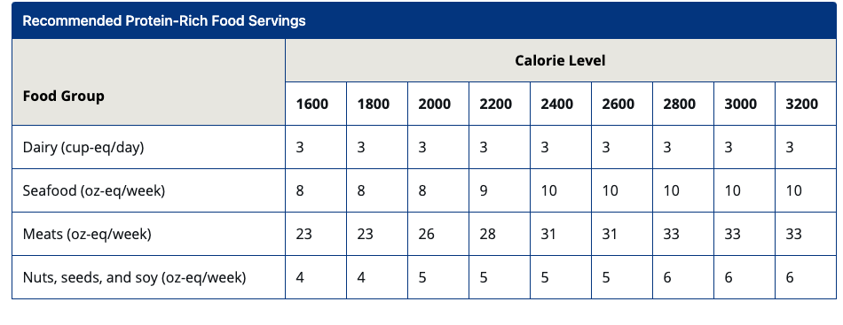
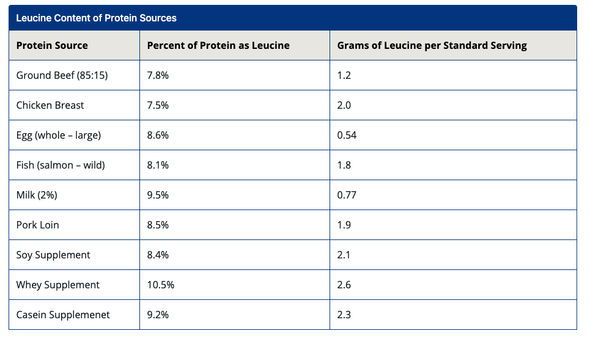
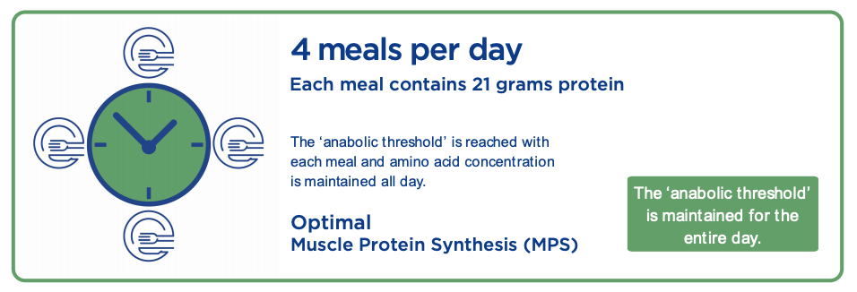

# Accommodating In A Dietary Program

### USDA Dietary Guidelines for Americans 2015–2020

suggests this to be approximately **85 to 90 grams** of protein per 2,000 calories per day, or **17 to 18%** of total calories when including protein from all sources.

### Dietary Reference Intakes

The dietary reference intakes \(DRI\) are established by the Food and Nutrition Board of the Institute of Medicine

They establish the **recommended dietary allowance \(RDA\)** for protein, last revised in 2005. The RDA for protein is **46 grams per day for women and 56 grams per day for men.** based on providing **0.8** grams of protein per kilogram of body weight per day.

### Total Daily Protein Requirements

research on the effects of very high protein intake \(3.0 to 4.4 grams per kilogram\) on body composition indicate that individuals overeating protein will not experience an increase in body fat mass over time

Maintaining as much muscle mass as possible while dieting can be achieved with greater protein intake \(at least 1.8 to 2.2 grams per kilogram\) and regular resistance training.

### Protein Quality

**Protein quality** refers to the number of essential amino acids contained within, and the digestibility of, a protein-containing food.

. A **complete protein** is a food source that contains all of the essential amino acids in appropriate quantities.

animal proteins are complete proteins and plant proteins are incomplete proteins, exception of soy

They can be combined to form a complete protein in a single meal. Because of this, they are called **complementary proteins**. 

wheat/peanut butter, pasta/peas, and lentils/almonds

a vegetarian or vegan diet may pair grains or nuts/seeds with legumes to obtain sufficient EAAs.

#### Special Consideration – Leucine

The amino acid leucine is a primary factor for increasing muscle protein synthesis to facilitate muscle recovery and growth.

**Leucine** is capable of enhancing muscle protein synthesis signaling for a period of about **3 hours after ingestion**, and the _optimal_ dose to maximize protein synthesis is **0.05 grams of leucine per kilogram of body weight** 

\*\*\*\*

### Protein Timing

Consuming small quantities of protein or amino acids during endurance events can limit muscle breakdown, serve as an alternative fuel substrate, and reduce muscle soreness **.**

Several investigations have observed increased rates of muscle protein synthesis when consuming protein 1 to 2 hours after resistance training; _however_, only a few studies have found that muscle gain is enhanced over time when protein is consumed post-workout and total daily protein intake is controlled.

the recommendation to consume protein after training can be reserved for more well-trained individuals

