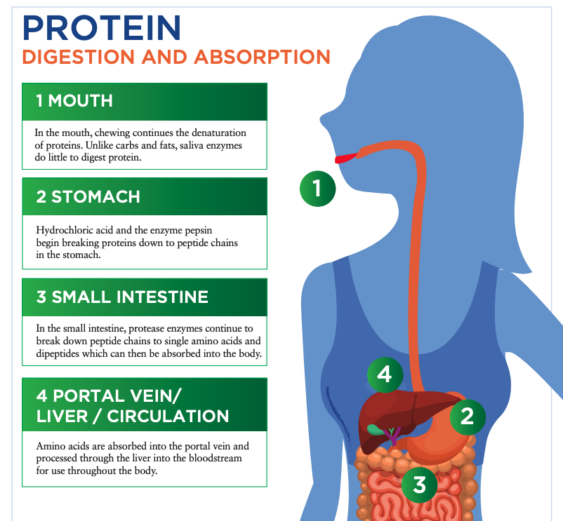

# Digestion, Absorption

## Protein Digestion and Absorption

1. protein breakdown is **denaturation**, changing the shape of a protein but not its primary structure.

   1. Response to many factors such as temperature, pH, and enzymes,
   2. process begins with cooking the food
   3. Unlike with carbohydrates and fats, enzymes for protein in the saliva are relatively inactive and do little to aid in digestion.
   4. Chewing food causes the stomach wall to release **gastrin** in anticipation of the digestion process. 

2. Hydrochloric acid denatures the protein and pepsin begins breaking the very long polypeptide chains into smaller peptide chains \(hydrolysis reaction\) 
   1. gastrin causes the release of hydrochloric acid and the hormone **pepsinogen** in the stomach. 
   2. hydrochloric acid and pepsin begin the enzymatic breakdown of protein in the stomach.
3.  Food passes from the stomach into the **duodenum** of the small intestine.    Intestinal cells release the hormones **secretin** and **cholecystokinin**.    **Secretin** mostly acts as a regulator of digestion, reducing acid release to help restore pH   when eating ceases.     **Cholecystokinin** acts on the pancreas, which releases the **protease** enzymes trypsin, chymotrypsin, carboxypeptidase, and elastase into the small intestine.      **protease enzymes** continue to break down peptide chains into even **shorter** **peptides**.      **peptidases** and **aminopeptidases** reduce the size to single amino acids and dipeptides, which can then be absorbed from the small intestine into the **hepatic portal vein**, carrying them to the liver. 
4. Within the liver, amino acids may be used for
   1.  protein synthesis, 
   2. broken down into urea \(urine waste\), 
   3. converted to carbohydrate or fat \(gluconeogenesis or ketogenesis\), 
   4. metabolized for energy, 
   5.  released into the peripheral blood stream for use throughout the body.
5. Any remaining proteins and peptides that make it past the small intestine and into the large intestine \(colon\) are fermented by bacteria and secreted as waste

  
  
  
   **aminopeptidase**: Enzymes that cleave individual amino acids from a peptide chain so they may be absorbed.

   **pepsinogen:** A proenzyme secreted by the stomach as a precursor to pepsin.

