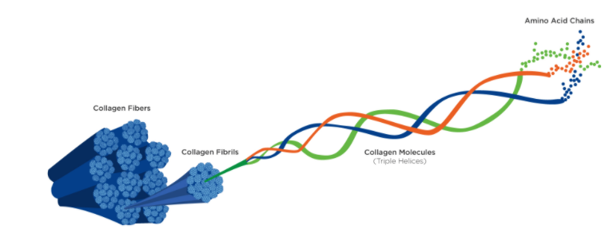
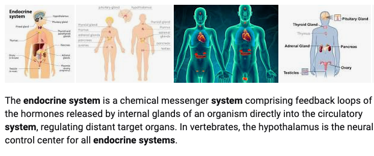

# Function

Although it is possible for **protein**  for energy, this only occurs when there is an **abundance of protein in the diet** and/or when there is **not enough carbohydrate** to support normal energy production.

there is **no true storage depot** for protein : carbohydrates \(glycogen stored in muscle tissue and the liver\) or fats \(adipose tissue, i.e., body fat\).

## Bodily Tissues

Along with the mineral calcium, bones are formed from very strong **collagen proteins.** 

Collagen’s molecular structure is a **triple helix**, which gives it great **tensile strength.**

it is formed from many small amino acids \(glycine, proline, and hydroxyproline\).which can move around _without_ breaking their bonds.

**elastin** protein, ****which provides elasticity so tissues can bend but not break.

Muscle proteins **myosin, actin, and titin** are another large repository for body proteins that enable movement

 **keratin** is another tough protein found in human hair and fingernails. 

## Enzymes and Cellular Transporters

Nearly all enzymes are made from protein.

Cellular transporters are similar to enzymes.  they are more like doorways in cell membranes.

The **sodium–potassium pump** actively \(using ATP\) transports **potassium** into the cell and **sodium** out of the cell to create a gradient that the cell can use for other transporters and electrical signaling. 

Proteins are also critical for transporting a wide range of nutrients throughout the body.

1.**hemoglobin** is a protein in red blood cells that binds to and transports both oxygen and the metabolic waste product of carbon dioxide.

2. **lipoproteins \(cholesterol**\), which are molecules that make the transport of lipids \(fats\) throughout the body possible.

## Cell Signaling

an increase in the amino acid **leucine** has been shown to signal muscle cells to begin synthesizing new proteins when the other necessary **amino acids** are present.

**Leucine** in isolation will not build muscle, but supplementing leucine into an otherwise high-protein diet can help enhance muscle hypertrophy

## Fluid Balance

Proteins help maintain fluid balance on the cellular level as part of their role as transporters across cell membranes, allowing water to move between the cells and the blood.

 Fluid balance is also managed by the protein **albumin**, ****the most abundant protein in blood plasma. A protein found in the blood stream that helps draw water into the blood vessel from surrounding tissue.

## pH Balance

by binding to free hydroxyl groups or hydrogen ions in the blood

**Hemoglobin** is one of the most well-known proteins that assist with this. As a side effect of its role in binding to carbon dioxide to transport it out of the body as waste, it prevents the CO2 from forming carbonic acid and lowering blood pH.   fart？？

## Hormones and Neurotransmitters

Neurotransmitters are part of the nervous system, while hormones are part of the **endocrine** system.

Many hormones are derived from amino acids, which are known as peptide hormones. 

 human growth hormone \(produced in the pituitary gland\) contains 191 amino acids. 

insulin \(produced in the pancreas\), 

gastrin \(produced in the stomach\)

leptin \(produced within adipose tissue\).

**Peptide hormones often also act as neurotransmitters.**serve as chemical messengers throughout the body

As a hormone, for example, oxytocin acts within the mammary glands to signal the release of breast milk after giving birth.

As a neurotransmitter, oxytocin acts on the prefrontal cortex to stimulate feelings of social connection and sexual attraction, giving rise to its nickname as the love hormone

## Immune System

Like red blood cells with hemoglobin, white blood cells also require protein to become functional. The white blood cells themselves also use proteins to fight infection and disease.

