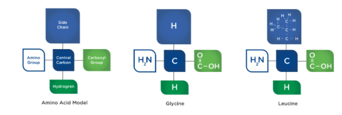

# What is Protein

It is the second-most abundant molecule in fat-free bodily tissues \(water being the most abundant\).

It plays a pivotal role in **exercise recovery** and it is involved in nearly all bodily functions and processes.

Proteins are responsible for many functions throughout the body, including **acid–base balance**, **energy production**, **cell signaling,** and **nutrient transport.**

### Amino Acids and Protein Structure

All proteins are composed of amino acids.

Amino acid structure and arrangement has five components: **A central carbon, a carboxyl group \(organic acid – COOH\), a hydrogen, an amino group \(NH2\), and a side chain \(R group\).**

The side chain is what makes each individual amino acid unique**.** 

### Essential Amino Acid \(EAA\)

Amino acids that are necessary for bodily functions but cannot be synthesized by the body and, therefore, must be obtained in the diet.

### Branched Chain Amino Acid

The three essential amino acids \(leucine, isoleucine, and valine\) which are abundant in skeletal muscle tissue and named for their branch-like structure.

### Conditionally Essential Amino Acids

Amino acids that are not typically essential, but can become essential during times of extreme dietary insufficiency, illness, or trauma.

### Nonessential Amino Acids

Amino acids that can be synthesized by the body and do not, under normal circumstances, need to be obtained in the diet.

**C**lassification system for amino acids is based on their potential to become glucose or ketones for use in energy metabolism.

**Glucogenic** amino acids

carbon backbone converted to glucose by the process of gluconeogenesis,

they can be converted to an intermediate compound that may enter the Krebs cycle directly.

**Ketogenic** amino acids

acetoacetate \(a ketone body\) or acetyl-CoA prior to entering the Krebs cycle for the generation of ATP.

## Protein Synthesis

Protein synthesis is the process by which amino acids are joined together to form proteins, such as lean tissues, like muscle.

food-&gt;digestiion\(intestines\)-&gt;amino acids-&gt;transported to -&gt;Peripheral tissues -&gt; recombined -&gt; new proteins \( collagen, myosin and hemoglobin\) -&gt; Lean tissue\(muscle\)

**Dehydration Synthesis**

In a dehydration synthesis reaction, a hydrogen from one amino acid and a hydroxyl group \(OH\) from a second amino acid are **removed** and joined together by a **peptide bond** to form the newly synthesized molecule and the byproduct of water \(H2O\). 

**Peptide Bond**

The bond between two amino acids, occurring between the carboxyl group of one and the amino group of the other.

**hydrolysis Synthesis**

The opposite process is known as **hydrolysis**, which occurs during digestion when proteins are broken down to amino acids.

**Joined amino acids**

two amino acids are joined, it is known as a dipeptide.

three amino acids are joined, it is known as a tripeptide.

When between four and nine amino acids join it is called an oligopeptide,

chains of 10 or more amino acids are called polypeptides.

Bodily proteins are most often formed by at least 50 amino acids.

The human body is in a constant state of both **protein synthesis \(anabolic\)** _and_ **protein breakdown \(catabolic\)**

**Muscle proteins**

The three major muscle proteins are myosin, actin, and titin

**Titin** has about 30,000 amino acids

**Titin** helps provide a muscle’s **elasticity** so it can return to its resting length following muscle contractions

**myosin** has about 6,000 amino acid**s**

Myosin uses energy from ATP to grab actin and flex in unison with many other myosin proteins to produce a muscle contraction.

**actin** has about 400 amino acids.

Actin is a highly abundant intracellular **protein** present in all eukaryotic cells and has a pivotal role in muscle contraction as well as in **cell** movements. Actin also has an essential function in maintaining and controlling **cell shape** and architecture.

